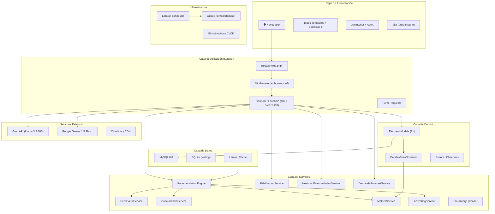
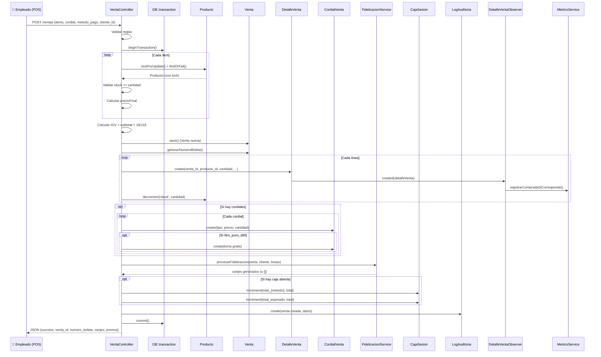
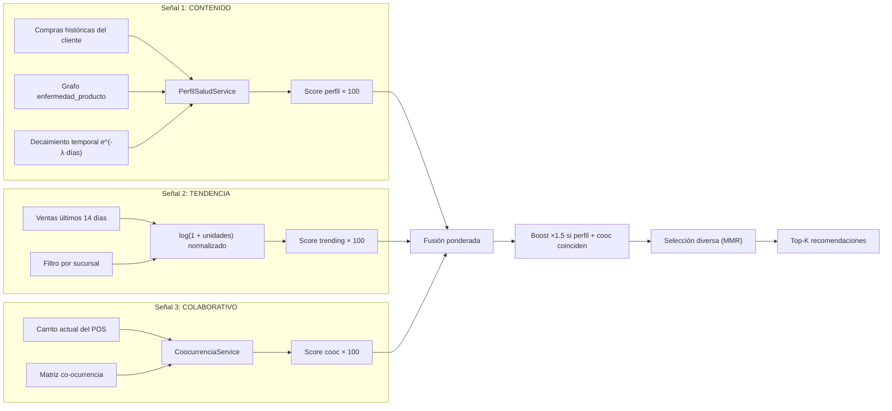
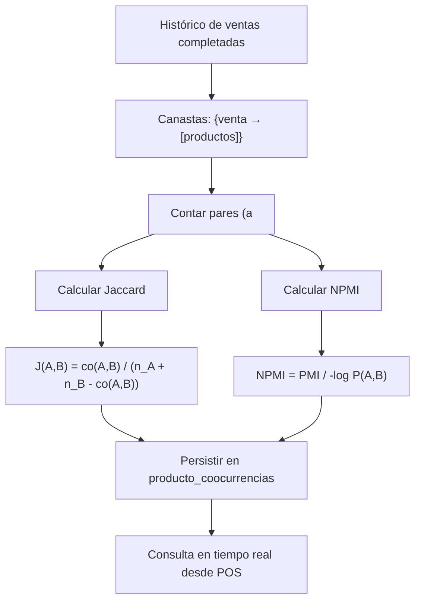
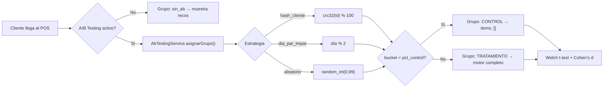
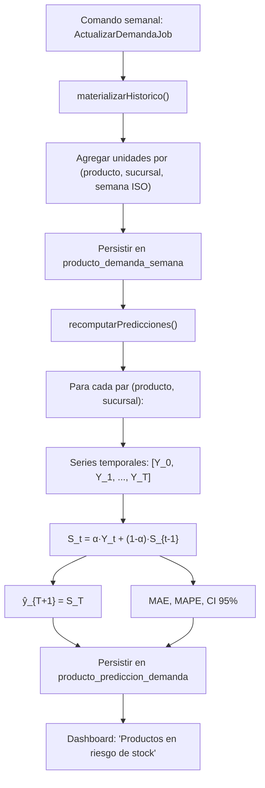
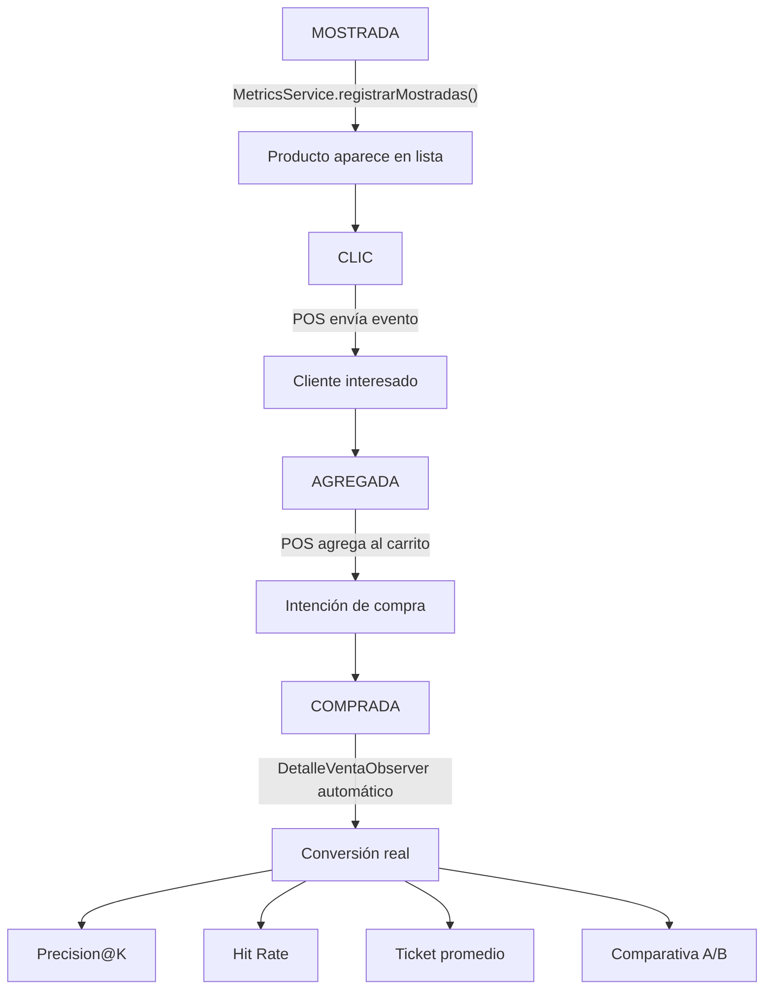

# Arquitectura Detallada — NATURACOR

## Sistema Web Empresarial  
**Fecha:** 03/05/2026  
**Versión:** 1.2 — Alineada al código actual (`Http/Controllers`)  
**Stack:** Laravel 12 + MySQL + Vite + Bootstrap 5

---

## 1. Visión General

NATURACOR es un sistema web **multi-capa** que extiende el patrón MVC clásico de Laravel con una capa de servicios (`Services/`) para aislar la lógica pesada de los controladores, un sistema de observadores (`Observers/`) para desacoplar efectos secundarios, y jobs schedulados para procesamiento offline.



---

## 2. Flujo de una Venta Completa

Este es el flujo más complejo del sistema. Involucra 8 componentes y 4 tablas en una sola transacción:



---

## 3. Arquitectura del Motor de Recomendación

### 3.1. Pipeline Híbrido

El motor implementa un sistema de recomendación híbrido con tres señales fusionadas por pesos configurables:



### 3.2. Fórmula de Scoring

```
score_final = (peso_perfil × comp_perfil) + (peso_trending × comp_trend) + (peso_cooc × comp_cooc)

Si comp_cooc > 0 (señal redundante perfil + carrito):
    score_final *= boost_carrito (1.5)
```

**Pesos configurables** (`config/recommendaciones.php`):
- `peso_perfil`: 1.0 (dominante)
- `peso_trending`: 0.45 (moderado)
- `peso_coocurrencia`: 0.35 (complementario)
- `boost_carrito`: 1.5 (refuerzo por coincidencia)

### 3.3. Co-ocurrencia Item-Item (Bloque 2)



**Implementación técnica:**
- **Truncate + insert** atómico dentro de transacción (regeneración completa).
- **Pares ordenados** `(a < b)` para evitar duplicados `(a,b)/(b,a)`.
- **Filtro de ruido:** Descarta pares con `co_count < min_co_count` (default: 2).
- **Ventana temporal:** Configurable (default: 90 días).

### 3.4. Experimentación A/B (Bloque 4)



**Tests estadísticos implementados en PHP puro (sin dependencias externas):**
- Welch's t-test (no asume varianzas iguales)
- Aproximación de p-valor (Abramowitz & Stegun + Beta incompleta regularizada)
- Cohen's d como tamaño de efecto
- Función lnGamma (aproximación de Lanczos)

### 3.5. Pronóstico de Demanda SES (Bloque 5)



---

## 4. Arquitectura del Pipeline de Métricas

### 4.1. Embudo de Conversión



### 4.2. Atribución de Compra

El `DetalleVentaObserver` implementa **atribución por sesión con ventana temporal**:

1. Cuando se crea un `DetalleVenta` (línea de venta), el observer verifica:
   - ¿La venta tiene `cliente_id` y estado `completada`?
   - ¿Existe un evento `mostrada/clic/agregada` para ese `(cliente, producto)` en las últimas 72 horas?
   - ¿La sesión de recomendación tiene un `mostrada` vigente?
2. Si todas las condiciones se cumplen → registra evento `comprada` vinculado a la venta.
3. La herencia de `grupo_ab` se mantiene desde la `mostrada` original (trazabilidad A/B).

---

## 5. Mapa de Controladores y Rutas

| Controlador | Rutas principales | Middleware | Responsabilidad |
|------------|-------------------|------------|-----------------|
| `VentaController` | `GET /ventas/pos`, `POST /ventas`, `GET/PATCH/DELETE /ventas/{id}` | `auth` | POS + CRUD de ventas |
| `ProductoController` | `resource /productos`, `GET /api/productos/buscar`, `importar/exportar` | `auth` | Inventario completo |
| `ClienteController` | `resource /clientes`, `GET /api/clientes/dni`, `padecimientos` | `auth` | Clientes + perfil salud |
| `CajaController` | `GET /caja`, `POST abrir/movimiento/cerrar` | `auth` | Sesiones de caja |
| `RecomendacionController` | `GET /api/recomendaciones/{cliente}`, `POST evento` | `auth` | API de recomendación |
| `RecomendacionMetricasController` | `GET /metricas/recomendaciones` | `auth` | Dashboard de métricas |
| `HeatmapEnfermedadesController` | `GET /metricas/heatmap-enfermedades` | `auth` | Mapa de calor |
| `DashboardController` | `GET /dashboard` | `auth` | KPIs del negocio |
| `IAController` | `GET /ia`, `POST /ia/analizar` | `auth` | Asistente IA |
| `RecetarioController` | `resource /recetario` | `auth` | CRUD de enfermedades |
| `ReclamoController` | `resource /reclamos`, `POST escalar` | `auth` | Gestión de reclamos |
| `ReporteController` | `GET /reportes`, `POST generar` | `auth` | Reportes de ventas |
| `BoletaController` | `GET boletas/{venta}`, `pdf`, `ticket`, `whatsapp` | `auth` | Boletas |
| `CordialController` | `resource /cordiales`, `GET precios` | `auth` | Venta de cordiales |
| `FidelizacionController` | `GET /fidelizacion`, `POST entregar` | `auth` | Premios |
| `SucursalController` | `resource /sucursales` | `auth + role:admin` | CRUD sucursales |
| `UsuarioController` | `resource /usuarios` | `auth + role:admin` | CRUD usuarios |
| `CatalogoController` | `GET /catalogo` | **público** | Catálogo sin login |

---

## 6. Patrones de Diseño Identificados

| Patrón | Implementación | Archivo(s) |
|--------|---------------|-------------|
| **MVC** | Separación estricta Model-View-Controller | Todo el framework Laravel |
| **Repository/Service** | Servicios de dominio separados de controladores | `app/Services/*` |
| **Observer** | Eventos automáticos al crear `DetalleVenta` | `DetalleVentaObserver` → `MetricsService` |
| **Strategy** | Estrategias intercambiables de A/B testing | `AbTestingService` (hash, día par/impar, aleatorio) |
| **Chain of Responsibility** | Cascada de proveedores IA: Groq → Gemini → Offline | `IAController@analizar` |
| **Singleton (Service Container)** | Inyección de dependencias vía constructor | Todos los controladores y servicios |
| **Template Method** | Normalización de score con Floor para padecimientos | `PerfilSaludService@reconstruirPerfil` |
| **Cache-Aside** | Cache con versioned keys para invalidación controlada | `RecomendacionEngine` |
| **Batch Processing** | Insert masivo en bloques de 50/200/500 filas | `MetricsService`, `CoocurrenciaService`, `PerfilSaludService` |

---

## 7. Scheduler Nocturno

```mermaid
gantt
    title Schedule Offline del Motor de Recomendación
    dateFormat HH:mm
    axisFormat %H:%M
    
    section Diario
    ReconstruirPerfilesJob        :02:00, 30min
    ReconstruirCoocurrenciaJob    :02:30, 30min
    
    section Semanal (Lunes)
    ActualizarDemandaJob          :03:00, 30min
```



| Job | Frecuencia | Qué hace | Tabla afectada |
|-----|-----------|----------|----------------|
| `ReconstruirPerfilesJob` | Diario 02:00 | Recalcula perfil de afinidad de todos los clientes activos | `cliente_perfil_afinidad` |
| `ReconstruirCoocurrenciaJob` | Diario 02:30 | Recomputa matriz de co-ocurrencia | `producto_coocurrencias` |
| `ActualizarDemandaJob` | Semanal 03:00 (lunes) | Materializa histórico + predicciones SES | `producto_demanda_semana`, `producto_prediccion_demanda` |

---

## 8. Stack Tecnológico Completo

| Capa | Tecnología | Versión |
|------|-----------|---------|
| **Backend** | Laravel (PHP) | 12.x (PHP 8.2+) |
| **Base de datos** | MySQL | 8.0+ |
| **Testing** | PHPUnit + SQLite in-memory | — |
| **Frontend** | Blade + Bootstrap + JavaScript | Bootstrap 5, ES6 |
| **Build** | Vite | 7.3 |
| **Autenticación** | Laravel Breeze | Latest |
| **Roles** | Spatie Laravel Permission | 6.25 |
| **PDF** | Barryvdh DomPDF | 3.1 |
| **Imágenes** | Cloudinary (SDK) | — |
| **IA** | Groq (Llama 3.3 70B) + Google Gemini 1.5 Flash | REST APIs |
| **CI/CD** | GitHub Actions | — |
| **Despliegue** | Railway.app / XAMPP local | — |
| **Análisis estático** | SonarQube / SonarCloud | — |
