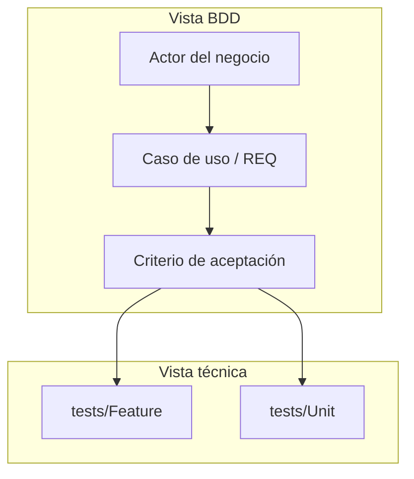

# Enfoque BDD — NATURACOR

## Behavior-Driven Development aplicado al Sistema Web de Punto de Venta y Gestión Integral
**Fecha:** 03/05/2026  
**Versión:** 1.1 — Enlaces a `doc/` por carpetas; suite 350 tests  
**Estándar de referencia:** ISO/IEC 25010 (calidad en uso), práctica BDD (Dan North), alineación con casos de uso UML (`../05_especificacion/casos_uso.md`)

---

## Tabla de Contenido

1. [Propósito y alcance](#1-propósito-y-alcance)
2. [Qué es BDD y cómo difiere del TDD](#2-qué-es-bdd-y-cómo-difiere-del-tdd)
3. [Actores y lenguaje ubicuo en NATURACOR](#3-actores-y-lenguaje-ubicuo-en-naturacor)
4. [Especificación por comportamiento en este proyecto](#4-especificación-por-comportamiento-en-este-proyecto)
5. [Casos de uso como escenarios de negocio](#5-casos-de-uso-como-escenarios-de-negocio)
6. [De los flujos CU-XXX a las pruebas Feature](#6-de-los-flujos-cu-xxx-a-las-pruebas-feature)
7. [Ejemplos de escenarios Gherkin equivalentes](#7-ejemplos-de-escenarios-gherkin-equivalentes)
8. [Cobertura BDD por módulo del sistema](#8-cobertura-bdd-por-módulo-del-sistema)
9. [Comportamientos transversales](#9-comportamientos-transversales)
10. [Colaboración, documentación y límites](#10-colaboración-documentación-y-límites)

---

## 1. Propósito y alcance

Este documento describe **cómo el proyecto NATURACOR materializa los principios de Behavior-Driven Development (BDD)**: definir el comportamiento esperado del sistema **desde la perspectiva de los actores del negocio** (dueña, empleados, administrador), usando un **lenguaje compartido** y vinculando **casos de uso**, **historias de usuario / requerimientos** y **pruebas automatizadas** que actúan como **especificación ejecutable**.

**Alcance:**

- Se basa en los **12 casos de uso** documentados en `../05_especificacion/casos_uso.md` y en los **72 requerimientos funcionales** del `../01_fundamentos/Documento_Requerimientos_NATURACOR.md`.
- Explica cómo las pruebas **`tests/Feature/`** (integración HTTP) encarnan escenarios “Dado–Cuando–Entonces” sin depender obligatoriamente de herramientas Gherkin/Cucumber.
- Complementa `enfoque_tdd_naturacor.md` (énfasis en diseño técnico y regresión) con la vista **comportamental y de valor para el stakeholde**r.

---

## 2. Qué es BDD y cómo difiere del TDD

| Aspecto | TDD (énfasis técnico) | BDD (énfasis negocio/comportamiento) |
|---------|------------------------|--------------------------------------|
| **Pregunta central** | ¿El código hace lo correcto a nivel de unidad/integración? | ¿El sistema se comporta como esperan los usuarios y reglas de negocio? |
| **Artefacto típico** | Tests PHPUnit en `Unit/` y `Feature/` | Escenarios, casos de uso, criterios de aceptación |
| **Audiencia** | Desarrolladores | Negocio + desarrollo + QA |
| **En NATURACOR** | 350 tests, refactor seguro | CU-001…CU-012 + REQ + manual de usuario |

**BDD no reemplaza a TDD:** en este proyecto **conviven**. Los Feature tests son el puente: leen como **comportamiento observable** (respuestas HTTP, mensajes, estados en BD) y se alinean con los pasos de los casos de uso.



---

## 3. Actores y lenguaje ubicuo en NATURACOR

Según `../05_especificacion/casos_uso.md`, los actores principales son:

| Actor | Rol en el comportamiento del sistema |
|-------|--------------------------------------|
| **Empleado** | Opera POS, caja, clientes, cordiales, recetario, reclamos en el día a día. |
| **Administrador** | Inventario avanzado, fidelización, IA de negocio, reportes, sucursales, usuarios, dashboard. |
| **Cliente** | Actor indirecto (fidelización, reclamos). |
| **Sistema (scheduler)** | Jobs de recomendaciones, reconstrucción de perfiles, forecasting. |

**Lenguaje ubicuo (ejemplos):** *boleta B001*, *IGV incluido*, *acumulado naturales*, *cordial*, *litro puro*, *caja abierta*, *premio Nopal 2L*. Esos términos aparecen de forma **consistente** en formularios Blade, mensajes de validación, `../04_operacion_despliegue/manual_usuario.md` y en los **nombres descriptivos de los tests** en español, lo que refuerza la trazabilidad entre negocio y automatización.

---

## 4. Especificación por comportamiento en este proyecto

En NATURACOR, el BDD se concretó mediante:

1. **Documentación de comportamiento:** casos de uso con pre/postcondiciones y flujos alternativos (`../05_especificacion/casos_uso.md`).
2. **Criterios de aceptación implícitos en REQ** (`./matriz_trazabilidad.md`).
3. **Especificación ejecutable:** clases en `tests/Feature/` que simulan acciones de usuario (login, POST a rutas, verificación de JSON o redirecciones).

No se adoptó **Behat/Gherkin** en archivo `.feature` por restricciones de tiempo y stack; el **mismo rol semántico** lo cumplen los escenarios PHPUnit con nombres verbales (`puede_acceder_al_pos`, `venta_sin_productos_retorna_error_422`).

---

## 5. Casos de uso como escenarios de negocio

Los **12 casos de uso** (CU-001 a CU-012) cubren el comportamiento end-to-end del producto. Tabla de correspondencia con áreas del sistema:

| ID | Nombre resumido | Comportamiento principal documentado |
|----|-----------------|-------------------------------------|
| CU-001 | Registrar venta POS | Carrito, IGV, boleta, stock, caja, fidelización |
| CU-002 | Registrar cliente | DNI único, registro desde POS |
| CU-003 | Abrir/cerrar caja | Sesiones, métodos de pago, arqueo |
| CU-004 | Consultar recomendaciones | Motor, perfiles, métricas |
| CU-005 | Venta cordiales | Tipos, promos litro, cortesías |
| CU-006 | Fidelización | Umbral S/500, premios, canje |
| CU-007 | Reportes de ventas | Filtros, agregados |
| CU-008 | Reclamos | Estados, escalado admin |
| CU-009 | Recetario | Enfermedades ↔ productos |
| CU-010 | IA de negocio | Groq/Gemini, modo degradado |
| CU-011 | Inventario | CRUD productos, alertas |
| CU-012 | Sucursales y usuarios | RBAC, administración |

Cada CU enlaza con **requerimientos** que a su vez enlazan con **tests**; la cadena **CU → REQ → Feature test** es la columna vertebral del enfoque BDD en este repositorio.

---

## 6. De los flujos CU-XXX a las pruebas Feature

**Idea rectora:** un **paso del flujo principal** o **flujo alternativo** del caso de uso debe ser **observable** mediante al menos un escenario automatizado cuando el riesgo es alto (ventas, dinero, roles, datos personales).

| Fase en documentación BDD | Ejemplo NATURACOR |
|---------------------------|-------------------|
| **Dado (contexto)** | Empleado autenticado, caja abierta, productos en stock (`setUp` en Feature test, factories). |
| **Cuando (evento)** | POST `/ventas` con payload del carrito, o GET al POS. |
| **Entonces (resultado)** | HTTP 200, `success: true`, filas en `ventas`/`detalle_venta`, boleta generada, o 422 con mensaje de negocio. |

**Archivos orientados a comportamiento de usuario:** `VentaTest.php`, `VentaTest2.php`, `CajaTest*.php`, `FidelizacionTest*.php`, `CordialTest*.php`, `AutenticacionTest.php`, `SeguridadTest.php`, `ClienteCrudTest*.php`, etc. (lista completa en `./matriz_pruebas.md`).

---

## 7. Ejemplos de escenarios Gherkin equivalentes

A continuación, **tres escenarios representativos** del proyecto, expresados en estilo Gherkin para lectura de negocio. Los equivalentes ejecutables están en los Feature tests citados.

### Escenario A — Venta mínima exitosa (CU-001)

```gherkin
Característica: Registrar venta en POS
  Como empleado
  Quiero registrar una venta con al menos un producto
  Para dejar constancia en caja y stock

  Escenario: Venta con un producto y total correcto
    Dado que inicié sesión como empleado
    Y tengo una caja abierta
    Y existe un producto con stock suficiente
    Cuando confirmo una venta con un ítem y método de pago válido
    Entonces el sistema responde éxito
    Y se registra la venta y el detalle
    Y se genera un número de boleta con formato B001-
```

**Implementación de referencia:** `VentaTest::puede_registrar_venta_con_un_producto`, REQ-POS-003.

### Escenario B — Carrito vacío (CU-001, FA-5)

```gherkin
  Escenario: No permitir venta sin ítems
    Dado que estoy en el POS con caja abierta
    Cuando intento confirmar sin productos ni cordiales
    Entonces recibo error 422
    Y el mensaje indica que debo agregar al menos un producto
```

**Implementación de referencia:** `VentaTest::venta_sin_productos_retorna_error_422`, REQ-POS-011.

### Escenario C — Stock insuficiente (CU-001, FA-1)

```gherkin
  Escenario: Stock insuficiente revierte la operación
    Dado un producto con stock menor que la cantidad solicitada
    Cuando intento completar la venta
    Entonces la transacción no deja venta inconsistente
    Y se informa el problema de stock
```

**Implementación de referencia:** tests de rollback en `VentaTest2.php`, REQ-POS-012.

---

## 8. Cobertura BDD por módulo del sistema

Vista **comportamental** (qué **debe hacer** el producto frente al usuario), alineada con módulos del README y `../02_diseno_arquitectura/arquitectura.md`:

| Módulo | Comportamiento clave para el negocio | Pruebas Feature / flujos |
|--------|--------------------------------------|---------------------------|
| POS | Cobrar con reglas fiscales y boleta | `VentaTest`, `VentaTest2`, `BoletaTest*` |
| Inventario | Mantener catálogo y alertas | `ProductoCrudTest*`, `CatalogoTest` |
| Clientes | Identificar y fidelizar | `ClienteCrudTest*` |
| Caja | Control de efectivo y cierre | `CajaTest`, `CajaTest2` |
| Fidelización | Premios por reglas 2026 | `FidelizacionTest*` |
| Cordiales | Bebidas y promociones | `CordialTest*` |
| Recomendaciones / IA | Sugerencias y asistente | `Recomendacion*`, `IATest*` |
| Recetario | Vínculo salud–producto | `RecetarioTest`, `RecetarioExcelTest` |
| Reclamos | Seguimiento y confianza | `ReclamoTest*` |
| Reportes | Visibilidad gerencial | `ReporteTest`, `DashboardTest` |
| Administración | Roles y multi-sucursal | `UsuarioCrudTest*`, `SucursalCrudTest*` |
| Analytics | Heatmap, forecast (valor analítico) | `HeatmapEnfermedadesFlowTest`, `Forecasting/*` |

---

## 9. Comportamientos transversales

El BDD también cubre **calidades** que el usuario “siente” aunque no sean un CRUD:

| Comportamiento | Significado para el negocio | Evidencia en el proyecto |
|----------------|-----------------------------|----------------------------|
| **Solo personal autorizado** | Datos de ventas y clientes protegidos | `SeguridadTest`, middleware de roles, `AutenticacionTest` |
| **Integridad ante fallos** | No cobrar sin stock o sin consistencia de caja | Transacciones + tests de rollback |
| **Coherencia fiscal** | IGV y totales confiables | `VentaTest`, `VentaUnitTest` |
| **Experiencia operativa** | Mensajes claros (422, validaciones) | Aserciones sobre contenido/JSON en Feature tests |

Estos puntos conectan con **ISO 25010** (seguridad, fiabilidad, usabilidad) desarrollado en `../02_diseno_arquitectura/metricas_calidad.md`.

---

## 10. Colaboración, documentación y límites

**Colaboración:** la dueña del negocio y el equipo definieron reglas (fidelización 2026, cordiales, formatos de boleta); esas reglas pasaron a **requerimientos** y **casos de uso**, y luego a **criterios verificables** en CI. El **manual de usuario** (`../04_operacion_despliegue/manual_usuario.md`) es el complemento **no ejecutable** del BDD: describe los mismos comportamientos para capacitación en tienda.

**Límites:**

- Sin motor Gherkin separado, los escenarios “oficiales” para jurados académicos siguen siendo **CU + REQ + tests**; este documento y `../05_especificacion/casos_uso.md` cierran el círculo semántico.
- Pruebas manuales de **usabilidad** y **accesibilidad** no están totalmente automatizadas.

**Mejora futura:** mantener una tabla viva **CU-ID → ID de escenario → archivo Feature** en revisiones de release (similar a `./matriz_trazabilidad.md` pero orientada puramente a lectura de negocio).

---

## Referencias cruzadas dentro del repositorio

| Documento | Relación con este BDD |
|-----------|------------------------|
| `../05_especificacion/casos_uso.md` | Fuente de escenarios y actores. |
| `../01_fundamentos/Documento_Requerimientos_NATURACOR.md` | Requerimientos y reglas de negocio. |
| `./matriz_trazabilidad.md` | REQ → tests ejecutables. |
| `../04_operacion_despliegue/manual_usuario.md` | Comportamiento descrito para usuarios finales. |
| `./matriz_pruebas.md` | Inventario de pruebas Feature que materializan escenarios. |
| `./enfoque_tdd_naturacor.md` | Enfoque técnico Red–Green–Refactor en el mismo codebase. |

---

**Fin del documento — Enfoque BDD NATURACOR v1.1**
