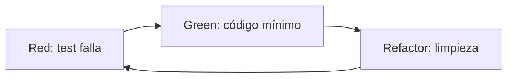
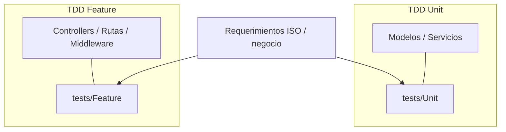

# Enfoque TDD — NATURACOR

## Test-Driven Development en el Sistema Web de Punto de Venta y Gestión Integral
**Fecha:** 03/05/2026  
**Versión:** 1.1 — Consistencia con suite PHPUnit (350 tests)  
**Estándar de referencia:** ISO/IEC/IEEE 29119 (Testing de Software), práctica TDD (Kent Beck)

---

## Tabla de Contenido

1. [Propósito y alcance](#1-propósito-y-alcance)
2. [Qué es TDD y el ciclo Red–Green–Refactor](#2-qué-es-tdd-y-el-ciclo-redgreenrefactor)
3. [Contexto técnico del proyecto](#3-contexto-técnico-del-proyecto)
4. [Niveles de prueba alineados con TDD](#4-niveles-de-prueba-alineados-con-tdd)
5. [Aplicación del TDD por capas en NATURACOR](#5-aplicación-del-tdd-por-capas-en-naturacor)
6. [Módulos funcionales y evidencia de tests](#6-módulos-funcionales-y-evidencia-de-tests)
7. [Trazabilidad TDD ↔ requerimientos](#7-trazabilidad-tdd--requerimientos)
8. [Integración continua y calidad de regresión](#8-integración-continua-y-calidad-de-regresión)
9. [Convenciones y buenas prácticas adoptadas](#9-convenciones-y-buenas-prácticas-adoptadas)
10. [Límites del enfoque y trabajo futuro](#10-límites-del-enfoque-y-trabajo-futuro)

---

## 1. Propósito y alcance

Este documento describe **cómo se aplicó el desarrollo guiado por pruebas (TDD)** en el proyecto **NATURACOR**: qué significa en la práctica con **Laravel 12**, **PHPUnit** y la suite de **350 tests** (113 unitarios + 237 de integración), y cómo esa práctica se relaciona con la **verificación técnica** de modelos, servicios y flujos HTTP.

**Alcance:**

- Cubre la filosofía TDD (escribir la prueba antes o en estrecho ciclo con el código mínimo que la hace pasar).
- Relaciona los directorios `tests/Unit` y `tests/Feature` con las capas del sistema descritas en `../02_diseno_arquitectura/arquitectura.md`.
- No sustituye a `./matriz_pruebas.md` (inventario exhaustivo) ni a `./matriz_trazabilidad.md` (REQ → test); las **complementa** desde la perspectiva metodológica.

---

## 2. Qué es TDD y el ciclo Red–Green–Refactor

**TDD** es una disciplina de desarrollo en la que el comportamiento esperado se materializa primero como **prueba automatizada fallida o pendiente** y el código de producción se evoluciona hasta satisfacerla, manteniendo el diseño simple y seguro ante cambios.

| Fase | Nombre | Significado en NATURACOR |
|------|--------|---------------------------|
| **Red** | Escribir un test que falla | Definir una regla de negocio o un endpoint (ej. formato de boleta, cálculo de IGV, respuesta HTTP 422) antes de considerar la implementación final. |
| **Green** | Hacer pasar el test con el mínimo código | Implementar en el modelo, `VentaController`, `FidelizacionService`, etc., lo justo para que el test pase. |
| **Refactor** | Mejorar sin romper | Extraer a servicios (`Services/`), usar transacciones, observers, sin cambiar el comportamiento verificado por los tests. |

En un proyecto académico con plazos fijos, el equipo a veces aplicó **TDD estricto** (test primero) en lógica crítica (IGV, boletas, fidelización, recomendaciones) y **test inmediato después** en CRUDs repetitivos; en ambos casos el **resultado observable** es el mismo: base de regresión automatizada documentada en `./matriz_pruebas.md`.

---

## 3. Contexto técnico del proyecto

| Aspecto | Detalle |
|---------|---------|
| **Framework** | Laravel 12 (PHP 8.2+) |
| **Test runner** | PHPUnit con atributo `#[Test]` |
| **BD en tests** | SQLite en memoria (`RefreshDatabase`), aislamiento total |
| **Tests totales** | **350** en **52** archivos (excluye `ExampleTest` como scaffold) |
| **CI/CD** | GitHub Actions (Ubuntu, PHP 8.2), ejecución en cada push/PR |

La elección de **tests de integración HTTP** como mayor volumen (237 Feature) refleja que NATURACOR es una aplicación **transaccional y basada en rutas**: muchos requerimientos se validan de forma más fiable simulando request real + persistencia que mockeando toda la pila.

---

## 4. Niveles de prueba alineados con TDD

| Nivel | Ubicación | Rol en TDD | Cantidad aprox. |
|-------|-----------|------------|-----------------|
| **Unitario** | `tests/Unit/` | Aislar reglas en **servicios** y **modelos** (cálculos, formatos, reglas puras o con BD refrescada) | 113 tests / 12 archivos |
| **Integración / Feature** | `tests/Feature/` | Verificar **controladores**, **middleware**, **flujos completos** (POST venta, cierre de caja, CRUD) | 237 tests / 42 archivos + subcarpetas |

**Criterio de uso:** la lógica reutilizable y costosa de corregir (motores de recomendación, A/B, forecast, coocurrencia) se cubre con **Unit**; los **casos de uso** que cruzan HTTP + políticas + vistas JSON/HTML se cubren con **Feature**.

---

## 5. Aplicación del TDD por capas en NATURACOR

### 5.1. Capa de dominio (modelos)

Los tests unitarios sobre **Eloquent** validan invariantes: soft deletes, relaciones `Venta`–`DetalleVenta`, formato `B001-XXXXXX`, extracción de IGV. Ejemplos de archivos: `VentaUnitTest.php`, `ProductoUnitTest.php`, `ClienteUnitTest.php`, `FidelizacionCanjeUnitTest.php`.

### 5.2. Capa de servicios

Servicios bajo `app/Services/` concentran algoritmos (recomendación, A/B testing, heatmap, demanda, coocurrencia). El TDD aquí consiste en **fijar entradas/salidas** y casos límite sin pasar por el navegador: p. ej. `AbTestingServiceTest`, `CoocurrenciaServiceTest`, `DemandaForecastServiceTest`, `HeatmapEnfermedadesServiceTest`.

### 5.3. Capa de aplicación (HTTP + políticas)

`tests/Feature/` ejerce el rol de **especificación ejecutable** del comportamiento observable: códigos HTTP, `success: true/false`, filas en BD tras un POST, denegación por rol. Esto conecta directamente con los **requerimientos funcionales** (REQ-POS-*, REQ-INV-*, etc.) documentados en la matriz de trazabilidad.

---

## 6. Módulos funcionales y evidencia de tests

La siguiente tabla resume **dónde el enfoque TDD asegura regresión** por módulo (archivos representativos; el detalle numérico está en `./matriz_pruebas.md`).

| Módulo | Unit (ejemplos) | Feature (ejemplos) | Comportamiento crítico cubierto |
|--------|-----------------|---------------------|--------------------------------|
| POS / Ventas | `VentaUnitTest` | `VentaTest`, `VentaTest2` | Boleta, IGV, stock, transacciones, descuentos |
| Inventario | `ProductoUnitTest` | `ProductoCrudTest*` | CRUD, stock bajo, búsqueda AJAX |
| Clientes | `ClienteUnitTest` | `ClienteCrudTest*` | DNI único, búsqueda, historial |
| Caja | — | `CajaTest`, `CajaTest2` | Apertura/cierre, métodos de pago, movimientos |
| Fidelización | `FidelizacionCanjeUnitTest` | `FidelizacionTest*` | Reglas 2026, canjes, acumulado |
| Cordiales | `CordialVentaUnitTest` | `CordialTest*` | Tipos, promos, integración con venta |
| Recomendaciones / IA | `CoocurrenciaServiceTest`, etc. | `Recomendacion*`, `IATest*` | API, jobs, métricas, asistente |
| Recetario | `RecetarioUnitTest` | `RecetarioTest`, `RecetarioExcelTest` | CRUD enfermedades–productos |
| Reclamos | — | `ReclamoTest*` | Estados, auditoría, permisos |
| Reportes / Boletas | — | `ReporteTest`, `BoletaTest*` | PDF, filtros, consistencia |
| Admin | — | `UsuarioCrudTest*`, `SucursalCrudTest*`, `DashboardTest` | Roles, KPIs |
| Seguridad transversal | — | `SeguridadTest` | CSRF, rutas, autorización |
| Analytics / Jobs | `HeatmapEnfermedadesServiceTest` | `HeatmapEnfermedadesFlowTest`, `Jobs/*` | Pipelines asíncronos |

---

## 7. Trazabilidad TDD ↔ requerimientos

El TDD en NATURACOR **no es un fin en sí mismo**: cada batería de tests está pensada para demostrar cumplimiento de requerimientos. La fuente autoritativa de mapeo **REQ → archivo de test → resultado** es:

- **`./matriz_trazabilidad.md`** — matriz bidireccional por módulo (POS, Inventario, Clientes, …).

Ejemplo de cadena lógica:

1. **REQ-POS-004** (IGV incluido) → implementación en `VentaController` / modelo `Venta`.
2. Tests: `VentaTest::venta_calcula_total_con_igv_incluido`, `VentaUnitTest::igv_extraido_del_total_no_sumado`.
3. **Resultado:** ✅ PASA — la suite TDD actúa como **prueba de regresión** ante cualquier refactor.

---

## 8. Integración continua y calidad de regresión

| Elemento | Descripción |
|----------|-------------|
| **Pipeline** | GitHub Actions ejecuta la suite completa en ambiente limpio. |
| **Beneficio TDD** | Los cambios en `main` no rompen silenciosamente reglas ya acordadas (boletas, caja, roles). |
| **Métrica de salud** | Tasa de éxito 100 % documentada en `./matriz_pruebas.md`; tiempo local ~30–40 s (`vendor/bin/phpunit`). |

El TDD bien aplicado reduce el costo de **integración continua**: los fallos aparecen en el PR, no en producción.

---

## 9. Convenciones y buenas prácticas adoptadas

| Práctica | Descripción |
|----------|-------------|
| Atributo `#[Test]` | Uso de PHP 8.2+ en lugar del prefijo `test_` exclusivamente. |
| Nombres en español | Ej. `puede_registrar_venta_con_un_producto`, alineado al lenguaje del negocio y a los manuales. |
| **Un test, una intención** | Facilita localizar regresiones cuando falla un método concreto. |
| **BD limpia** | `RefreshDatabase` para no acoplar orden de ejecución. |
| **Feature como contrato** | POST/GET esperados documentan el API interno de la aplicación (JSON/HTML). |

---

## 10. Límites del enfoque y trabajo futuro

| Limitación | Comentario |
|------------|------------|
| **No todo fue “test primero” en tiempo real** | En módulos CRUD repetitivos se priorizó velocidad con plantillas de tests similares. |
| **Pruebas E2E de navegador** | No hay Cypress/Dusk en el alcance actual; la UI se valida más por Feature + manual según `../04_operacion_despliegue/manual_usuario.md`. |
| **Carga y estrés** | Fuera de alcance académico; ver restricciones en `Plan_de_Pruebas_NATURACOR.md`. |

**Línea futura:** aumentar tests de contrato en APIs públicas internas y, si el presupuesto lo permite, un conjunto pequeño de E2E para el flujo crítico POS.

---

## Referencias cruzadas dentro del repositorio

| Documento | Relación con este TDD |
|-----------|------------------------|
| `./matriz_pruebas.md` | Inventario y estadísticas de los 350 tests. |
| `./matriz_trazabilidad.md` | REQ → tests. |
| `../02_diseno_arquitectura/arquitectura.md` | Capas donde se ubica la lógica bajo prueba. |
| `./Plan_de_Pruebas_NATURACOR.md` | Estrategia general de pruebas del proyecto. |
| `./enfoque_bdd_naturacor.md` | Complemento: comportamiento desde negocio y casos de uso. |

---

**Fin del documento — Enfoque TDD NATURACOR v1.1**
