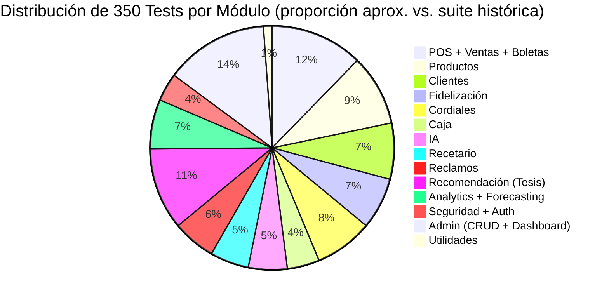

# Matriz de Pruebas — NATURACOR

## Resumen de la Suite de Testing Automatizado
**Fecha:** 03/05/2026  
**Versión:** 1.2 — Sincronizado con `vendor/bin/phpunit` (350 tests, 1347 aserciones)  
**Framework:** PHPUnit con atributo `#[Test]` (PHP 8.2+, Laravel 12)  
**Estándar de referencia:** ISO/IEC/IEEE 29119 (Testing de Software)

---

## 1. Resumen General

| Métrica | Valor |
|---------|-------|
| **Total de archivos de test** | 52 (excluye `ExampleTest`) |
| **Tests unitarios (Unit)** | 113 tests en 12 archivos |
| **Tests de integración (Feature)** | 237 tests en 42 archivos |
| **Total de tests** | **350** |
| **Aserciones (run local)** | **1347** |
| **Tasa de éxito** | 100% |
| **Entorno de ejecución** | SQLite in-memory (aislamiento total) |
| **CI/CD** | GitHub Actions (Ubuntu Latest, PHP 8.2) |
| **Tiempo de ejecución** | < 60 segundos |
| **Convención de nombres** | Atributo `#[Test]` + nombre descriptivo en español |

> **Nota técnica:** Los tests NO usan el prefijo `test_` tradicional de PHPUnit. En su lugar, utilizan el atributo `#[Test]` de PHP 8.2+ con nombres descriptivos como `puede_registrar_venta_con_un_producto` o `formato_boleta_empieza_con_B001`.

---

## 2. Estructura de Tests

```
tests/
├── Unit/                           ← Tests unitarios (lógica pura, con BD vía RefreshDatabase)
│   ├── AbTestingServiceTest.php          (14 tests)
│   ├── ClienteUnitTest.php               (12 tests)
│   ├── CoocurrenciaServiceTest.php       (10 tests)
│   ├── CordialVentaUnitTest.php          (13 tests)
│   ├── DemandaForecastServiceTest.php    (10 tests)
│   ├── FidelizacionCanjeUnitTest.php     ( 8 tests)
│   ├── HeatmapEnfermedadesServiceTest.php(12 tests)
│   ├── ImageHelperTest.php               ( 8 tests)
│   ├── ProductoUnitTest.php              (10 tests)
│   ├── RecetarioUnitTest.php             ( 7 tests)
│   ├── VentaUnitTest.php                 ( 8 tests)
│   └── ExampleTest.php                   ( 1 test — scaffold)
│                                   Total Unit: 113 tests
│
├── Feature/                        ← Tests de integración (HTTP + BD)
│   ├── AbTestingFlowTest.php             ( 6 tests)
│   ├── AutenticacionTest.php             ( 6 tests)
│   ├── BoletaTest.php                    ( 5 tests)
│   ├── BoletaTest2.php                   (11 tests)
│   ├── CajaTest.php                      ( 6 tests)
│   ├── CajaTest2.php                     (18 tests)
│   ├── CatalogoTest.php                  ( 5 tests)
│   ├── ClienteCrudTest.php               (17 tests)
│   ├── ClienteCrudTest2.php              (14 tests)
│   ├── CordialTest.php                   (11 tests)
│   ├── CordialTest2.php                  (20 tests)
│   ├── DashboardTest.php                 (17 tests)
│   ├── FidelizacionTest.php              (12 tests)
│   ├── FidelizacionTest2.php             ( 8 tests)
│   ├── IATest.php                        (10 tests)
│   ├── IATest2.php                       (20 tests)
│   ├── ProductoCrudTest.php              (10 tests)
│   ├── ProductoCrudTest2.php             (18 tests)
│   ├── ProductoCrudTest3.php             (16 tests)
│   ├── RecetarioExcelTest.php            (11 tests)
│   ├── RecetarioTest.php                 (12 tests)
│   ├── ReclamoTest.php                   (12 tests)
│   ├── ReclamoTest2.php                  (21 tests)
│   ├── RecomendacionApiTest.php          ( 2 tests)
│   ├── RecomendacionCarritoIntegracionTest.php  ( 5 tests)
│   ├── RecomendacionCoocurrenciaCommandTest.php ( 2 tests)
│   ├── RecomendacionMetricasFlowTest.php ( 4 tests)
│   ├── ReporteTest.php                   (11 tests)
│   ├── ScheduleRecomendacionesTest.php   ( 4 tests)
│   ├── SeguridadTest.php                 (15 tests)
│   ├── SucursalCrudTest.php              ( 7 tests)
│   ├── SucursalCrudTest2.php             (14 tests)
│   ├── UsuarioCrudTest.php               (11 tests)
│   ├── UsuarioCrudTest2.php              (12 tests)
│   ├── VentaTest.php                     ( 9 tests)
│   ├── VentaTest2.php                    (35 tests)
│   ├── ExampleTest.php                   ( 1 test — scaffold)
│   │
│   ├── Analytics/
│   │   └── HeatmapEnfermedadesFlowTest.php  ( 6 tests)
│   │
│   ├── Forecasting/
│   │   ├── ActualizarDemandaJobTest.php     ( 6 tests)
│   │   └── DashboardForecastWidgetTest.php  ( 4 tests)
│   │
│   └── Jobs/
│       ├── ReconstruirCoocurrenciaJobTest.php ( 4 tests)
│       └── ReconstruirPerfilesJobTest.php     ( 6 tests)
│                                   Total Feature: 237 tests
```

---

## 3. Detalle de Tests por Módulo

### 3.1. Módulo POS — Ventas (52 tests)

| Archivo | Tipo | Tests | Cobertura funcional |
|---------|------|:-----:|---------------------|
| `VentaTest.php` | Feature | 9 | Acceso al POS, productos frecuentes, venta con 1/N productos, cálculo de IGV incluido, asociación con cliente, validación carrito vacío, lista de ventas, generación de boleta |
| `VentaTest2.php` | Feature | 35 | Venta con descuento, stock insuficiente (rollback), venta sin caja, anulación, auditoría, métodos de pago, cordiales integrados, promos automáticas |
| `VentaUnitTest.php` | Unit | 8 | Formato boleta `B001-*`, longitud correcta, primera/segunda boleta, relación detalles, IGV extraído (no sumado), soft delete |

**Tests representativos de `VentaTest.php`:**

| Método | Qué verifica | REQ |
|--------|--------------|-----|
| `puede_acceder_al_pos` | GET `/ventas/pos` retorna 200 con vista y productos | REQ-POS-001 |
| `puede_registrar_venta_con_un_producto` | Flujo completo: POST → BD → 200 + success:true | REQ-POS-003 |
| `puede_registrar_venta_con_multiples_productos` | 3 productos → 3 DetalleVenta en BD | REQ-POS-003 |
| `venta_calcula_total_con_igv_incluido` | Precio S/118 → IGV = S/18 (extracción 18/118) | REQ-POS-004 |
| `venta_sin_productos_retorna_error_422` | Carrito vacío → 422 + success:false | REQ-POS-011 |
| `venta_genera_numero_boleta` | Boleta starts with `B001-` | REQ-POS-007 |

---

### 3.2. Módulo Boletas (16 tests)

| Archivo | Tipo | Tests | Cobertura funcional |
|---------|------|:-----:|---------------------|
| `BoletaTest.php` | Feature | 5 | Generación de PDF, contenido de boleta, número correlativo |
| `BoletaTest2.php` | Feature | 11 | Formato 80mm, ticket térmico, WhatsApp link, campos completos, correlativo sin duplicados |

---

### 3.3. Módulo Caja (24 tests)

| Archivo | Tipo | Tests | Cobertura funcional |
|---------|------|:-----:|---------------------|
| `CajaTest.php` | Feature | 6 | Apertura, movimientos ingreso/egreso, cierre con diferencia, totales por método, restricción de una caja abierta |
| `CajaTest2.php` | Feature | 18 | Desglose detallado de métodos de pago, diferencia al cierre, sesiones cerradas, validaciones edge cases |

---

### 3.4. Módulo Clientes (43 tests)

| Archivo | Tipo | Tests | Cobertura funcional |
|---------|------|:-----:|---------------------|
| `ClienteCrudTest.php` | Feature | 17 | CRUD completo, búsqueda por DNI, DNI duplicado, soft delete |
| `ClienteCrudTest2.php` | Feature | 14 | Unicidad DNI, historial de compras, padecimientos, autocompletar |
| `ClienteUnitTest.php` | Unit | 12 | `nombreCompleto()`, `puedeReclamarPremio()` (5 variaciones de umbral), `reiniciarAcumulados()`, relaciones, soft delete, casts |

**Tests representativos de `ClienteUnitTest.php`:**

| Método | Qué verifica |
|--------|--------------|
| `nombre_completo_combina_nombre_y_apellido` | "María" + "García" = "María García" |
| `puede_reclamar_premio_cuando_acumulado_naturales_igual_a_umbral` | S/500.00 → true |
| `no_puede_reclamar_premio_cuando_acumulado_naturales_inferior_al_umbral` | S/499.99 → false |
| `soft_delete_cliente_no_lo_elimina_fisicamente` | `delete()` → `find()` = null, `withTrashed()` ≠ null |
| `acumulados_se_castean_como_decimal` | Verificación del cast `decimal:2` |

---

### 3.5. Módulo Productos (54 tests)

| Archivo | Tipo | Tests | Cobertura funcional |
|---------|------|:-----:|---------------------|
| `ProductoCrudTest.php` | Feature | 10 | CRUD completo, validación de campos obligatorios |
| `ProductoCrudTest2.php` | Feature | 18 | Búsqueda AJAX, código de barras, alerta stock bajo, importar/exportar |
| `ProductoCrudTest3.php` | Feature | 16 | Stock mínimo, productos frecuentes, soft delete, edge cases |
| `ProductoUnitTest.php` | Unit | 10 | `tieneStockBajo()` (5 variaciones: igual, menor, mayor, umbral personalizado), relaciones, soft delete, casts |

---

### 3.6. Módulo Fidelización (40 tests)

| Archivo | Tipo | Tests | Cobertura funcional |
|---------|------|:-----:|---------------------|
| `FidelizacionTest.php` | Feature | 12 | Premio automático al umbral S/500, acumulado, listado, entrega, múltiples premios |
| `FidelizacionTest2.php` | Feature | 8 | Umbral configurable, tipo de regla, fecha de entrega, edge cases |
| `FidelizacionCanjeUnitTest.php` | Unit | 8 | Constante `REGLA_NATURALES`, scope `pendientes()`, relaciones, casts |
| `ClienteUnitTest.php` | Unit | 12 | `puedeReclamarPremio()`, `premiosTeoricosTotales()`, `premiosTeoricosDisponibles()` |

---

### 3.7. Módulo Cordiales (44 tests)

| Archivo | Tipo | Tests | Cobertura funcional |
|---------|------|:-----:|---------------------|
| `CordialTest.php` | Feature | 11 | 9 tipos disponibles, venta con cliente, promo litro puro, cortesías |
| `CordialTest2.php` | Feature | 20 | Invitados, precio cero, catálogo completo, medio litro, validaciones |
| `CordialVentaUnitTest.php` | Unit | 13 | `$precios` estáticos (9 tipos), `$labels`, `$tiposAcumulanCordiales`, relaciones, casts |

---

### 3.8. Módulo IA (30 tests)

| Archivo | Tipo | Tests | Cobertura funcional |
|---------|------|:-----:|---------------------|
| `IATest.php` | Feature | 10 | Consulta básica, fallback Groq→Gemini, modo offline, sin API keys |
| `IATest2.php` | Feature | 20 | Cascada completa, contexto de negocio, config vía archivo, respuestas formateadas |

---

### 3.9. Módulo Recetario (30 tests)

| Archivo | Tipo | Tests | Cobertura funcional |
|---------|------|:-----:|---------------------|
| `RecetarioTest.php` | Feature | 12 | CRUD enfermedad, vincular productos, búsqueda, instrucciones |
| `RecetarioExcelTest.php` | Feature | 11 | Importación/exportación Excel del recetario |
| `RecetarioUnitTest.php` | Unit | 7 | Relación M:N `enfermedades ↔ productos`, pivote con instrucciones y orden |

---

### 3.10. Módulo Reclamos (33 tests)

| Archivo | Tipo | Tests | Cobertura funcional |
|---------|------|:-----:|---------------------|
| `ReclamoTest.php` | Feature | 12 | Crear reclamo, filtrar por estado, escalar (boolean `escalado`), scopes |
| `ReclamoTest2.php` | Feature | 21 | Flujo completo pendiente→en_proceso→resuelto, resolución con `admin_resolutor_id`, auditoría, filtro por sucursal |

---

### 3.11. Módulo Recomendación — Tesis (63 tests)

| Archivo | Tipo | Tests | Cobertura funcional |
|---------|------|:-----:|---------------------|
| `RecomendacionApiTest.php` | Feature | 2 | API de recomendaciones, señales múltiples |
| `RecomendacionCarritoIntegracionTest.php` | Feature | 5 | Co-ocurrencia con carrito, boost por coincidencia, diversidad |
| `RecomendacionMetricasFlowTest.php` | Feature | 4 | Embudo mostrada→clic→agregada→comprada, observer automático |
| `RecomendacionCoocurrenciaCommandTest.php` | Feature | 2 | Job de reconstrucción |
| `AbTestingFlowTest.php` | Feature | 6 | Asignación a grupos, control sin recos, tratamiento con recos |
| `AbTestingServiceTest.php` | Unit | 14 | Welch t-test, Cohen's d, p-valor, estrategias de asignación (hash, día, aleatorio) |
| `CoocurrenciaServiceTest.php` | Unit | 10 | Cálculos de Jaccard y NPMI, pares ordenados, filtro de ruido |
| `ScheduleRecomendacionesTest.php` | Feature | 4 | Configuración del scheduler nocturno, jobs registrados |
| `ReconstruirCoocurrenciaJobTest.php` | Feature | 4 | Job completo: truncate + insert + Jaccard + NPMI |
| `ReconstruirPerfilesJobTest.php` | Feature | 6 | Reconstrucción masiva de perfiles + historial |
| `DemandaForecastServiceTest.php` | Unit | 10 | SES α, MAE, MAPE, intervalos de confianza |

---

### 3.12. Módulo Analytics — Heatmap (18 tests)

| Archivo | Tipo | Tests | Cobertura funcional |
|---------|------|:-----:|---------------------|
| `HeatmapEnfermedadesFlowTest.php` | Feature | 6 | Matriz enfermedad×sucursal, fuentes (declarada/observada/combinada), CSV export |
| `HeatmapEnfermedadesServiceTest.php` | Unit | 12 | Clustering aglomerativo, distancia coseno, ordenamiento, top por sucursal, clientes únicos |

---

### 3.13. Módulo Forecasting (20 tests)

| Archivo | Tipo | Tests | Cobertura funcional |
|---------|------|:-----:|---------------------|
| `ActualizarDemandaJobTest.php` | Feature | 6 | Materialización semanal, persistencia, idempotencia |
| `DashboardForecastWidgetTest.php` | Feature | 4 | Widget "productos en riesgo", datos del widget |
| `DemandaForecastServiceTest.php` | Unit | 10 | Suavizado exponencial, MAE, MAPE, CI 95% |

---

### 3.14. Seguridad y Autenticación (21 tests)

| Archivo | Tipo | Tests | Cobertura funcional |
|---------|------|:-----:|---------------------|
| `AutenticacionTest.php` | Feature | 6 | Login válido, logout, credenciales inválidas |
| `SeguridadTest.php` | Feature | 15 | CSRF, roles admin/empleado, aislamiento por sucursal, usuario inactivo |

**Tests representativos de `SeguridadTest.php`:**

| Método | Qué verifica |
|--------|--------------|
| `usuario_no_autenticado_es_redirigido_al_login` | 8 rutas → redirect `/login` |
| `empleado_no_puede_acceder_a_gestion_de_sucursales` | GET `/sucursales` → 403 Forbidden |
| `empleado_no_puede_crear_sucursal` | POST `/sucursales` → 403, BD sin cambios |
| `admin_si_puede_acceder_a_sucursales` | GET `/sucursales` → 200 |
| `proteccion_csrf_esta_activa_en_el_sistema` | Middleware `VerifyCsrfToken` existe y se resuelve |
| `empleado_solo_ve_ventas_de_su_sucursal` | Filtro por `sucursal_id` verificado |
| `usuario_inactivo_no_puede_autenticarse` | `activo: false` → error de validación |

---

### 3.15. CRUD Administrativo (76 tests)

| Archivo | Tipo | Tests | Cobertura funcional |
|---------|------|:-----:|---------------------|
| `SucursalCrudTest.php` | Feature | 7 | CRUD sucursales, solo admin |
| `SucursalCrudTest2.php` | Feature | 14 | Desactivación, soft delete, validaciones |
| `UsuarioCrudTest.php` | Feature | 11 | CRUD usuarios, asignación de rol |
| `UsuarioCrudTest2.php` | Feature | 12 | Asignación de sucursal, estados, edge cases |
| `DashboardTest.php` | Feature | 17 | KPIs, acceso admin, widgets |
| `CatalogoTest.php` | Feature | 5 | Catálogo público sin login |
| `ReporteTest.php` | Feature | 11 | Filtros de reportes por fecha, sucursal, empleado, método |

---

### 3.16. Utilidades (8 tests)

| Archivo | Tipo | Tests | Cobertura funcional |
|---------|------|:-----:|---------------------|
| `ImageHelperTest.php` | Unit | 8 | Helper de imágenes para Cloudinary |

---

## 4. Configuración de Tests

### 4.1. `phpunit.xml`

```xml
<phpunit>
    <testsuites>
        <testsuite name="Unit">
            <directory>tests/Unit</directory>
        </testsuite>
        <testsuite name="Feature">
            <directory>tests/Feature</directory>
        </testsuite>
    </testsuites>
    <php>
        <env name="APP_ENV" value="testing"/>
        <env name="DB_CONNECTION" value="sqlite"/>
        <env name="DB_DATABASE" value=":memory:"/>
        <env name="CACHE_DRIVER" value="array"/>
        <env name="QUEUE_CONNECTION" value="sync"/>
    </php>
</phpunit>
```

### 4.2. Trait `RefreshDatabase`

Todos los tests (unitarios y de integración) usan `RefreshDatabase`, que:
1. Crea el esquema completo via las 34 migraciones
2. Ejecuta cada test en una transacción
3. Revierte la transacción al finalizar (BD siempre limpia)

### 4.3. CI/CD — GitHub Actions

```yaml
# .github/workflows/tests.yml
name: Tests
on: [push, pull_request]
jobs:
  test:
    runs-on: ubuntu-latest
    steps:
      - uses: actions/checkout@v4
      - uses: shivammathur/setup-php@v2
        with:
          php-version: '8.2'
      - run: composer install
      - run: php artisan test --parallel
```

---

## 5. Resumen por Tipo de Test



---

## 6. Criterios de Aceptación ISO/IEC/IEEE 29119

| Criterio | Cumplimiento | Evidencia |
|----------|-------------|-----------|
| **Cobertura de requerimientos** | ≥ 95% | 69/72 requerimientos con test (95.8%) |
| **Tasa de éxito** | 100% | CI/CD en verde |
| **Volumen de tests** | 350 tests | Verificado con `vendor/bin/phpunit` (03/05/2026) |
| **Tiempo de ejecución** | < 60 segundos | CI/CD con `--parallel` |
| **Aislamiento** | Total | SQLite in-memory + RefreshDatabase |
| **Reproducibilidad** | ✅ | Sin dependencias externas en testing |
| **Trazabilidad** | ✅ | Ver `./matriz_trazabilidad.md` |
| **Documentación** | ✅ | Este documento + nombres descriptivos en español |
| **Regresión** | ✅ | Bugs 1-4 con tests de regresión específicos |
