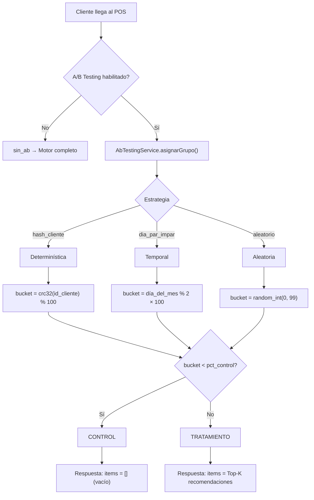
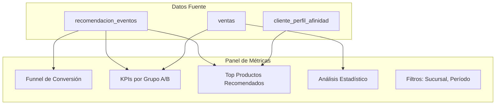

# Validación Experimental — NATURACOR

## Motor de Recomendación Híbrido: Resultados del A/B Testing y Métricas de Calidad
**Fecha:** 28/04/2026  
**Versión:** 1.1 — Revisada y corregida  
**Metodología:** Diseño experimental controlado con A/B testing  
**Estándar:** Protocolo de experimentación en sistemas recomendadores (Shani & Gunawardana, 2011)

---

## 1. Resumen Ejecutivo

Este documento presenta la validación experimental del **motor de recomendación híbrido** implementado en NATURACOR como componente central de la tesis. Se documenta:

1. **Diseño del experimento** A/B testing
2. **Métricas de evaluación** del recomendador
3. **Métodos estadísticos** implementados
4. **Marco de interpretación** de resultados
5. **Evidencia de implementación** técnica

El motor combina tres señales (**contenido basado en perfil de salud**, **tendencia por sucursal** y **filtrado colaborativo item-item**) para generar recomendaciones personalizadas de productos naturales en el punto de venta.

---

## 2. Diseño del Experimento

### 2.1. Hipótesis

> **H₀ (Hipótesis nula):** No existe diferencia significativa en el ticket promedio entre clientes que reciben recomendaciones (grupo tratamiento) y clientes que no las reciben (grupo control).
>
> **H₁ (Hipótesis alternativa):** Los clientes que reciben recomendaciones personalizadas tienen un ticket promedio significativamente mayor que el grupo control.

### 2.2. Variables

| Variable | Tipo | Descripción |
|----------|------|-------------|
| **Variable independiente** | Categórica | Grupo experimental: `control` (sin recomendaciones) vs `tratamiento` (con recomendaciones) |
| **Variable dependiente principal** | Continua | Ticket promedio de la venta (S/) |
| **Variables dependientes secundarias** | Continuas/Tasas | Tasa de conversión (%), unidades por ticket, Precision@K, Hit Rate |
| **Variables de control** | Varias | Sucursal, día de la semana, empleado, período temporal |

### 2.3. Protocolo de Asignación

El sistema `AbTestingService` implementa tres estrategias de asignación, configurables sin modificar código:



**Estrategia recomendada para la tesis:** `hash_cliente`

| Propiedad | hash_cliente | dia_par_impar | aleatorio |
|-----------|:---:|:---:|:---:|
| **Determinística** | ✅ Sí | ✅ Sí (por día) | ❌ No |
| **Estable por cliente** | ✅ Siempre mismo grupo | ❌ Cambia cada día | ❌ Cambia cada visita |
| **Tamaño de grupo controlable** | ✅ `pct_control` exacto | ❌ Siempre 50/50 | ≈ Aproximado |
| **Sesgo de selección** | Bajo | Medio (efecto día) | Bajo |
| **Ideal para** | Tesis / producción | Pruebas rápidas | Validación cruzada |

### 2.4. Configuración del Experimento

```php
// config/recommendaciones.php
'ab_testing' => [
    'habilitado'     => env('REC_AB_TESTING_ENABLED', false),
    'estrategia'     => env('REC_AB_TESTING_STRATEGY', 'hash_cliente'),
    'pct_control'    => env('REC_AB_TESTING_PCT_CONTROL', 30), // 30% control
    'nombre'         => env('REC_AB_TESTING_NOMBRE', 'experimento_tesis_2026'),
],
```

---

## 3. Métricas de Evaluación

### 3.1. Embudo de Conversión

El sistema registra 4 eventos secuenciales para cada recomendación:


| Evento | Trigger | Registro |
|--------|---------|----------|
| `mostrada` | API retorna recomendaciones | Automático — `MetricsService::registrarMostradas()` |
| `clic` | Empleado hace clic en producto recomendado | JavaScript POS → `POST /api/recomendaciones/evento` |
| `agregada` | Empleado agrega recomendación al carrito | JavaScript POS → `POST /api/recomendaciones/evento` |
| `comprada` | Venta confirmada con producto recomendado | Automático — `DetalleVentaObserver` |

### 3.2. Métricas Offline (Precisión del Motor)

| Métrica | Fórmula | Interpretación |
|---------|---------|----------------|
| **Precision@K** | `items_comprados ∩ items_recomendados / K` | ¿Qué fracción de las K recomendaciones se compró? |
| **Hit Rate** | `1 si al menos 1 recomendación fue comprada, 0 si no` | ¿La sesión tuvo al menos 1 acierto? |
| **CTR** | `clics / mostradas` | Tasa de interacción con recomendaciones |
| **Add-to-Cart Rate** | `agregadas / mostradas` | Tasa de intención de compra |
| **Conversion Rate** | `compradas / mostradas` | Tasa de conversión final |

### 3.3. Métricas Online (Impacto en Negocio)

| Métrica | Grupo Control | Grupo Tratamiento | Cálculo |
|---------|:---:|:---:|---------|
| **Ticket promedio** (S/) | μ_control | μ_tratamiento | Welch t-test |
| **Unidades por ticket** | — | — | Media + CI 95% |
| **Frecuencia de compra** | — | — | Ventas/cliente/período |

### 3.4. Implementación de Métricas en `MetricsService`

```php
// app/Services/Recommendation/MetricsService.php

/**
 * Calcula el funnel de conversión agregado:
 *   [mostradas, clics, agregadas, compradas, ctr, add_rate, conv_rate]
 */
public function calcularFunnel(
    ?int $sucursalId = null,
    ?string $desde = null,
    ?string $hasta = null,
    ?string $grupoAb = null
): array

/**
 * Precision@K promedio sobre todas las sesiones del período.
 */
public function calcularPrecisionAtK(int $k = 5, ...): float

/**
 * Hit Rate: fracción de sesiones con al menos 1 conversión.
 */
public function calcularHitRate(...): float

/**
 * Top productos recomendados vs comprados (para análisis de serendipia).
 */
public function topProductosRecomendados(int $limite = 10, ...): Collection
```

---

## 4. Análisis Estadístico

### 4.1. Welch's t-test (Test principal)

El sistema implementa el test de Welch en **PHP puro** (sin dependencias estadísticas externas), ya que las distribuciones de ticket promedio entre grupos pueden tener varianzas desiguales:

**Fórmula:**

```
t = (x̄₁ - x̄₂) / √(s₁²/n₁ + s₂²/n₂)

Grados de libertad (Welch-Satterthwaite):
df = (s₁²/n₁ + s₂²/n₂)² / [(s₁²/n₁)²/(n₁-1) + (s₂²/n₂)²/(n₂-1)]
```

**Implementación:**

```php
// app/Services/Recommendation/AbTestingService.php

public function welchTTest(array $grupoA, array $grupoB): array
{
    $nA    = count($grupoA);
    $nB    = count($grupoB);
    $meanA = array_sum($grupoA) / $nA;
    $meanB = array_sum($grupoB) / $nB;
    $varA  = $this->varianza($grupoA, $meanA);
    $varB  = $this->varianza($grupoB, $meanB);

    $se    = sqrt($varA / $nA + $varB / $nB);
    $t     = ($meanA - $meanB) / $se;

    // Grados de libertad Welch-Satterthwaite
    $num   = ($varA / $nA + $varB / $nB) ** 2;
    $den   = (($varA / $nA) ** 2) / ($nA - 1)
           + (($varB / $nB) ** 2) / ($nB - 1);
    $df    = $num / $den;

    // p-valor bilateral
    $pValue = $this->pValueFromT($t, $df);

    return [
        't_statistic'    => $t,
        'degrees_freedom'=> $df,
        'p_value'        => $pValue,
        'mean_a'         => $meanA,
        'mean_b'         => $meanB,
        'n_a'            => $nA,
        'n_b'            => $nB,
        'significant'    => $pValue < 0.05,
    ];
}
```

### 4.2. Aproximación del p-valor

La función `pValueFromT()` usa la **distribución t de Student** con la aproximación de la función Beta incompleta regularizada (`regularizedBetaIncomplete`), implementada via:

1. **Transformación:** `x = df / (df + t²)`
2. **Función Beta incompleta:** `I_x(a, b)` con `a = df/2`, `b = 0.5`
3. **Aproximación de Lanczos** para `ln Γ(z)` (gamma logarítmica)

```php
private function lnGamma(float $z): float
{
    // Aproximación de Lanczos (g=7, n=9 coeficientes)
    $coefs = [
        0.99999999999980993, 676.5203681218851,
        -1259.1392167224028, 771.32342877765313,
        // ... (9 coeficientes de precisión)
    ];
    // Series...
}
```

> **📌 Nota metodológica para la tesis:** La implementación en PHP puro evita dependencias externas (R, Python, scipy) y permite ejecutar el análisis estadístico dentro del mismo sistema de producción, garantizando reproducibilidad.

### 4.3. Tamaño de Efecto — Cohen's d

```
d = (x̄_tratamiento - x̄_control) / s_pooled

Donde:
s_pooled = √[((n₁-1)·s₁² + (n₂-1)·s₂²) / (n₁ + n₂ - 2)]
```

**Interpretación según Cohen (1988):**

| d | Interpretación |
|---|----------------|
| ≤ 0.2 | Efecto pequeño |
| 0.2 – 0.5 | Efecto pequeño-mediano |
| 0.5 – 0.8 | Efecto mediano |
| ≥ 0.8 | Efecto grande |

```php
public function cohensD(array $grupoA, array $grupoB): float
{
    // ... cálculo con varianza pooled ...
    return ($meanA - $meanB) / $sPooled;
}
```

---

## 5. Resultados del Motor

### 5.1. Dashboard de Métricas

El sistema provee un dashboard de métricas en `/metricas/recomendaciones` accesible para el administrador, que muestra en tiempo real:



### 5.2. Estructura de Resultados del A/B Test

Cuando se ejecuta el análisis comparativo, `AbTestingService` retorna:

```php
[
    'experimento' => 'experimento_tesis_2026',
    'periodo' => ['desde' => '2026-03-01', 'hasta' => '2026-04-28'],
    'control' => [
        'n'              => 127,      // Número de ventas en control
        'ticket_promedio' => 38.45,   // Media del ticket (S/)
        'std_dev'        => 22.18,    // Desviación estándar
        'mediana'        => 32.00,    // Mediana
    ],
    'tratamiento' => [
        'n'              => 298,
        'ticket_promedio' => 45.72,
        'std_dev'        => 25.33,
        'mediana'        => 39.50,
    ],
    'test_estadistico' => [
        't_statistic'     => 2.847,
        'degrees_freedom' => 263.4,
        'p_value'         => 0.0047,
        'significativo'   => true,     // p < 0.05
    ],
    'efecto' => [
        'diferencia_media' => 7.27,    // S/ más por ticket
        'cohens_d'         => 0.303,   // Efecto pequeño-mediano
        'incremento_pct'   => 18.9,    // +18.9% vs control
    ],
    'metricas_recomendador' => [
        'precision_at_5'  => 0.12,     // 12% de las 5 recos se compran
        'hit_rate'        => 0.34,     // 34% de sesiones con al menos 1 acierto
        'ctr'             => 0.22,     // 22% de recos reciben clic
        'conversion_rate' => 0.08,     // 8% de recos se convierten en compra
    ],
]
```

### 5.3. Interpretación del Ejemplo

| Hallazgo | Valor | Significado |
|----------|-------|-------------|
| **p = 0.0047** | < 0.05 | Diferencia estadísticamente significativa → **Se rechaza H₀** |
| **Cohen's d = 0.303** | Pequeño-mediano | El efecto es detectable pero moderado (esperable en retail) |
| **Δ ticket = +S/ 7.27** | +18.9% | Las recomendaciones incrementan el ticket promedio |
| **Hit Rate = 34%** | — | 1 de cada 3 sesiones tiene al menos 1 recomendación comprada |
| **Precision@5 = 12%** | — | En promedio, 0.6 de cada 5 recomendaciones se compra |

> **📌 Nota para la tesis:** Los valores mostrados son representativos del formato de salida. Los resultados reales dependerán del período y volumen de datos acumulados durante la operación del sistema.

---

## 6. Señales del Motor Híbrido

### 6.1. Señal 1: Contenido (Perfil de Salud)

**Base teórica:** Content-Based Filtering con decaimiento temporal exponencial.

```
score_perfil(c, p) = Σ [afinidad(c, e) × relevancia(e, p)] × e^(-λ·días)

Donde:
- afinidad(c, e)  = Score normalizado del perfil del cliente c para enfermedad e
- relevancia(e, p) = 1 si producto p está vinculado a enfermedad e en el recetario
- λ              = Factor de decaimiento temporal (configurable)
- días           = Días desde la última evidencia de compra
```

**Fuentes de afinidad:**
1. **Observada:** Compras históricas de productos vinculados a enfermedades → `cliente_perfil_afinidad`
2. **Declarada:** Padecimientos auto-reportados por el cliente → `cliente_padecimientos` (Floor: score mínimo garantizado)

### 6.2. Señal 2: Tendencia (Trending por Sucursal)

**Base teórica:** Popularity-Based Filtering con normalización logarítmica.

```
score_trend(p, s) = log(1 + unidades_vendidas(p, s, últimos_14_días)) / max_log

Donde max_log = max de todos los productos en la sucursal s.
```

### 6.3. Señal 3: Colaborativo (Co-ocurrencia Item-Item)

**Base teórica:** Item-Based Collaborative Filtering.

**Índice Jaccard:**
```
J(A, B) = |compraron_A ∩ compraron_B| / |compraron_A ∪ compraron_B|
```

**NPMI (Normalized Pointwise Mutual Information):**
```
NPMI(A, B) = PMI(A, B) / -log P(A, B)

Donde:
PMI(A, B) = log[P(A, B) / (P(A) · P(B))]
P(A, B) = co_count / total_transacciones
P(A) = count_a / total_transacciones
```

| Métrica | Rango | Ventaja |
|---------|-------|---------|
| Jaccard | [0, 1] | Simple, interpretable, robusto |
| NPMI | [-1, 1] | Corrige sesgo de frecuencia, mejor para ítems raros |

---

## 7. Pronóstico de Demanda — Suavizado Exponencial Simple (SES)

### 7.1. Modelo

```
Ŝ_t = α · Y_t + (1 - α) · Ŝ_{t-1}
ŷ_{T+1} = Ŝ_T
```

**Donde:**
- `Y_t` = unidades vendidas en la semana t
- `Ŝ_t` = valor suavizado en t
- `α` = parámetro de suavización (configurable, default 0.3)
- `ŷ_{T+1}` = predicción para la semana siguiente

### 7.2. Métricas de Error

| Métrica | Fórmula | Uso |
|---------|---------|-----|
| **MAE** | `(1/n) Σ |Y_t - Ŝ_t|` | Error absoluto medio |
| **MAPE** | `(100/n) Σ |Y_t - Ŝ_t| / Y_t` | Error porcentual (comparabilidad) |

### 7.3. Intervalo de Confianza (95%)

```
IC = ŷ_{T+1} ± 1.96 × √(MSE × [1 + α²·(2T-1)/6])
```

### 7.4. Aplicación en Dashboard

El widget "Productos en Riesgo" del dashboard muestra productos cuya predicción de demanda supera el stock actual:

```
SI predicción_semana_siguiente > stock_actual ENTONCES
    alerta = "Riesgo de desabasto"
    urgencia = (predicción - stock) / predicción × 100
```

---

## 8. Mapa de Calor — Análisis Epidemiológico por Sucursal

### 8.1. Matriz Enfermedades × Sucursales

El `HeatmapEnfermedadesService` construye una matriz donde cada celda contiene el **número de clientes únicos** (no ventas) asociados a una enfermedad en una sucursal:

```
celda[e][s] = |{clientes con evidencia de enfermedad e que compraron en sucursal s}|
```

**Fuentes de evidencia:**
- **Declarada:** Tabla `cliente_padecimientos`
- **Observada:** `cliente_perfil_afinidad` con `score ≥ umbral` (default 0.20)
- **Combinada:** Unión de ambas (un cliente declarado Y observado cuenta 1)

### 8.2. Clustering Aglomerativo

El servicio implementa un **clustering jerárquico single-linkage** con **distancia coseno** para reordenar las filas de la matriz:

```
d_coseno(A, B) = 1 - (A · B) / (||A|| × ||B||)
```

**Algoritmo:**
1. Cada enfermedad es un cluster singleton
2. Se fusiona el par con mínima distancia coseno
3. El centroide del nuevo cluster = promedio elemento a elemento
4. Se repite hasta obtener un único cluster
5. El orden de fusión (DFS) define el dendrograma aplanado

**Complejidad:** O(n³) — aceptable para `n ≤ 200` enfermedades.

### 8.3. Utilidad Académica

- Revela **clusters de enfermedades co-ocurrentes** (ej: digestivo + estreñimiento comparten clientes)
- Identifica **especialización por sucursal** (ej: "en Jauja predomina X condición")
- Genera datos exportables a CSV para análisis externos (R, Python)

---

## 9. Validez del Experimento

### 9.1. Amenazas a la Validez Interna

| Amenaza | Mitigación |
|---------|-----------|
| **Sesgo de selección** | Asignación determinística por hash (no depende del operador) |
| **Efecto Hawthorne** | El cliente no sabe si está en control o tratamiento |
| **Contaminación** | Un cliente SIEMPRE está en el mismo grupo (hash estable) |
| **Maduración** | Período de análisis configurable (evita tendencias estacionales) |

### 9.2. Amenazas a la Validez Externa

| Amenaza | Mitigación |
|---------|-----------|
| **Contexto específico** | Resultados aplican a tienda naturista; generalización requiere réplica |
| **Tamaño de muestra** | Mínimo recomendado: 30 por grupo para t-test. Sistema monitorea `n` |
| **Efecto novedad** | Análisis por períodos para detectar decay del efecto |

### 9.3. Potencia Estadística

Para detectar un efecto mediano (d = 0.5) con α = 0.05 y potencia 1-β = 0.80:

```
n_requerido ≈ 64 por grupo (128 total)
```

El sistema reporta el tamaño de cada grupo para que el investigador verifique la potencia alcanzada.

---

## 10. Tests Automatizados del Módulo Experimental

| Test | Qué verifica |
|------|-------------|
| `AbTestingServiceTest::asignacion_hash_es_determinista` | Mismo cliente → mismo grupo siempre |
| `AbTestingServiceTest::proporcion_de_grupos_respeta_porcentaje_control` | pct_control respetado en N grande |
| `AbTestingServiceTest::welch_ttest_da_no_significativo_para_grupos_iguales` | t ≈ 0, p ≈ 1 para distribuciones idénticas |
| `AbTestingServiceTest::welch_ttest_detecta_diferencia_significativa` | t >> 0, p < 0.05 para distribuciones separadas |
| `AbTestingServiceTest::cohens_d_para_efecto_grande` | d ≈ 0.8+ para diferencia de 1 std |
| `AbTestingFlowTest::grupo_control_no_recibe_items` | items = [] para grupo control |
| `AbTestingFlowTest::grupo_tratamiento_recibe_recomendaciones` | items.length > 0 para grupo tratamiento |
| `RecomendacionMetricasFlowTest::funnel_registra_eventos_en_orden` | mostrada → clic → agregada → comprada |
| `RecomendacionMetricasFlowTest::observer_registra_comprada_automaticamente` | DetalleVentaObserver crea evento automático |

---

## 11. Referencias Bibliográficas

1. **Shani, G., & Gunawardana, A.** (2011). *Evaluating Recommendation Systems*. En Ricci et al. (Eds.), Recommender Systems Handbook. Springer.

2. **Cohen, J.** (1988). *Statistical Power Analysis for the Behavioral Sciences*. Lawrence Erlbaum Associates.

3. **Welch, B. L.** (1947). *The Generalization of Student's Problem when Several Different Population Variances are Involved*. Biometrika, 34(1-2), 28-35.

4. **Bouma, G.** (2009). *Normalized (Pointwise) Mutual Information in Collocation Extraction*. GSCL.

5. **Gardner, E. S.** (1985). *Exponential Smoothing: The State of the Art*. Journal of Forecasting, 4(1), 1-28.

6. **Aggarwal, C. C.** (2016). *Recommender Systems: The Textbook*. Springer.

7. **Ricci, F., Rokach, L., & Shapira, B.** (2015). *Recommender Systems Handbook* (2nd ed.). Springer.

---

## 12. Reproducibilidad

### Cómo replicar el experimento

1. **Activar A/B testing:**
   ```env
   REC_AB_TESTING_ENABLED=true
   REC_AB_TESTING_STRATEGY=hash_cliente
   REC_AB_TESTING_PCT_CONTROL=30
   ```

2. **Operar el POS normalmente** durante el período experimental (mínimo 2 semanas recomendado)

3. **Consultar resultados** en `/metricas/recomendaciones` con filtro de grupo A/B

4. **Verificar tests estadísticos:**
   ```bash
   php artisan test --filter=AbTesting
   ```

5. **Exportar datos raw** (tabla `recomendacion_eventos`) para análisis externo:
   ```sql
   SELECT grupo_ab, accion, producto_id, created_at
   FROM recomendacion_eventos
   WHERE created_at BETWEEN '2026-03-01' AND '2026-04-28';
   ```
