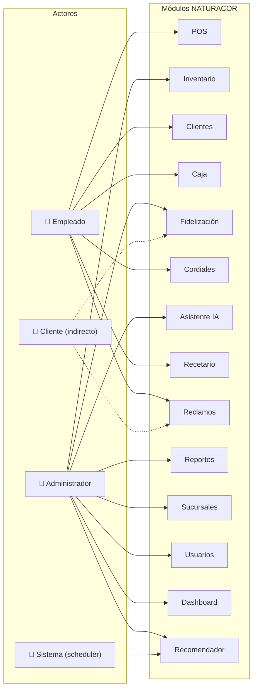
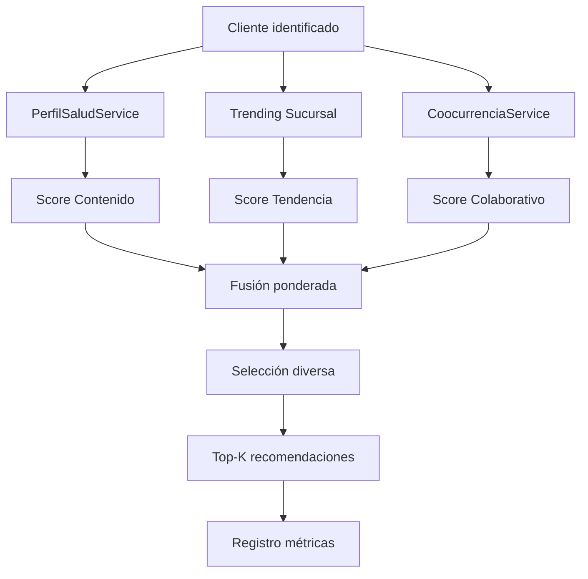

# Casos de Uso — NATURACOR

## Sistema Web de Punto de Venta y Gestión Integral
**Fecha:** 03/05/2026  
**Versión:** 1.2 — Reubicada en `05_especificacion/`  
**Estándar de referencia:** UML 2.5, ISO/IEC 25010 (Usabilidad)

---

## Tabla de Contenido

1. [Diagrama General de Actores](#1-diagrama-general-de-actores)
2. [CU-001: Registrar Venta en POS](#cu-001-registrar-venta-en-pos)
3. [CU-002: Registrar Cliente](#cu-002-registrar-cliente)
4. [CU-003: Abrir y Cerrar Caja](#cu-003-abrir-y-cerrar-caja)
5. [CU-004: Consultar Recomendaciones](#cu-004-consultar-recomendaciones-del-sistema)
6. [CU-005: Registrar Venta de Cordial](#cu-005-registrar-venta-de-cordial)
7. [CU-006: Gestionar Fidelización](#cu-006-gestionar-fidelización)
8. [CU-007: Generar Reporte de Ventas](#cu-007-generar-reporte-de-ventas)
9. [CU-008: Registrar Reclamo](#cu-008-registrar-reclamo)
10. [CU-009: Consultar Recetario](#cu-009-consultar-recetario)
11. [CU-010: Consultar IA de Negocio](#cu-010-consultar-ia-de-negocio)
12. [CU-011: Gestionar Inventario](#cu-011-gestionar-inventario)
13. [CU-012: Administrar Sucursales y Usuarios](#cu-012-administrar-sucursales-y-usuarios)

---

## 1. Diagrama General de Actores

---

## CU-001: Registrar Venta en POS

| Campo | Descripción |
|-------|-------------|
| **ID** | CU-001 |
| **Nombre** | Registrar Venta en Punto de Venta |
| **Actor(es)** | Empleado |
| **Precondiciones** | 1. El empleado ha iniciado sesión. 2. Tiene una caja abierta. |
| **Postcondiciones** | 1. Se registra la venta en BD. 2. Se descuenta el stock. 3. Se genera número de boleta. 4. Se actualiza la caja. 5. Se evalúa fidelización. |
| **Prioridad** | Alta |
| **Requerimientos asociados** | REQ-POS-001 a REQ-POS-012 |

### Flujo Principal

| Paso | Actor | Sistema |
|------|-------|---------|
| 1 | El empleado accede a `/ventas/pos` | Muestra la interfaz POS con buscador de productos y carrito vacío |
| 2 | Escribe el nombre o escanea código de barras | Muestra productos coincidentes con precio (IGV incluido) y stock |
| 3 | Selecciona producto(s) y cantidad | Agrega al carrito, calcula subtotal y total en tiempo real |
| 4 | (Opcional) Busca cliente por DNI | Muestra datos del cliente y acumulado de fidelización |
| 5 | (Opcional) Agrega cordiales rápidos | Suma cordiales al total de la venta |
| 6 | Selecciona método de pago (efectivo/Yape/Plin) | Habilita botón de confirmar |
| 7 | Presiona "Confirmar Venta" | Ejecuta transacción: crea `Venta`, `DetalleVenta`, cordiales; descuenta stock; actualiza caja; evalúa fidelización; genera boleta |
| 8 | — | Retorna JSON con `venta_id`, `numero_boleta`, premios generados y promos aplicadas |
| 9 | (Opcional) Imprime boleta o la comparte | Genera PDF/ticket/WhatsApp link |

### Flujos Alternativos

| ID | Condición | Acción |
|----|-----------|--------|
| FA-1 | Stock insuficiente para un producto | Muestra error "Stock insuficiente para {nombre}" y revierte la transacción (`rollback`) |
| FA-2 | No hay caja abierta | Muestra advertencia en la interfaz POS |
| FA-3 | Cliente alcanza umbral S/500 | Genera automáticamente `FidelizacionCanje` y notifica "Premio generado" |
| FA-4 | Cordial litro puro S/80 | Crea automáticamente 1 toma `llevar_s5` gratis (promo) |
| FA-5 | Carrito vacío (sin items ni cordiales) | Retorna error 422: "Agrega al menos un producto" |

---

## CU-002: Registrar Cliente

| Campo | Descripción |
|-------|-------------|
| **ID** | CU-002 |
| **Nombre** | Registrar Nuevo Cliente |
| **Actor(es)** | Empleado, Administrador |
| **Precondiciones** | El actor ha iniciado sesión |
| **Postcondiciones** | Se crea registro de cliente con acumulado en 0 |
| **Prioridad** | Alta |
| **Requerimientos asociados** | REQ-CLI-001 a REQ-CLI-006 |

### Flujo Principal

| Paso | Actor | Sistema |
|------|-------|---------|
| 1 | Accede a `/clientes/create` o busca desde POS | Muestra formulario de registro |
| 2 | Ingresa DNI, nombre, apellido, teléfono | Valida unicidad del DNI en tiempo real |
| 3 | Presiona "Guardar" | Crea `Cliente` con `acumulado_naturales = 0` |
| 4 | — | Redirige al detalle del cliente con mensaje de éxito |

### Flujos Alternativos

| ID | Condición | Acción |
|----|-----------|--------|
| FA-1 | DNI ya existe | Muestra error "El DNI ya está registrado" |
| FA-2 | Registro desde POS (modal AJAX) | Retorna JSON con datos del cliente creado |
| FA-3 | Campos obligatorios vacíos | Muestra validación en el formulario |

### Flujo de Búsqueda por DNI (Sub-CU)

| Paso | Actor | Sistema |
|------|-------|---------|
| 1 | Ingresa DNI en buscador del POS | Envía request AJAX a `/api/clientes/dni?dni=...` |
| 2 | — | Retorna `{found: true, cliente: {...}}` o `{found: false}` |
| 3 | Si no se encontró, ofrece registrar | Muestra modal de registro rápido |

---

## CU-003: Abrir y Cerrar Caja

| Campo | Descripción |
|-------|-------------|
| **ID** | CU-003 |
| **Nombre** | Gestionar Sesión de Caja |
| **Actor(es)** | Empleado |
| **Precondiciones** | El empleado ha iniciado sesión |
| **Postcondiciones** | La sesión de caja queda registrada con apertura, movimientos, ventas y cierre |
| **Prioridad** | Alta |
| **Requerimientos asociados** | REQ-CAJA-001 a REQ-CAJA-006 |

### Flujo Principal — Apertura

| Paso | Actor | Sistema |
|------|-------|---------|
| 1 | Accede a `/caja` | Muestra panel de caja. Si hay sesión abierta, muestra resumen. |
| 2 | Ingresa monto inicial y presiona "Abrir Caja" | Valida que no tenga otra caja abierta. Crea `CajaSesion` con estado `abierta` |
| 3 | — | Muestra panel con totales iniciales en 0 |

### Flujo Principal — Operación

| Paso | Actor | Sistema |
|------|-------|---------|
| 1 | Registra movimiento (ingreso/egreso) | Crea `CajaMovimiento`, actualiza `total_esperado` |
| 2 | Realiza ventas desde el POS | Cada venta incrementa los totales por método de pago |
| 3 | — | Panel muestra totales en tiempo real: efectivo, Yape, Plin, otros |

### Flujo Principal — Cierre

| Paso | Actor | Sistema |
|------|-------|---------|
| 1 | Ingresa conteo real de efectivo | — |
| 2 | Presiona "Cerrar Caja" | Calcula `diferencia = monto_real - total_esperado` |
| 3 | — | Guarda `monto_real_cierre`, `diferencia`, `cierre_at`. Cambia estado a `cerrada` |
| 4 | — | Muestra resumen con diferencia (verde si ≥ 0, rojo si < 0) |

---

## CU-004: Consultar Recomendaciones del Sistema

| Campo | Descripción |
|-------|-------------|
| **ID** | CU-004 |
| **Nombre** | Consultar Recomendaciones Inteligentes |
| **Actor(es)** | Empleado (vía POS), Sistema (scheduler) |
| **Precondiciones** | Cliente identificado por DNI; producto(s) en recetario |
| **Postcondiciones** | Se muestran recomendaciones; se registran eventos de métricas |
| **Prioridad** | Alta (Tesis) |
| **Requerimientos asociados** | REQ-RECO-001 a REQ-RECO-009 |

### Flujo Principal

| Paso | Actor | Sistema |
|------|-------|---------|
| 1 | Empleado identifica al cliente en el POS | — |
| 2 | El POS llama a `GET /api/recomendaciones/{cliente}` | Motor híbrido evalúa 3 señales: **contenido** (perfil salud), **tendencia** (ventas recientes), **colaborativo** (co-ocurrencia con carrito) |
| 3 | — | Si A/B testing activo y cliente es `control`: retorna `items: []` |
| 4 | — | Registra eventos `mostrada` en `recomendacion_eventos` |
| 5 | Empleado sugiere producto al cliente | — |
| 6 | (Opcional) Empleado agrega producto al carrito | POS envía `POST /api/recomendaciones/evento` con acción `agregada` |
| 7 | Se confirma la venta | `DetalleVentaObserver` registra evento `comprada` si hay exposición previa |

### Señales del Motor

---

## CU-005: Registrar Venta de Cordial

| Campo | Descripción |
|-------|-------------|
| **ID** | CU-005 |
| **Nombre** | Registrar Venta de Cordial (Bebida Natural) |
| **Actor(es)** | Empleado |
| **Precondiciones** | Sesión iniciada; caja abierta |
| **Postcondiciones** | Cordial registrado; promos aplicadas si corresponde |
| **Prioridad** | Media |
| **Requerimientos asociados** | REQ-COR-001 a REQ-COR-005 |

### Flujo Principal

| Paso | Actor | Sistema |
|------|-------|---------|
| 1 | Accede al módulo de cordiales | Muestra catálogo de 9 tipos con precios |
| 2 | Selecciona tipo, cantidad y cliente | — |
| 3 | Confirma la venta | Crea `CordialVenta` con precio desde `CordialVenta::$precios` |
| 4 | — | Si es litro puro S/80: crea automáticamente 1 toma gratis |

---

## CU-006: Gestionar Fidelización

| Campo | Descripción |
|-------|-------------|
| **ID** | CU-006 |
| **Nombre** | Gestionar Premios de Fidelización |
| **Actor(es)** | Empleado, Sistema (automático) |
| **Precondiciones** | Cliente ha acumulado compras durante el período vigente |
| **Postcondiciones** | Premio registrado y/o entregado |
| **Prioridad** | Alta |

### Flujo Principal — Generación Automática

| Paso | Actor | Sistema |
|------|-------|---------|
| 1 | — (trigger: venta confirmada) | `FidelizacionService` calcula `floor(acumulado / umbral)` |
| 2 | — | Si hay premios faltantes: crea `FidelizacionCanje` con descripción del premio |
| 3 | — | VentaController retorna `premio_generado: true` al POS |

### Flujo Principal — Entrega

| Paso | Actor | Sistema |
|------|-------|---------|
| 1 | Accede a `/fidelizacion` | Muestra lista de premios pendientes |
| 2 | Ubica al cliente y confirma entrega | — |
| 3 | Presiona "Entregar" | Actualiza `entregado = true`, `entregado_at = now()` |

---

## CU-007: Generar Reporte de Ventas

| Campo | Descripción |
|-------|-------------|
| **ID** | CU-007 |
| **Actor(es)** | Administrador |
| **Precondiciones** | Existen ventas registradas |
| **Postcondiciones** | Se muestra reporte filtrado con totales |

### Flujo Principal

| Paso | Actor | Sistema |
|------|-------|---------|
| 1 | Accede a `/reportes` | Muestra formulario de filtros |
| 2 | Selecciona rango de fechas, sucursal, empleado, método de pago | — |
| 3 | Presiona "Generar" | Ejecuta query con filtros y muestra tabla de resultados con totales |
| 4 | (Opcional) Descarga boleta individual | Genera PDF optimizado para 80mm o ticket térmico |

---

## CU-008: Registrar Reclamo

| Campo | Descripción |
|-------|-------------|
| **ID** | CU-008 |
| **Actor(es)** | Empleado, Administrador |
| **Precondiciones** | Sesión iniciada |
| **Postcondiciones** | Reclamo registrado con estado `pendiente` |

### Flujo Principal

| Paso | Actor | Sistema |
|------|-------|---------|
| 1 | Accede a `/reclamos/create` | Muestra formulario |
| 2 | Ingresa cliente, descripción, tipo | — |
| 3 | Presiona "Registrar" | Crea `Reclamo` con estado `pendiente`, registra auditoría |
| 4 | (Admin) Escala reclamo | Cambia estado a `en_proceso` |
| 5 | (Admin) Resuelve reclamo | Registra resolución, cambia a `resuelto` |

---

## CU-009: Consultar Recetario

| Campo | Descripción |
|-------|-------------|
| **ID** | CU-009 |
| **Actor(es)** | Empleado, Administrador |
| **Precondiciones** | Existen enfermedades registradas con productos vinculados |
| **Postcondiciones** | Se muestra la información del recetario |

### Flujo Principal

| Paso | Actor | Sistema |
|------|-------|---------|
| 1 | Accede a `/recetario` | Muestra lista de enfermedades con búsqueda |
| 2 | Selecciona una enfermedad | Muestra productos recomendados con instrucciones de uso |
| 3 | (Admin) Crea/edita enfermedad y vincula productos | Almacena relación M:N con instrucciones y orden |

---

## CU-010: Consultar IA de Negocio

| Campo | Descripción |
|-------|-------------|
| **ID** | CU-010 |
| **Actor(es)** | Administrador, Empleado |
| **Precondiciones** | Sesión iniciada |
| **Postcondiciones** | Se muestra análisis generado por IA |

### Flujo Principal

| Paso | Actor | Sistema |
|------|-------|---------|
| 1 | Accede a `/ia` | Muestra interfaz de consulta |
| 2 | Escribe pregunta sobre el negocio | — |
| 3 | Presiona "Analizar" | Ejecuta cascada: **Groq** (Llama 3.3 70B) → **Gemini** (1.5 Flash) → **Modo offline** |
| 4 | — | Muestra respuesta formateada |

### Flujos Alternativos

| ID | Condición | Acción |
|----|-----------|--------|
| FA-1 | Groq falla (timeout/error) | Intenta con Gemini |
| FA-2 | Gemini también falla | Opera en modo offline con análisis local |
| FA-3 | Sin API keys configuradas | Funciona 100% offline |

---

## CU-011: Gestionar Inventario

| Campo | Descripción |
|-------|-------------|
| **ID** | CU-011 |
| **Actor(es)** | Administrador |
| **Precondiciones** | Sesión con rol admin |
| **Postcondiciones** | Producto creado/editado/eliminado |

### Flujo Principal

| Paso | Actor | Sistema |
|------|-------|---------|
| 1 | Accede a `/productos` | Muestra listado con stock, precio, alertas |
| 2 | Crea/edita producto | Valida campos obligatorios |
| 3 | (Opcional) Importa desde Excel | Procesa archivo con `ProductoController@importar` |
| 4 | (Opcional) Exporta catálogo | Genera Excel con `ProductoController@exportar` |
| 5 | — | Muestra alerta si `stock <= stock_minimo` |

---

## CU-012: Administrar Sucursales y Usuarios

| Campo | Descripción |
|-------|-------------|
| **ID** | CU-012 |
| **Actor(es)** | Administrador |
| **Precondiciones** | Sesión con rol `admin` |
| **Postcondiciones** | Sucursal/usuario creado, editado o desactivado |

### Flujo Principal

| Paso | Actor | Sistema |
|------|-------|---------|
| 1 | Accede a `/sucursales` o `/usuarios` | Muestra listado CRUD |
| 2 | Crea sucursal con nombre, dirección, RUC | — |
| 3 | Crea usuario con email, nombre, rol, sucursal asignada | Hashea contraseña con Bcrypt |
| 4 | — | Middleware `role:admin` bloquea acceso a empleados |
