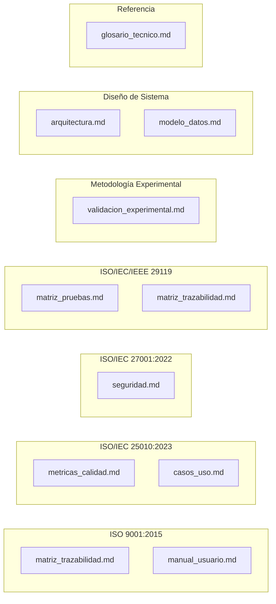

# Índice de Documentación — NATURACOR

## Sistema Web de Punto de Venta y Gestión Integral
**Fecha:** 03/05/2026  
**Versión:** 1.2 — Reorganizado en carpetas y sincronizado con el código (PHPUnit 11)  
**Total de documentos de contenido:** 19 · **Archivos `.md` en `doc/`:** 20 (incluye [README.md](README.md) de orientación)

---

## Organización por carpetas

La documentación se agrupa en **cinco carpetas temáticas** más este índice en la raíz de `doc/`:

| Carpeta | Propósito |
|---------|-----------|
| **`01_fundamentos/`** | Requerimientos del sistema y análisis técnico previo a la implementación. |
| **`02_diseno_arquitectura/`** | Arquitectura de software, modelo de datos, seguridad y métricas de calidad ISO 25010. |
| **`03_pruebas_calidad/`** | Plan de pruebas, matrices, validación experimental, enfoques TDD y BDD. |
| **`04_operacion_despliegue/`** | Manual de usuario, guías técnicas/de despliegue y roadmap. |
| **`05_especificacion/`** | Casos de uso UML y glosario técnico. |

---

## Documentación del Proyecto

La documentación del proyecto NATURACOR se organiza en **3 categorías** que cubren todos los aspectos requeridos para evaluación académica de nivel tesis.

---

## 1. Documentos Fundacionales (Previos)

| # | Ruta | Contenido | Páginas est. |
|---|------|-----------|:---:|
| 1 | `01_fundamentos/Documento_Requerimientos_NATURACOR.md` | 72 requerimientos funcionales + no funcionales, historias de usuario, reglas de negocio | ~25 |
| 2 | `01_fundamentos/Analisis_Tecnico_NATURACOR.md` | Análisis técnico del sistema, stack, decisiones de diseño | ~10 |
| 3 | `03_pruebas_calidad/Plan_de_Pruebas_NATURACOR.md` | Plan maestro de pruebas y estrategia de testing | ~15 |
| 4 | `04_operacion_despliegue/guia_tecnica_naturacor.md` | Guía técnica de desarrollo y contribución | ~12 |
| 5 | `04_operacion_despliegue/guia_despliegue_produccion.md` | Guía de despliegue en Railway.app y producción | ~10 |
| 6 | `04_operacion_despliegue/roadmap_produccion.md` | Roadmap de desarrollo a futuro | ~8 |

---

## 2. Documentos Técnicos de Tesis (Nuevos v1.1+)

Documentos generados y validados contra el código fuente (métricas de pruebas verificadas el **03/05/2026** con `vendor/bin/phpunit`: **350 tests**, **113** Unit, **237** Feature, **1347** aserciones).

| # | Ruta | Norma ISO | Contenido | Páginas est. |
|---|------|-----------|-----------|:---:|
| 7 | `03_pruebas_calidad/matriz_trazabilidad.md` | ISO 9001, ISO 29119 | 72 requerimientos → componentes → tests automatizados → resultado | ~15 |
| 8 | `05_especificacion/casos_uso.md` | UML 2.5, ISO 25010 | 12 casos de uso con flujos, actores y diagramas Mermaid | ~12 |
| 9 | `02_diseno_arquitectura/modelo_datos.md` | — | 21 tablas + 34 migraciones, ER diagram, relaciones, campos | ~15 |
| 10 | `02_diseno_arquitectura/arquitectura.md` | — | Diagrama multi-capa, flujo de venta (sequence diagram), motor de recomendación, patrones de diseño, scheduler | ~14 |
| 11 | `02_diseno_arquitectura/seguridad.md` | ISO 27001, OWASP Top 10 | RBAC, CSRF, Bcrypt, validación, auditoría, gestión de sesiones | ~12 |
| 12 | `02_diseno_arquitectura/metricas_calidad.md` | ISO/IEC 25010 | 8 características de calidad evaluadas con métricas cuantitativas | ~14 |
| 13 | `03_pruebas_calidad/matriz_pruebas.md` | ISO/IEC/IEEE 29119 | 350 tests en 52 archivos activos, detalle por módulo, CI/CD | ~14 |
| 14 | `03_pruebas_calidad/validacion_experimental.md` | Shani & Gunawardana | Diseño A/B, Welch t-test, Cohen's d, Precision@K, SES, heatmap, reproducibilidad, referencias bibliográficas | ~18 |
| 15 | `04_operacion_despliegue/manual_usuario.md` | ISO 9001 | Guía operativa paso a paso de 13 módulos + FAQ | ~12 |
| 16 | `05_especificacion/glosario_tecnico.md` | — | 40+ acrónimos, 100+ definiciones técnicas organizadas por categoría | ~6 |
| 17 | `indice_documentacion.md` | — | **Este documento** — Índice maestro de toda la documentación | ~4 |
| 18 | `03_pruebas_calidad/enfoque_tdd_naturacor.md` | — | TDD: ciclo Red–Green–Refactor, Unit/Feature, capas, CI/CD, trazabilidad con REQ | ~8 |
| 19 | `03_pruebas_calidad/enfoque_bdd_naturacor.md` | — | BDD: actores, casos de uso, escenarios tipo Gherkin, Feature tests como especificación ejecutable | ~8 |

---

## 3. Mapa de Cobertura por Norma ISO

> **Nota:** Los archivos anteriores residen en las subcarpetas `02_diseno_arquitectura/`, `03_pruebas_calidad/`, `04_operacion_despliegue/` y `05_especificacion/` según la tabla de la sección 2.

---

## 4. Orden de Lectura Sugerido

Para evaluadores académicos (jurados de tesis), se recomienda el siguiente orden (rutas relativas a `doc/`):

1. **`01_fundamentos/Documento_Requerimientos_NATURACOR.md`** — Entender qué hace el sistema
2. **`02_diseno_arquitectura/arquitectura.md`** — Entender cómo está construido
3. **`02_diseno_arquitectura/modelo_datos.md`** — Entender la estructura de datos
4. **`05_especificacion/casos_uso.md`** — Entender los flujos de usuario
5. **`03_pruebas_calidad/validacion_experimental.md`** — Evaluar la metodología experimental
6. **`02_diseno_arquitectura/metricas_calidad.md`** — Verificar los criterios ISO 25010
7. **`03_pruebas_calidad/matriz_trazabilidad.md`** — Verificar cobertura req → test
8. **`03_pruebas_calidad/matriz_pruebas.md`** — Auditar los 350 tests automatizados
9. **`02_diseno_arquitectura/seguridad.md`** — Verificar controles ISO 27001/OWASP
10. **`04_operacion_despliegue/manual_usuario.md`** — Verificar usabilidad
11. **`05_especificacion/glosario_tecnico.md`** — Consulta rápida de términos
12. **`03_pruebas_calidad/enfoque_tdd_naturacor.md`** — Metodología TDD aplicada al código y a la suite PHPUnit
13. **`03_pruebas_calidad/enfoque_bdd_naturacor.md`** — Comportamiento del sistema desde negocio y casos de uso

---

## 5. Estadísticas Globales de la Documentación

| Métrica | Valor |
|---------|-------|
| **Archivos de documentación** | 20 (19 técnicos + README de carpeta) |
| **Carpetas temáticas** | 5 (`01` … `05`) + índice en raíz |
| **Diagramas Mermaid** | 27+ (ER, sequence, flow, pie, mindmap, gantt) |
| **Tablas estructuradas** | 80+ |
| **Normas ISO cubiertas** | 4 (9001, 25010, 27001, 29119) |
| **Referencias bibliográficas** | 7+ (en validación experimental) |
| **Requerimientos documentados** | 72 funcionales + 15 no funcionales |
| **Tests documentados (estado repo 03/05/2026)** | **350** (113 Unit + 237 Feature) |
| **Modelos documentados** | 21 |
| **Controladores de dominio** | 18 (+ 10 auth Breeze bajo `Auth/`) |
| **Servicios documentados** | 9 |
| **Casos de uso** | 12 |
| **Términos del glosario** | 100+ |
