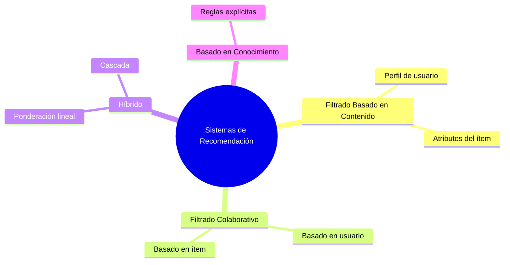
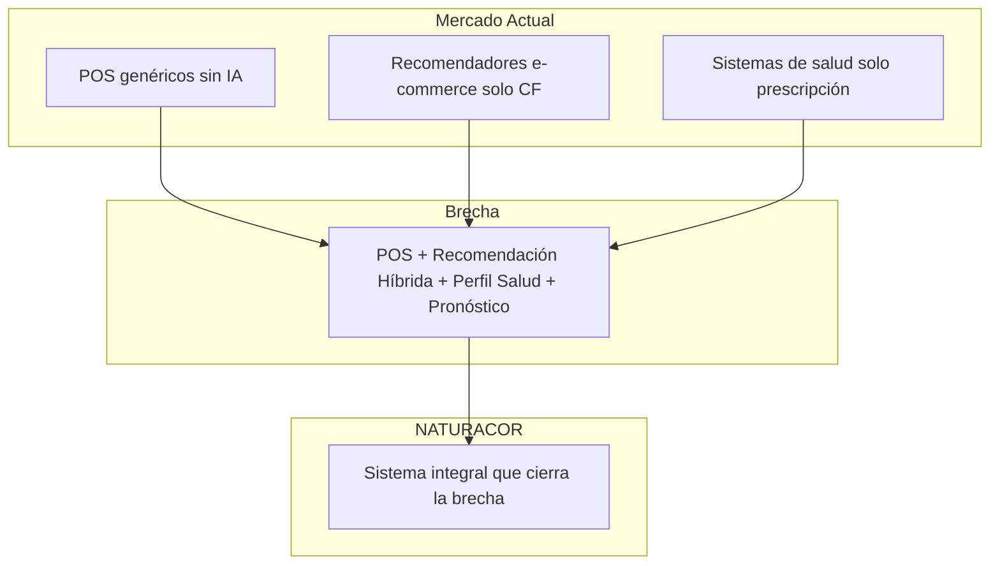

# Estado del Arte — NATURACOR

## Revisión de Literatura y Análisis Comparativo
**Fecha:** 09/05/2026  
**Versión:** 1.0  
**Autores:** Bendezu Lagos J., Reyes Cordero Í., Julca Laureano D.  
**Curso:** Pruebas y Calidad de Software — 7mo ciclo

---

## 1. Introducción

Este documento presenta el estado del arte del proyecto NATURACOR, un sistema web integral para tiendas naturistas con motor de recomendación híbrido e IA. Se analizan antecedentes teóricos, soluciones existentes, vacíos de conocimiento y la contribución diferenciadora.

### 1.1. Contexto del Problema

Las tiendas naturistas en el Perú (particularmente en Jauja, Junín) operan con sistemas manuales o genéricos que no consideran la relación entre **condiciones de salud del cliente** y **productos naturales recomendados**, generando:

- Pérdida de oportunidades de venta cruzada
- Gestión reactiva del inventario sin predicción de demanda
- Falta de evidencia científica sobre estrategias de venta
- Desconexión entre el recetario tradicional y la venta

---

## 2. Sistemas POS Existentes

### 2.1. Soluciones Comerciales

| Sistema | Recomendación | Predicción | Perfil Salud | Precio |
|---------|:---:|:---:|:---:|--------|
| **Vend (Lightspeed)** | ❌ | ❌ | ❌ | $89/mes+ |
| **Square POS** | Básica | ❌ | ❌ | Gratis + comisión |
| **Shopify POS** | Básica (CF) | ❌ | ❌ | $39/mes+ |
| **Odoo POS** | ❌ | ❌ | ❌ | Gratis (community) |

**Brecha:** Ningún POS comercial combina recomendación basada en perfil de salud con punto de venta para retail naturista.

### 2.2. Soluciones Especializadas

| Sistema | País | Limitación |
|---------|------|------------|
| **NaturalSoft** | España | Sin recomendación inteligente |
| **iHerb** | EE.UU. | Solo CF por compras, sin perfil clínico |
| **Fullscript** | Canadá | Enfocado en prescripción, no POS |

---

## 3. Sistemas de Recomendación — Fundamentos

### 3.1. Taxonomía



### 3.2. Content-Based Filtering (CB)

Según Aggarwal (2016), recomienda ítems similares a los consumidos, basándose en atributos.

**En NATURACOR:** perfil del cliente con decaimiento exponencial `peso = cantidad × e^(-λ · días)` y compensación por grado del producto (análogo a IDF).

### 3.3. Collaborative Filtering (CF)

Ricci et al. (2015): recomienda basándose en patrones compartidos entre usuarios.

**En NATURACOR:** Item-Item CF con Jaccard `J(A,B) = |compras_A ∩ compras_B| / |compras_A ∪ compras_B|` + NPMI (Bouma, 2009).

### 3.4. Enfoque Híbrido de NATURACOR

Fusión lineal ponderada (Burke, 2002):

```
score_final(c, p) = w₁·score_perfil + w₂·score_trending + w₃·score_coocurrencia
```

### 3.5. Perfil Declarado vs. Observado — Contribución Original

| Tipo | Fuente | Sistemas que lo usan |
|------|--------|---------------------|
| **Observado** | Historial de compras | Amazon, Netflix, Spotify |
| **Declarado** | Auto-reportado | Fullscript, apps de salud |
| **Combinado** | Ambas fuentes fusionadas | **NATURACOR** (aporte original) |

---

## 4. Pronóstico de Demanda en Retail

| Modelo | Complejidad | Estacionalidad | Uso |
|--------|:-----------:|:--------------:|-----|
| **SES** | Baja | ❌ | **NATURACOR** (Gardner, 1985) |
| **Holt-Winters** | Media-Alta | ✅ | Mejora futura |
| **ARIMA/SARIMA** | Alta | ✅ | Requiere R/Python |

**Justificación de SES:** implementable en PHP puro, suficiente para ~200 productos, transparente para el usuario final.

---

## 5. Análisis de Brechas (Gap Analysis)



---

## 6. Comparación con Trabajos Relacionados

| Criterio | Amazon | Netflix | iHerb | **NATURACOR** |
|----------|:---:|:---:|:---:|:---:|
| Filtrado colaborativo | ✅ | ✅ | ✅ | ✅ Jaccard+NPMI |
| Content-based | ❌ | ❌ | ❌ | ✅ Perfil salud |
| Perfil declarado | ❌ | ❌ | Parcial | ✅ Padecimientos |
| A/B Testing integrado | ✅ | ✅ | ❌ | ✅ Welch |
| Predicción demanda | ✅ ML | N/A | ❌ | ✅ SES |
| POS físico | ❌ | ❌ | ❌ | ✅ Barcode |
| Open source | ❌ | ❌ | ❌ | ✅ MIT |

---

## 7. Contribuciones Originales

1. **Fusión de perfil declarado + observado** con decaimiento exponencial para productos naturales
2. **Motor híbrido 3 señales** integrado a POS físico con pesos ajustables
3. **A/B testing en PHP puro** con Welch t-test y Cohen's d en retail PYME real
4. **Pronóstico SES** materializado para prevención de quiebre de stock
5. **Mapa de calor epidemiológico** con clustering jerárquico por sucursal
6. **350+ tests automatizados** con CI/CD y documentación ISO

---

## 8. Referencias Bibliográficas

1. **Aggarwal, C. C.** (2016). *Recommender Systems: The Textbook*. Springer.
2. **Bouma, G.** (2009). *Normalized (Pointwise) Mutual Information in Collocation Extraction*. GSCL.
3. **Burke, R.** (2002). *Hybrid Recommender Systems: Survey and Experiments*. UMUAI, 12(4), 331-370.
4. **Cohen, J.** (1988). *Statistical Power Analysis for the Behavioral Sciences*. LEA.
5. **Gardner, E. S.** (1985). *Exponential Smoothing: The State of the Art*. J. of Forecasting, 4(1), 1-28.
6. **Koren, Y., Bell, R., & Volinsky, C.** (2009). *Matrix Factorization Techniques for Recommender Systems*. Computer, 42(8).
7. **Linden, G., Smith, B., & York, J.** (2003). *Amazon.com Recommendations*. IEEE Internet Computing, 7(1).
8. **Ricci, F., Rokach, L., & Shapira, B.** (2015). *Recommender Systems Handbook* (2nd ed.). Springer.
9. **Shani, G., & Gunawardana, A.** (2011). *Evaluating Recommendation Systems*. Springer.
10. **Welch, B. L.** (1947). *The Generalization of Student's Problem*. Biometrika, 34(1-2).
11. **ISO/IEC 25010:2023**, **ISO/IEC/IEEE 29119:2022**, **ISO/IEC 27001:2022**.
