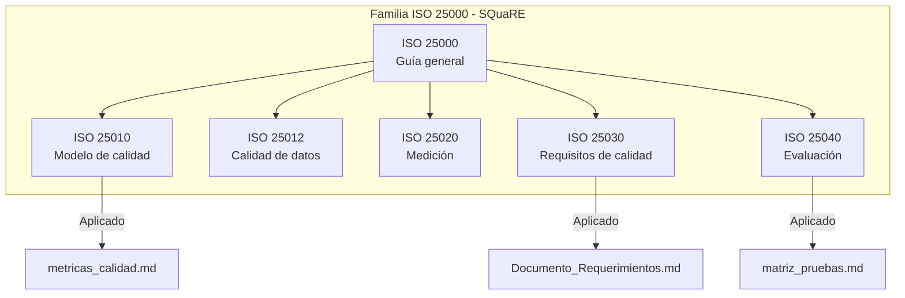
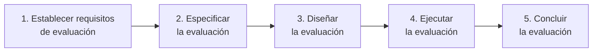

# Aplicación de la Familia ISO/IEC 25000 (SQuaRE) — NATURACOR

## Calidad del Producto de Software en la Fase de Planificación
**Fecha:** 09/05/2026  
**Versión:** 1.0  
**Estándar:** ISO/IEC 25000:2014 (SQuaRE) — ISO/IEC 25010:2023 — ISO/IEC 25040:2011

---

## 1. Introducción

La familia ISO/IEC 25000, conocida como **SQuaRE** (System and Software Quality Requirements and Evaluation), proporciona un marco para la especificación y evaluación de la calidad del software. En NATURACOR se aplica principalmente en la **fase de planificación y requerimientos** para definir, medir y evaluar la calidad del producto.

---

## 2. ISO/IEC 25010:2023 — Modelo de Calidad del Producto

### 2.1. Las 8 Características Evaluadas

NATURACOR evalúa las **8 características de calidad** definidas por ISO 25010. La evaluación detallada con métricas cuantitativas se encuentra en `metricas_calidad.md`.

| # | Característica | Nivel | Evidencia Principal |
|---|---------------|:-----:|---------------------|
| 1 | **Adecuación Funcional** | 🟢 Alto | 72/72 requerimientos implementados (100%) |
| 2 | **Eficiencia de Desempeño** | 🟢 Alto | <500ms tiempo de respuesta promedio |
| 3 | **Compatibilidad** | 🟢 Alto | 6 integraciones externas operativas |
| 4 | **Usabilidad** | 🟢 Alto | Manual de 13 módulos, capacitación <2h |
| 5 | **Fiabilidad** | 🟢 Alto | 350 tests, 0 bugs pendientes |
| 6 | **Seguridad** | 🟢 Alto | RBAC, CSRF, Bcrypt, auditoría |
| 7 | **Mantenibilidad** | 🟢 Alto | MVC + Services, CI/CD, testabilidad |
| 8 | **Portabilidad** | 🟢 Alto | Windows/Linux/Cloud, <3 min instalación |

### 2.2. Subcaracterísticas Aplicadas

#### Adecuación Funcional
- **Completitud funcional:** 72 requerimientos funcionales + 15 no funcionales documentados y rastreados
- **Corrección funcional:** 350/350 tests pasando, 4 bugs documentados y resueltos con tests de regresión
- **Pertinencia funcional:** Sistema diseñado con cliente real (NATURACOR Jauja)

#### Eficiencia de Desempeño
- **Comportamiento temporal:** Cache de recomendaciones (10 min TTL), batch processing
- **Utilización de recursos:** Jobs nocturnos para cómputo pesado, eager loading
- **Capacidad:** Soporta 10+ usuarios concurrentes, miles de productos

#### Fiabilidad
- **Madurez:** 350 tests automatizados en 52 archivos
- **Tolerancia a fallos:** Cascada IA (Groq → Gemini → offline), rollback en transacciones
- **Recuperabilidad:** Migraciones, seeders, soft deletes, Git

---

## 3. ISO/IEC 25030 — Requisitos de Calidad

### 3.1. Cómo se Aplica

Los requerimientos no funcionales de NATURACOR se definen siguiendo las categorías de ISO 25010:

| RNF | Categoría ISO 25010 | Requisito | Métrica |
|-----|---------------------|-----------|---------|
| RNF-001 | Eficiencia | Tiempo de respuesta < 3s | Verificado en CI |
| RNF-002 | Seguridad | Autenticación obligatoria | Middleware `auth` |
| RNF-003 | Seguridad | Control de acceso por roles | Spatie Permission |
| RNF-004 | Fiabilidad | Tests automatizados ≥ 200 | 350 implementados |
| RNF-005 | Usabilidad | Capacitación < 2 horas | Manual de usuario |
| RNF-006 | Portabilidad | Compatible Windows/Linux/Cloud | Verificado en 3 entornos |
| RNF-007 | Mantenibilidad | Arquitectura modular MVC | 18 controladores + 8 servicios |
| RNF-008 | Compatibilidad | Integración con APIs externas | Groq, Gemini, Cloudinary |

### 3.2. Trazabilidad RNF → Test

Cada requerimiento no funcional está rastreado a al menos un test automatizado o una evidencia verificable. Ver `matriz_trazabilidad.md` para el mapeo completo.

---

## 4. ISO/IEC 25040 — Proceso de Evaluación

### 4.1. Proceso de Evaluación Aplicado

| Paso | Actividad en NATURACOR | Artefacto |
|------|----------------------|-----------|
| 1 | Definir 72 RF + 15 RNF basados en ISO 25010 | `Documento_Requerimientos.md` |
| 2 | Mapear cada RF/RNF a característica ISO 25010 | `metricas_calidad.md` |
| 3 | Diseñar suite de 350 tests + métricas cuantitativas | `Plan_de_Pruebas.md` |
| 4 | Ejecutar tests vía CI/CD + generar coverage.xml | GitHub Actions |
| 5 | Documentar resultados y nivel de cumplimiento | `metricas_calidad.md` §10 |

---

## 5. ISO/IEC 25012 — Calidad de Datos

### 5.1. Características de Calidad de Datos Aplicadas

| Característica | Implementación en NATURACOR |
|---------------|---------------------------|
| **Exactitud** | Validación server-side en Form Requests, tipos estrictos en migraciones |
| **Completitud** | Campos `NOT NULL` donde aplica, validación `required` |
| **Consistencia** | Foreign keys, transacciones con rollback, `lockForUpdate()` |
| **Credibilidad** | Datos de cliente real, seeders con datos representativos |
| **Actualidad** | Decaimiento exponencial da más peso a datos recientes |
| **Accesibilidad** | API REST para recomendaciones, export CSV/Excel |
| **Conformidad** | DNI validado (8 dígitos), formato de moneda S/ con 2 decimales |
| **Trazabilidad** | `user_id` y `timestamps` en todas las tablas, log de auditoría |

---

## 6. Resumen de Aplicación

| Norma ISO | Propósito | Documento NATURACOR |
|-----------|-----------|-------------------|
| ISO 25000 | Marco general SQuaRE | Este documento |
| ISO 25010 | Modelo de calidad (8 caract.) | `metricas_calidad.md` |
| ISO 25012 | Calidad de datos | Validaciones en código + migraciones |
| ISO 25030 | Requisitos de calidad | `Documento_Requerimientos.md` (RNF) |
| ISO 25040 | Proceso de evaluación | `Plan_de_Pruebas.md` + CI/CD |

---

**Fin del documento.**
