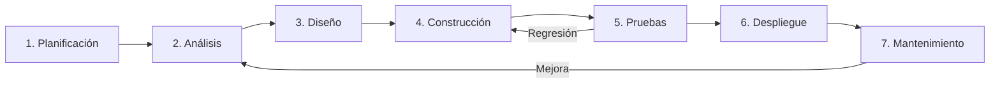
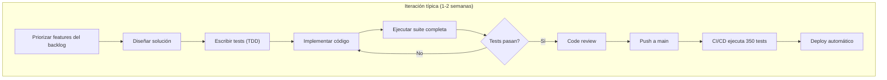

# Metodología General del Proyecto — NATURACOR

## Proceso de Desarrollo y Ciclo de Vida del Software
**Fecha:** 09/05/2026  
**Versión:** 1.0  
**Estándar base:** Ciclo de vida del software adaptado con prácticas ágiles

---

## 1. Enfoque Metodológico

NATURACOR adopta un enfoque **híbrido** que combina elementos de metodologías ágiles con la rigurosidad de estándares ISO para documentación académica:

| Componente | Metodología | Justificación |
|-----------|-------------|---------------|
| **Gestión del proyecto** | Kanban adaptado | Flujo continuo, tablero de tareas, priorización por valor |
| **Desarrollo** | Iterativo-incremental | Entregas funcionales cada 1-2 semanas |
| **Testing** | TDD + BDD | Calidad desde el diseño, no al final |
| **Documentación** | ISO 25000/29119/27000 | Rigor académico para tesis |
| **Despliegue** | CI/CD con GitHub Actions | Integración y entrega continua |

---

## 2. Ciclo de Vida del Proyecto

### 2.1. Fase 1 — Planificación y Requerimientos (ISO 25000)

| Actividad | Artefacto | Estado |
|-----------|-----------|--------|
| Levantamiento de requerimientos con la cliente | `Documento_Requerimientos_NATURACOR.md` | ✅ Completado |
| Definición de casos de uso UML | `casos_uso.md` | ✅ Completado |
| Revisión de literatura | `estado_del_arte.md` | ✅ Completado |
| Definición de métricas de calidad ISO 25010 | `metricas_calidad.md` | ✅ Completado |

**Técnicas utilizadas:**
- Entrevistas semi-estructuradas con la dueña del negocio (Anita María Cordero Campos)
- Observación directa de la operación en tienda (Jauja, Junín)
- Análisis de competidores y sistemas POS existentes
- Revisión sistemática de literatura en sistemas de recomendación

### 2.2. Fase 2 — Análisis y Diseño (ISO 25000 + ISO 29119)

| Actividad | Artefacto | Estado |
|-----------|-----------|--------|
| Diseño de arquitectura MVC + Services | `arquitectura.md` | ✅ Completado |
| Modelado de datos (21 tablas) | `modelo_datos.md` | ✅ Completado |
| Análisis técnico del stack | `Analisis_Tecnico_NATURACOR.md` | ✅ Completado |
| Diseño del motor de recomendación | `validacion_experimental.md` | ✅ Completado |

### 2.3. Fase 3 — Construcción (ISO 29119)

| Actividad | Artefacto | Estado |
|-----------|-----------|--------|
| Implementación del backend Laravel 12 | Código fuente en `app/` | ✅ Completado |
| Implementación del frontend Blade + Bootstrap | Código en `resources/views/` | ✅ Completado |
| Desarrollo de tests (TDD) | `tests/Unit/` + `tests/Feature/` | ✅ 350 tests |
| Plan de pruebas | `Plan_de_Pruebas_NATURACOR.md` | ✅ Completado |

### 2.4. Fase 4 — Pruebas y Validación (ISO 29119)

| Actividad | Artefacto | Estado |
|-----------|-----------|--------|
| Ejecución de suite de pruebas | CI/CD GitHub Actions | ✅ 350/350 passing |
| Matriz de trazabilidad req → test | `matriz_trazabilidad.md` | ✅ Completado |
| Validación experimental A/B | `validacion_experimental.md` | ✅ Completado |
| Análisis de cobertura | `coverage.xml` + SonarQube | ✅ Completado |

### 2.5. Fase 5 — Despliegue y Mantenimiento (ISO 27000)

| Actividad | Artefacto | Estado |
|-----------|-----------|--------|
| Despliegue en Railway.app | `guia_despliegue_produccion.md` | ✅ Completado |
| Manual de usuario | `manual_usuario.md` | ✅ 13 módulos |
| Controles de seguridad | `seguridad.md` | ✅ ISO 27001 + OWASP |
| Roadmap de mejoras | `roadmap_produccion.md` | ✅ Completado |

---

## 3. Roles del Equipo

| Integrante | Rol Principal | Responsabilidades |
|-----------|---------------|-------------------|
| **Bendezu Lagos Jack Joshua** | Líder de proyecto y desarrollo | Arquitectura, implementación del motor de recomendación, CI/CD, documentación técnica |
| **Reyes Cordero Ítalo Eduardo** | Desarrollo y QA | Implementación de módulos, aseguramiento de calidad, tests automatizados |
| **Julca Laureano Dickmar Wilber** | Análisis y pruebas | Requerimientos, análisis de datos, ejecución y documentación de pruebas |

**Cliente:** Anita María Cordero Campos — Propietaria de NATURACOR, Jauja, Junín, Perú.

---

## 4. Herramientas de Desarrollo

| Categoría | Herramienta | Propósito |
|-----------|------------|-----------|
| **IDE** | VS Code | Desarrollo principal |
| **Control de versiones** | Git + GitHub | Versionado y colaboración |
| **CI/CD** | GitHub Actions | Ejecución automática de tests |
| **Base de datos** | MySQL 8.0 (prod) / SQLite (test) | Persistencia de datos |
| **Framework** | Laravel 12 + PHP 8.2 | Backend |
| **Frontend** | Blade + Bootstrap 5.3 + Vite | Interfaz de usuario |
| **Testing** | PHPUnit 11.5 + Mockery | Pruebas automatizadas |
| **Calidad** | SonarQube / SonarCloud | Análisis estático y cobertura |
| **Documentación** | Markdown + Mermaid | Documentación técnica |
| **Despliegue** | Railway.app | Hosting en la nube |

---

## 5. Proceso de Desarrollo Iterativo

### 5.1. Definición de Hecho (Definition of Done)

Un feature se considera **terminado** cuando cumple:

- [ ] Código implementado siguiendo PSR-12 (Laravel Pint)
- [ ] Tests unitarios escritos y pasando
- [ ] Tests de integración escritos y pasando
- [ ] Sin regresiones en la suite existente (350 tests en verde)
- [ ] Documentación actualizada (si aplica)
- [ ] CI/CD en verde en GitHub Actions
- [ ] Revisión por al menos un compañero del equipo

---

## 6. Gestión de Configuración

### 6.1. Estrategia de Branching

- **`main`**: rama de producción, protegida con CI/CD obligatorio
- **`feature/*`**: ramas de desarrollo por funcionalidad
- **`hotfix/*`**: correcciones urgentes directas a main

### 6.2. Variables de Entorno

Toda configuración de negocio es externalizable vía `.env`:
- Parámetros de negocio (IGV, fidelización, umbrales)
- API keys de IA (Groq, Gemini) — opcionales
- Pesos del recomendador (`REC_PESO_PERFIL`, etc.)
- Configuración de A/B testing

---

## 7. Alineamiento con Normas ISO

| Fase del Ciclo de Vida | Norma ISO Principal | Documentos Asociados |
|----------------------|--------------------|--------------------|
| Planificación / Requerimientos | **ISO/IEC 25000** (SQuaRE) | Requerimientos, casos de uso, métricas de calidad |
| Diseño / Construcción / Pruebas | **ISO/IEC/IEEE 29119** | Plan de pruebas, matrices, TDD, BDD, validación |
| Mantenimiento / Seguridad | **ISO/IEC 27000** | Seguridad, despliegue, operación, manual |

---

**Fin del documento.**
