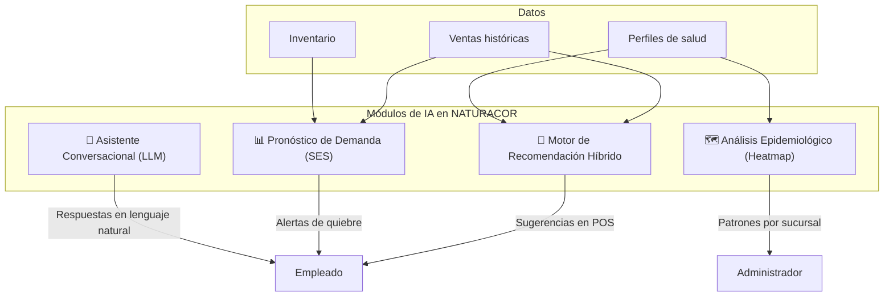
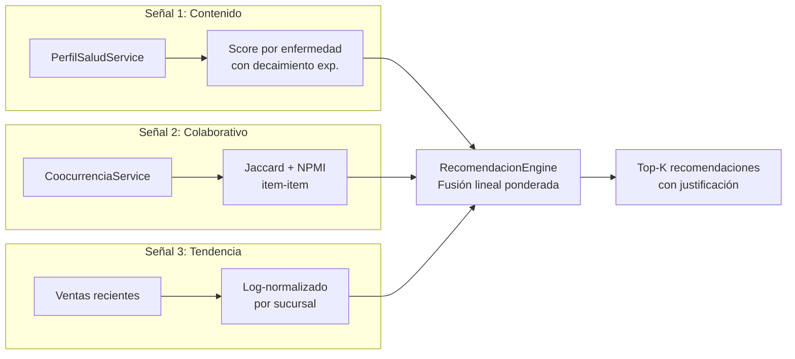
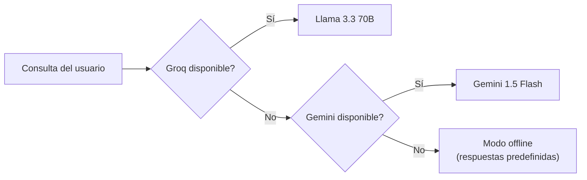
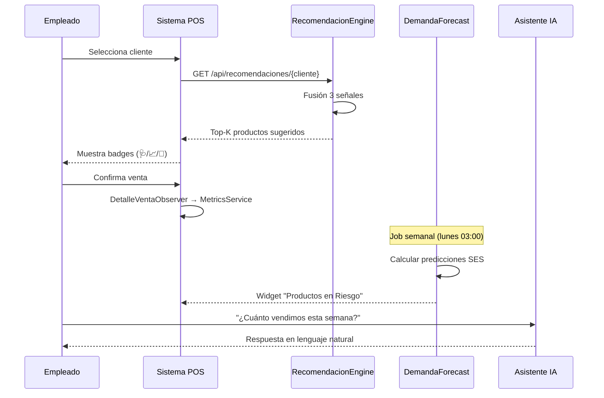

# Metodología de IA Aplicada — NATURACOR

## Inteligencia Artificial en el Sistema de Gestión Naturista
**Fecha:** 09/05/2026  
**Versión:** 1.0  
**Enfoque:** IA aplicada a retail naturista con validación experimental

---

## 1. Visión General

NATURACOR integra **cuatro módulos de inteligencia artificial** que operan de forma coordinada para optimizar la operación de la tienda naturista:



---

## 2. Módulo 1: Motor de Recomendación Híbrido

### 2.1. Descripción del Problema

¿Cómo sugerir productos naturales relevantes a un cliente en el punto de venta, considerando su historial de compras, sus condiciones de salud declaradas y las tendencias de la sucursal?

### 2.2. Metodología Aplicada

**Tipo de IA:** Sistema de recomendación híbrido (Content-Based + Collaborative Filtering + Popularity).

**Arquitectura del motor:**



### 2.3. Algoritmos Implementados

#### Decaimiento Exponencial (Perfil de Salud)
```
peso(compra) = cantidad × e^(-λ × días_desde_compra)
```
- **λ (lambda):** 0.008 (configurable vía `REC_LAMBDA`)
- **Ventana:** 365 días (`REC_VENTANA_DIAS`)
- **Justificación:** compras recientes son más relevantes que antiguas; el decaimiento exponencial es estándar en la literatura de sistemas de recomendación (Aggarwal, 2016)

#### Compensación por Grado del Producto
```
contribución(producto, enfermedad) = peso / grado(producto)
```
- **Analogía:** similar a IDF (Inverse Document Frequency) en TF-IDF
- **Efecto:** productos muy genéricos (vinculados a muchas enfermedades) reciben menos peso que productos específicos

#### Índice de Jaccard (Co-ocurrencia)
```
J(A, B) = |ventas_A ∩ ventas_B| / |ventas_A ∪ ventas_B|
```
- Materializado en tabla `producto_coocurrencia`
- Recalculado por job nocturno (`ReconstruirCoocurrenciaJob`)

#### NPMI (Información Mutua Normalizada)
```
NPMI(A, B) = log[P(A,B) / (P(A)·P(B))] / -log[P(A,B)]
```
- Complementa Jaccard corrigiendo sesgo de frecuencia (Bouma, 2009)
- Rango [-1, 1]: mejor para detectar asociaciones entre ítems raros

#### Fusión Lineal Ponderada
```
score_final = w₁·perfil + w₂·trending + w₃·coocurrencia
```
- Pesos configurables: `REC_PESO_PERFIL=1.0`, `REC_PESO_TRENDING=0.45`, `REC_PESO_COOCURRENCIA=0.35`
- **Normalización:** cada componente se normaliza a [0, 1] antes de la fusión

#### Diversificación por Enfermedad
- `seleccionarDiverso()`: evita que todas las recomendaciones sean de la misma enfermedad
- **Aporte original:** mejora la serendipia del sistema

### 2.4. Perfil Declarado + Observado

| Fuente | Método | Score |
|--------|--------|:-----:|
| **Compras históricas** (observado) | Decaimiento exp. + normalización min-max | Variable [0, 1] |
| **Padecimientos auto-reportados** (declarado) | Score base inyectado | 0.80 (configurable) |

**Innovación:** La fusión de señal declarada + observada permite que un **cliente nuevo** (sin historial de compras) reciba recomendaciones relevantes desde su primera visita, basándose en sus condiciones de salud declaradas.

### 2.5. Evaluación del Motor

| Métrica | Fórmula | Implementación |
|---------|---------|----------------|
| **Precision@K** | `comprados ∩ recomendados / K` | `MetricsService::calcularPrecisionAtK()` |
| **Hit Rate** | `1 si ≥1 acierto, 0 si no` | `MetricsService::calcularHitRate()` |
| **CTR** | `clics / mostradas` | Calculado en dashboard |
| **Conversión** | `compradas / mostradas` | Calculado en dashboard |
| **Ticket promedio** | `total_ventas / n_ventas` por grupo A/B | `AbTestingService` |

---

## 3. Módulo 2: Pronóstico de Demanda (SES)

### 3.1. Descripción del Problema

¿Cuántas unidades de cada producto se venderán la próxima semana? ¿Cuáles están en riesgo de quiebre de stock?

### 3.2. Metodología

**Tipo de IA:** Modelo de series temporales — Suavizado Exponencial Simple (Gardner, 1985).

```
Ŝ_t = α · Y_t + (1 - α) · Ŝ_{t-1}
```

| Parámetro | Valor Default | Configurable |
|-----------|:-----:|:---:|
| **α (alpha)** | 0.4 | `REC_FORECAST_ALPHA` |
| **Semanas de historia** | 16 | `REC_FORECAST_HISTORIA` |
| **Observaciones mínimas** | 8 | `REC_FORECAST_MIN_OBS` |

### 3.3. Métricas de Error

- **MAE:** `(1/n) Σ|Y_t - Ŝ_t|`
- **MAPE:** `(100/n) Σ|Y_t - Ŝ_t|/Y_t`
- **IC 95%:** `ŷ ± 1.96 × √(MSE × [1 + α²·(2T-1)/6])`

### 3.4. Aplicación en Dashboard

El widget "Productos en Riesgo" muestra los top-10 productos cuya predicción supera el stock actual, ordenados por urgencia.

---

## 4. Módulo 3: Análisis Epidemiológico (Mapa de Calor)

### 4.1. Descripción del Problema

¿Qué enfermedades prevalecen en cada sucursal? ¿Existen clusters de enfermedades co-ocurrentes?

### 4.2. Metodología

**Tipo de IA:** Clustering jerárquico aglomerativo (unsupervised learning).

- **Distancia:** Coseno `d(A,B) = 1 - (A·B)/(||A||×||B||)`
- **Linkage:** Single-linkage (mínima distancia entre clusters)
- **Resultado:** Dendrograma aplanado que reordena las filas del heatmap

### 4.3. Fuentes de Evidencia

| Fuente | Tabla | Tipo |
|--------|-------|------|
| **Declarada** | `cliente_padecimientos` | Auto-reportado |
| **Observada** | `cliente_perfil_afinidad` (score ≥ 0.20) | Inferido de compras |
| **Combinada** | Unión deduplicada | Ambas |

---

## 5. Módulo 4: Asistente Conversacional (LLM)

### 5.1. Descripción del Problema

¿Cómo permitir consultas de negocio en lenguaje natural sin requerir conocimientos técnicos?

### 5.2. Metodología

**Tipo de IA:** Large Language Models (LLM) con patrón de cascada (fallback).



**Principio de diseño:** El sistema **siempre** responde, incluso sin conexión a internet.

---

## 6. Cómo la IA se Aplica en el Flujo Operativo



---

## 7. Validación de la IA

| Módulo | Método de Validación | Tests Automatizados |
|--------|---------------------|:-------------------:|
| Recomendador | A/B Testing (Welch t-test) | 14 tests |
| Pronóstico SES | MAE / MAPE sobre histórico | 10 tests |
| Heatmap | Verificación visual + export CSV | 8 tests |
| Asistente LLM | Cascada de fallback | 6 tests |

---

**Fin del documento.**
