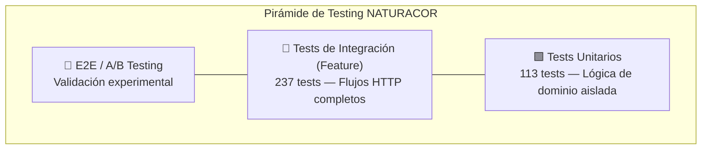
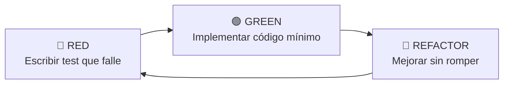
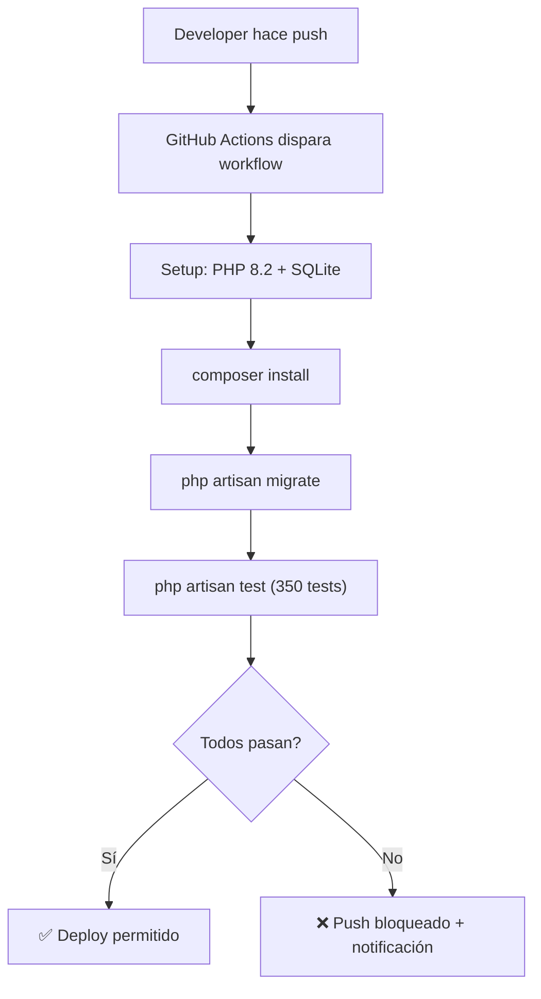

# Metodología de Pruebas — NATURACOR

## Estrategia, Técnicas y Procesos de Testing
**Fecha:** 09/05/2026  
**Versión:** 1.0  
**Estándar base:** ISO/IEC/IEEE 29119 — Proceso de pruebas de software

---

## 1. Visión General

NATURACOR aplica una estrategia de testing **multinivel** que combina tres enfoques complementarios, ejecutados de forma continua mediante CI/CD:



| Nivel | Cantidad | Framework | Enfoque |
|-------|:--------:|-----------|---------|
| **Unitario** | 113 | PHPUnit 11.5 | TDD — Lógica de modelos, cálculos, servicios |
| **Integración (Feature)** | 237 | PHPUnit 11.5 | BDD — Flujos HTTP, roles, transacciones |
| **Experimental** | A/B Testing | AbTestingService | Welch t-test, Cohen's d |
| **Total** | **350** | — | — |

---

## 2. Test-Driven Development (TDD)

### 2.1. Ciclo Red-Green-Refactor



### 2.2. Aplicación en NATURACOR

TDD se aplica a los **módulos críticos de lógica de negocio**:

| Módulo | Archivo de Test | Tests | Ejemplo de Ciclo TDD |
|--------|----------------|:-----:|----------------------|
| Cálculo de IGV | `VentaUnitTest` | 8 | `igv_extraido_del_total_no_sumado` → implementar `calcularIGV()` |
| Fidelización | `FidelizacionCanjeUnitTest` | 8 | `canje_se_genera_al_superar_umbral` → implementar `verificarCanje()` |
| Perfil de salud | `PerfilSaludUnitTest` | 12 | `decaimiento_reduce_peso_compra_antigua` → implementar decaimiento exp. |
| Co-ocurrencia | `CoocurrenciaUnitTest` | 10 | `jaccard_de_conjuntos_disjuntos_es_cero` → implementar Jaccard |
| A/B Testing | `AbTestingServiceTest` | 14 | `welch_ttest_detecta_diferencia` → implementar test estadístico |
| Pronóstico SES | `DemandaForecastUnitTest` | 10 | `ses_converge_a_media_con_alpha_alto` → implementar SES |
| Mapa de calor | `HeatmapServiceTest` | 8 | `clustering_agrupa_enfermedades_similares` → clustering |

### 2.3. Reglas de TDD del Equipo

1. **No escribir código de producción sin un test que lo requiera**
2. **Escribir el test mínimo que falle** antes de implementar
3. **Un refactor no cambia comportamiento observable** — los tests deben seguir en verde
4. **Cada bug reportado genera un test de regresión** antes del fix

---

## 3. Behavior-Driven Development (BDD)

### 3.1. Escenarios Tipo Gherkin

Los tests de Feature actúan como **especificación ejecutable** del comportamiento del sistema:

```gherkin
Feature: Punto de Venta
  Como empleado autenticado
  Quiero registrar una venta con productos
  Para que el stock se actualice y se genere la boleta

  Scenario: Venta exitosa con cálculo de IGV
    Given un empleado autenticado con caja abierta
    And un producto con stock suficiente (precio S/ 50.00, stock 10)
    When registro una venta con 2 unidades del producto
    Then el total de la venta es S/ 100.00
    And el IGV extraído es S/ 15.25 (18/118)
    And el stock del producto se reduce a 8
    And se genera una boleta con número secuencial
```

### 3.2. Mapeo Gherkin → PHPUnit Feature Test

```php
// tests/Feature/VentaFlowTest.php
#[Test]
public function venta_exitosa_calcula_igv_y_reduce_stock(): void
{
    // Given (Arrange)
    $empleado = User::factory()->create(['role' => 'empleado']);
    $caja = Caja::factory()->abierta()->create();
    $producto = Producto::factory()->create(['precio' => 50, 'stock' => 10]);

    // When (Act)
    $response = $this->actingAs($empleado)->post('/ventas', [
        'productos' => [['id' => $producto->id, 'cantidad' => 2]],
    ]);

    // Then (Assert)
    $response->assertRedirect();
    $this->assertDatabaseHas('ventas', ['total' => 100.00]);
    $this->assertEquals(8, $producto->fresh()->stock);
}
```

---

## 4. Niveles de Pruebas

### 4.1. Pruebas Unitarias (tests/Unit/)

| Característica | Detalle |
|---------------|---------|
| **Alcance** | Métodos individuales, cálculos, lógica pura |
| **Base de datos** | No (mocks/stubs cuando es necesario) |
| **Dependencias** | Mockery para aislar servicios |
| **Velocidad** | ~0.5ms por test |
| **Archivos** | 12 archivos en `tests/Unit/` |

### 4.2. Pruebas de Integración (tests/Feature/)

| Característica | Detalle |
|---------------|---------|
| **Alcance** | Flujos HTTP completos request → response |
| **Base de datos** | SQLite in-memory con `RefreshDatabase` |
| **Dependencias** | Laravel completo (routing, middleware, DB) |
| **Velocidad** | ~50ms por test |
| **Archivos** | 42 archivos en `tests/Feature/` |

### 4.3. Pruebas Experimentales (A/B Testing)

| Característica | Detalle |
|---------------|---------|
| **Alcance** | Impacto del recomendador en ventas reales |
| **Método** | Welch t-test + Cohen's d |
| **Estrategia** | `hash_cliente` (determinística, estable) |
| **Mínimo muestral** | 64 por grupo (potencia 0.80) |
| **Período** | Mínimo 2 semanas de operación |

---

## 5. Estrategia de Cobertura

### 5.1. Objetivos de Cobertura

| Componente | Objetivo | Actual |
|-----------|:--------:|:------:|
| Servicios de recomendación | ≥ 90% | Reportado en `coverage.xml` |
| Controladores de dominio | ≥ 80% | Verificado vía Feature tests |
| Modelos Eloquent | ≥ 70% | Cubierto por tests de integración |
| Helpers y utilidades | ≥ 60% | Cubierto parcialmente |

### 5.2. Generación de Reportes

```bash
# Cobertura en terminal
php artisan test --coverage

# Cobertura XML para SonarQube
XDEBUG_MODE=coverage php artisan test --coverage-clover=coverage.xml
```

---

## 6. Matriz de Técnicas por Tipo de Prueba

| Técnica | Unitario | Feature | A/B | Herramienta |
|---------|:--------:|:-------:|:---:|-------------|
| Caja blanca | ✅ | ✅ | ❌ | PHPUnit assertions |
| Caja negra | ❌ | ✅ | ✅ | HTTP requests |
| Valores límite | ✅ | ✅ | ❌ | DataProviders |
| Partición de equivalencia | ✅ | ❌ | ❌ | Grupos de datos |
| Prueba de regresión | ✅ | ✅ | ❌ | CI/CD en cada push |
| Prueba estadística | ❌ | ❌ | ✅ | Welch t-test |

---

## 7. Proceso de Ejecución de Pruebas



### 7.1. Criterios de Aceptación del Pipeline

- **0 fallos** en la suite de 350 tests
- **0 errores** de sintaxis o tipado
- Tiempo de ejecución < 120 segundos
- Sin warnings de deprecación en PHPUnit 11

---

## 8. Gestión de Defectos

| Severidad | Tiempo de Respuesta | Ejemplo |
|-----------|:-------------------:|---------|
| **Crítico** (bloquea operación) | < 4 horas | Venta no registra en BD |
| **Mayor** (funcionalidad degradada) | < 24 horas | Recomendador no invalida cache |
| **Menor** (cosmético) | < 1 semana | Texto de ruta duplicado |
| **Mejora** (nuevo feature) | Siguiente iteración | Clustering en heatmap |

### 8.1. Proceso de Fix

1. Reportar defecto con evidencia (log, screenshot, test fallido)
2. **Escribir test de regresión que reproduzca el bug** (TDD)
3. Implementar fix mínimo que haga pasar el test
4. Verificar que toda la suite sigue en verde
5. Documentar en `Analisis_Tecnico_NATURACOR.md` (sección de bugs)

---

**Fin del documento.**
