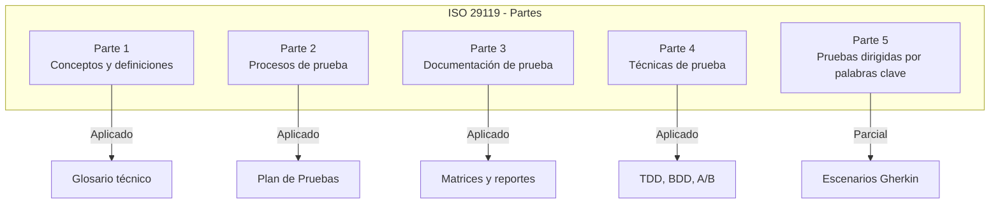
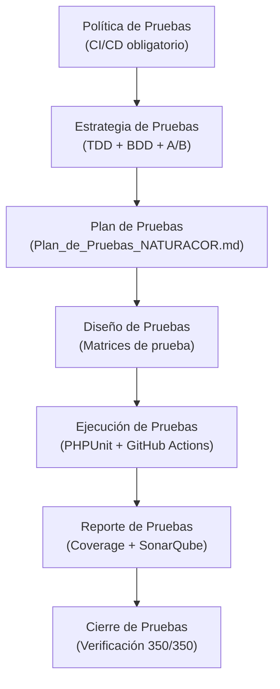
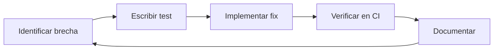

# Aplicación de la ISO/IEC/IEEE 29119 — NATURACOR

## Proceso de Pruebas de Software en la Fase de Construcción
**Fecha:** 09/05/2026  
**Versión:** 1.0  
**Estándar:** ISO/IEC/IEEE 29119:2022 (Partes 1-5)

---

## 1. Introducción

La ISO/IEC/IEEE 29119 es el estándar internacional para **pruebas de software**. Define procesos, documentación, técnicas y medición de cobertura. NATURACOR aplica esta norma en la **fase de construcción** para garantizar la calidad del software mediante pruebas rigurosas y documentadas.

---

## 2. Estructura de la Norma y Aplicación



---

## 3. Parte 1: Conceptos y Definiciones

### 3.1. Terminología Aplicada

| Término ISO 29119 | Definición | Aplicación en NATURACOR |
|-------------------|-----------|------------------------|
| **Ítem de prueba** | Componente a ser probado | Controladores, Servicios, Modelos |
| **Caso de prueba** | Conjunto de condiciones + resultado esperado | Métodos `#[Test]` en PHPUnit |
| **Suite de pruebas** | Colección de casos de prueba | `tests/Unit/` y `tests/Feature/` |
| **Oráculo de prueba** | Fuente de resultados esperados | Assertions de PHPUnit |
| **Entorno de prueba** | Configuración para ejecutar pruebas | SQLite in-memory + Laravel TestCase |
| **Informe de prueba** | Reporte de resultados | Output de CI/CD + coverage.xml |

---

## 4. Parte 2: Procesos de Prueba

### 4.1. Proceso Organizacional de Prueba



### 4.2. Política de Pruebas de NATURACOR

| Política | Regla |
|----------|-------|
| **Cobertura mínima** | ≥ 70% en módulos críticos |
| **Tests obligatorios** | Ningún merge a `main` sin CI en verde |
| **Regresión** | Cada bug documentado genera test de regresión antes del fix |
| **Independencia** | Tests aislados (SQLite in-memory, `RefreshDatabase`) |
| **Automatización** | 100% de la suite ejecutable sin intervención humana |

### 4.3. Niveles de Prueba según ISO 29119

| Nivel | Alcance | Implementación | Cantidad |
|-------|---------|----------------|:--------:|
| **Componente (Unit)** | Métodos y clases aisladas | `tests/Unit/` | 113 |
| **Integración** | Interacción entre componentes | `tests/Feature/` | 237 |
| **Sistema** | Flujos completos end-to-end | Feature tests con HTTP | Incluido en 237 |
| **Aceptación** | Criterios del cliente | A/B Testing + métricas | En operación |

---

## 5. Parte 3: Documentación de Prueba

### 5.1. Artefactos de Documentación

La ISO 29119-3 define los documentos que deben generarse. NATURACOR los implementa así:

| Documento ISO 29119 | Artefacto NATURACOR | Ubicación |
|---------------------|---------------------|-----------|
| **Plan de pruebas** | `Plan_de_Pruebas_NATURACOR.md` | `02_diseno_construccion/pruebas_calidad/` |
| **Especificación de diseño** | `enfoque_tdd_naturacor.md` + `enfoque_bdd_naturacor.md` | `02_diseno_construccion/pruebas_calidad/` |
| **Especificación de casos** | Métodos `#[Test]` en archivos PHPUnit | `tests/Unit/` y `tests/Feature/` |
| **Registro de ejecución** | Output de GitHub Actions | `.github/workflows/tests.yml` |
| **Informe de incidentes** | Bugs 1-4 en `Analisis_Tecnico_NATURACOR.md` | `02_diseno_construccion/arquitectura/` |
| **Informe de estado** | `coverage.xml` + dashboard SonarQube | Raíz del proyecto |
| **Informe de finalización** | `matriz_pruebas.md` | `02_diseno_construccion/pruebas_calidad/` |
| **Matriz de trazabilidad** | `matriz_trazabilidad.md` | `02_diseno_construccion/pruebas_calidad/` |

---

## 6. Parte 4: Técnicas de Prueba

### 6.1. Técnicas Aplicadas

| Técnica ISO 29119-4 | Tipo | Aplicación en NATURACOR | Ejemplo |
|---------------------|------|------------------------|---------|
| **Partición de equivalencia** | Caja negra | Grupos de datos válidos/inválidos | `LoginTest`: credenciales correctas vs incorrectas |
| **Análisis de valores límite** | Caja negra | Stock = 0, stock = 1, stock máximo | `ProductoCrudTest`: stock negativo rechazado |
| **Tabla de decisión** | Caja negra | Reglas de fidelización con múltiples condiciones | `FidelizacionTest`: umbral exacto y superado |
| **Prueba de transición de estados** | Caja negra | Caja: abierta → cerrada, Reclamo: pendiente → resuelto | `CajaTest`, `ReclamoTest` |
| **Cobertura de sentencias** | Caja blanca | Líneas de código ejecutadas | `coverage.xml` vía Xdebug |
| **Cobertura de ramas** | Caja blanca | Decisiones if/else cubiertas | Reportado en SonarQube |
| **Prueba basada en experiencia** | Experiencia | Flujos negativos de seguridad | CSRF, acceso sin rol, inyección |

### 6.2. Matriz Técnica × Nivel

| Técnica | Unit | Feature | A/B |
|---------|:----:|:-------:|:---:|
| Partición de equivalencia | ✅ | ✅ | ❌ |
| Valores límite | ✅ | ✅ | ❌ |
| Tabla de decisión | ✅ | ❌ | ❌ |
| Transición de estados | ❌ | ✅ | ❌ |
| Cobertura de sentencias | ✅ | ✅ | ❌ |
| Prueba estadística | ❌ | ❌ | ✅ |

---

## 7. Parte 5: Pruebas Dirigidas por Palabras Clave

### 7.1. Aplicación Parcial vía BDD

Aunque NATURACOR no usa un framework de palabras clave como Robot Framework, los **escenarios tipo Gherkin** en la documentación BDD cumplen un rol similar:

```
DADO que el empleado está autenticado
Y la caja está abierta
CUANDO registra una venta de 2 unidades del producto X
ENTONCES el stock se reduce en 2
Y se genera una boleta con número secuencial
```

Estos escenarios se traducen a Feature tests de PHPUnit con patrón **Arrange-Act-Assert**.

---

## 8. Métricas de Prueba según ISO 29119

| Métrica | Valor Actual | Objetivo |
|---------|:------------:|:--------:|
| **Total de tests** | 350 | ≥ 300 |
| **Tests unitarios** | 113 | ≥ 80 |
| **Tests de integración** | 237 | ≥ 150 |
| **Tasa de éxito** | 100% | 100% |
| **Cobertura de requerimientos** | 95.8% (69/72) | ≥ 90% |
| **Archivos de test** | 52 (activos) | — |
| **Bugs con test de regresión** | 4/4 (100%) | 100% |
| **Tiempo de ejecución CI** | < 120s | < 180s |

---

## 9. Proceso de Mejora Continua



| Ciclo | Brecha Identificada | Tests Agregados | Resultado |
|-------|--------------------|:---------------:|-----------|
| 1 | Bugs 1-4 del análisis técnico | +12 | 4 bugs resueltos |
| 2 | Co-ocurrencia sin tests | +10 | Jaccard + NPMI verificado |
| 3 | A/B testing sin validación | +14 | Welch t-test validado |
| 4 | Pronóstico SES sin tests | +10 | MAE/MAPE verificado |
| 5 | Heatmap sin tests | +8 | Clustering verificado |

---

**Fin del documento.**
