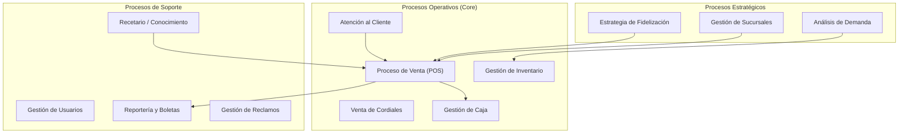
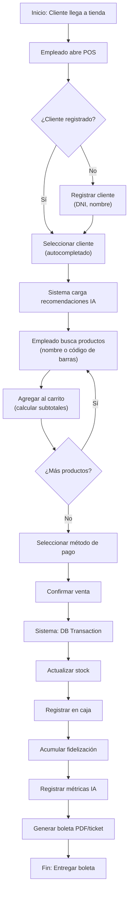
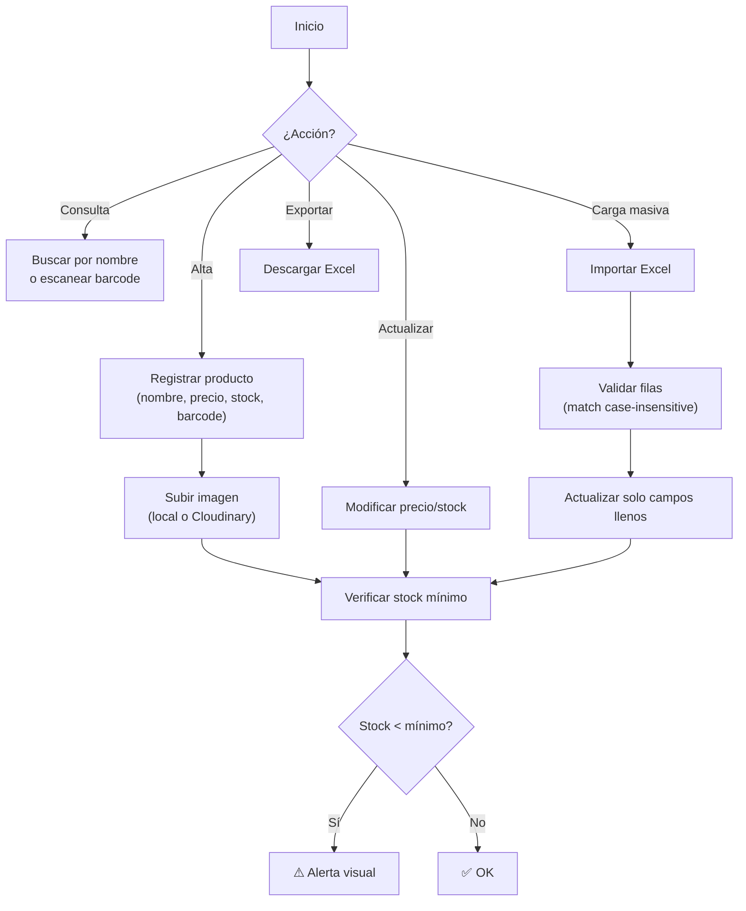
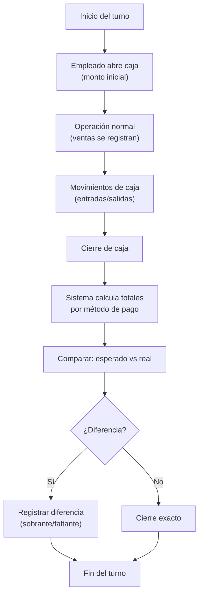
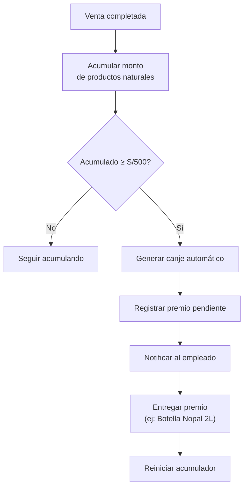
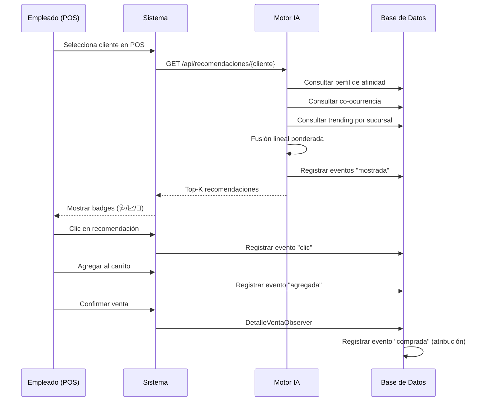
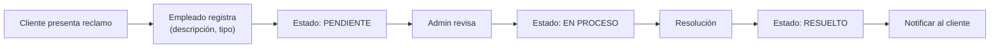

# Procesos de la Empresa NATURACOR

## Modelado de Procesos de Negocio y Puntos de Integración con el Sistema
**Fecha:** 09/05/2026  
**Versión:** 1.0  
**Notación:** BPMN 2.0 (Business Process Model and Notation)

---

## 1. Introducción

Este documento modela los **procesos de negocio** de NATURACOR como empresa naturista, identificando los flujos operativos principales, los actores involucrados y los **puntos de integración** donde el sistema web automatiza o asiste cada proceso.

### 1.1. Datos de la Empresa

| Dato | Valor |
|------|-------|
| **Razón social** | NATURACOR |
| **Propietaria** | Anita María Cordero Campos |
| **Ubicación** | Jauja, Junín, Perú |
| **Giro** | Venta de productos naturales y cordiales |
| **Sucursales** | Configurables (multi-sucursal) |
| **Empleados** | ~3-5 por sucursal |

---

## 2. Mapa de Procesos de la Empresa

---

## 3. Proceso Principal: Venta en Punto de Venta (POS)

### 3.1. Diagrama BPMN

### 3.2. Puntos de Integración con el Sistema

| Paso | Proceso Manual (sin sistema) | Con NATURACOR | Módulo |
|------|------------------------------|---------------|--------|
| Identificar cliente | Preguntar nombre, buscar cuaderno | Autocompletar por DNI/nombre | Clientes |
| Buscar producto | Buscar en estante | Búsqueda AJAX + código de barras | Inventario |
| Calcular total | Calculadora manual | Cálculo automático con IGV | POS |
| Sugerir productos | Experiencia del vendedor | **Motor IA con 3 señales** | Recomendador |
| Control de stock | Conteo manual | `lockForUpdate()` + rollback | Inventario |
| Fidelización | Tarjeta física de sellos | Acumulación automática | Fidelización |
| Boleta | Cuaderno de ventas | PDF A4 + ticket térmico | Reportes |

---

## 4. Proceso: Gestión de Inventario

### 4.1. Diagrama de Flujo

### 4.2. Automatización por el Sistema

| Actividad | Automatización | Beneficio |
|-----------|---------------|-----------|
| Control de stock mínimo | Alertas automáticas | Previene desabasto |
| Predicción de demanda | SES semanal (job nocturno) | Widget "Productos en Riesgo" |
| Carga masiva | Excel con validación | Ahorra horas de carga manual |
| Imágenes | Cloudinary con fallback local | CDN en producción |

---

## 5. Proceso: Gestión de Caja

**Regla de negocio:** Solo se permite **una caja abierta** por sucursal a la vez. El sistema impide abrir una segunda.

---

## 6. Proceso: Fidelización de Clientes

| Parámetro | Valor | Configurable |
|-----------|-------|:---:|
| Umbral de canje | S/ 500 | ✅ `FIDELIZACION_MONTO` |
| Premio máximo | S/ 30 | ✅ `FIDELIZACION_MAXIMO_PREMIO` |
| Período | Anual (2026) | ✅ `FIDELIZACION_INICIO/FIN` |
| Productos válidos | Solo productos naturales (no cordiales) | En código |

---

## 7. Proceso: Recomendación Inteligente

---

## 8. Proceso: Gestión de Reclamos

---

## 9. Proceso: Recetario y Conocimiento

| Actividad | Manual | Con Sistema |
|-----------|--------|-------------|
| Consultar qué producto sirve para diabetes | Preguntar a la dueña | Buscar en recetario digital |
| Agregar nueva enfermedad | Cuaderno | CRUD con relación a productos |
| Asociar productos a enfermedad | Memoria | `syncWithoutDetaching` |
| Carga masiva de recetario | No viable | Excel con separadores `\|` o `;` |

---

## 10. Resumen de Automatización por Proceso

| Proceso | Sin Sistema | Con NATURACOR | Ahorro |
|---------|:-----------:|:-------------:|--------|
| Venta POS | 5-10 min | 1-3 min | ~60% tiempo |
| Inventario | Manual, propenso a error | Automático + alertas | ~80% errores |
| Caja | Cuaderno + calculadora | Cierre automático | ~90% tiempo |
| Fidelización | Tarjeta física | Automática | 100% manual eliminado |
| Recomendación | Experiencia del vendedor | IA con 3 señales | Valor agregado nuevo |
| Pronóstico | No existe | SES semanal | Capacidad nueva |
| Reportes | Cuaderno | PDF + filtros | ~95% tiempo |

---

**Fin del documento.**
