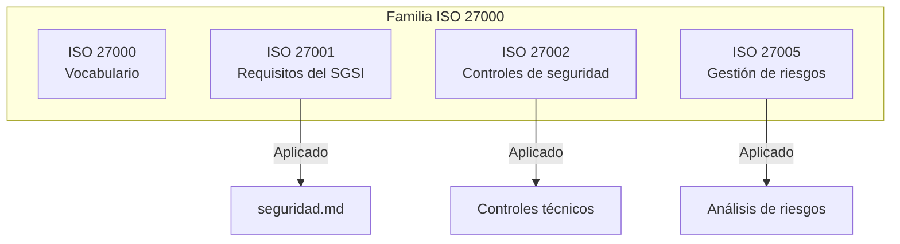
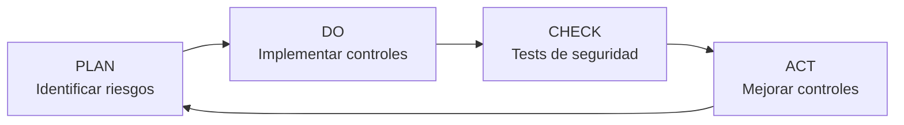

# Aplicación de la Familia ISO/IEC 27000 — NATURACOR

## Gestión de la Seguridad de la Información en la Fase de Mantenimiento
**Fecha:** 09/05/2026  
**Versión:** 1.0  
**Estándar:** ISO/IEC 27001:2022 — ISO/IEC 27002:2022

---

## 1. Introducción

La familia ISO/IEC 27000 proporciona un marco para la **gestión de la seguridad de la información (SGSI)**. En NATURACOR se aplica en la **fase de mantenimiento y seguridad** para garantizar la confidencialidad, integridad y disponibilidad de los datos del sistema.

---

## 2. Contexto de Seguridad de NATURACOR

### 2.1. Activos de Información

| Activo | Clasificación | Descripción |
|--------|:------------:|-------------|
| **Datos de clientes** | Confidencial | DNI, nombre, historial de compras, padecimientos de salud |
| **Datos de ventas** | Interno | Transacciones, totales, métodos de pago |
| **Credenciales** | Secreto | Contraseñas (hash Bcrypt), API keys |
| **Inventario** | Interno | Stock, precios, productos |
| **Configuración** | Secreto | `.env` con credenciales de BD, APIs, keys |
| **Métricas de IA** | Interno | Eventos de recomendación, perfiles de afinidad |

### 2.2. Roles y Responsabilidades

| Rol | Acceso | Control |
|-----|--------|---------|
| **Admin** | Total (todos los módulos) | CRUD completo + configuración |
| **Empleado** | Operativo (POS, clientes, inventario) | Lectura + operaciones de venta |
| **Visitante** | Catálogo público | Solo lectura de catálogo |

---

## 3. Controles de Seguridad Implementados (ISO 27002)

### 3.1. Controles Organizacionales (Cláusula 5)

| Control | Implementación |
|---------|---------------|
| **5.1 Políticas de seguridad** | Reglas de acceso documentadas en `seguridad.md` |
| **5.2 Roles y responsabilidades** | RBAC con Spatie Permission (admin/empleado) |
| **5.3 Separación de funciones** | Admin no puede auto-asignarse roles sin BD |
| **5.15 Control de acceso** | Middleware `auth` + `role:admin` en rutas protegidas |

### 3.2. Controles Tecnológicos (Cláusula 8)

| Control ISO 27002 | Implementación en NATURACOR | Evidencia |
|-------------------|---------------------------|-----------|
| **8.2 Gestión de acceso privilegiado** | Middleware `role:admin` para rutas administrativas | `routes/web.php` |
| **8.3 Restricción de acceso a información** | Aislamiento por `sucursal_id` en queries | Controladores |
| **8.5 Autenticación segura** | Laravel Breeze + Bcrypt (12 rounds) | `config/hashing.php` |
| **8.7 Protección contra malware** | Validación de uploads (tipo, tamaño) | Form Requests |
| **8.8 Gestión de vulnerabilidades** | Dependencias actualizadas, `composer audit` | CI/CD |
| **8.12 Prevención de fuga de datos** | `.env` en `.gitignore`, no en repositorio | `.gitignore` |
| **8.24 Uso de criptografía** | Bcrypt para passwords, HTTPS en producción | Laravel config |
| **8.25 Ciclo de vida de desarrollo seguro** | Tests de seguridad en Feature tests | `CsrfProtectionTest` |
| **8.28 Codificación segura** | PSR-12 (Laravel Pint), validación server-side | Pint + FormRequests |

### 3.3. Protección contra OWASP Top 10

| Vulnerabilidad OWASP | Mitigación | Test |
|----------------------|-----------|------|
| **A01: Control de acceso roto** | RBAC + middleware por ruta | `AuthorizationTest` |
| **A02: Fallas criptográficas** | Bcrypt 12 rounds, HTTPS | `LoginTest` |
| **A03: Inyección** | Eloquent ORM (prepared statements) | Implicit |
| **A04: Diseño inseguro** | Validación en Form Requests | `ProductoCrudTest` |
| **A05: Mala configuración** | `.env.example` como plantilla | Documentación |
| **A07: Fallas de autenticación** | Breeze + sesiones seguras | `AuthenticationTest` |
| **A08: Fallas de integridad** | CSRF tokens en todos los formularios | `CsrfProtectionTest` |
| **A09: Logging insuficiente** | Log de auditoría con `user_id`, `ip`, `timestamp` | `activity_log` |

---

## 4. Gestión de Riesgos (ISO 27005)

### 4.1. Identificación de Riesgos

| # | Riesgo | Probabilidad | Impacto | Nivel |
|---|--------|:------------:|:-------:|:-----:|
| R1 | Acceso no autorizado a datos de clientes | Media | Alto | 🟡 |
| R2 | Inyección SQL | Baja | Alto | 🟢 |
| R3 | CSRF en formularios de venta | Baja | Medio | 🟢 |
| R4 | Exposición de credenciales en código | Baja | Alto | 🟢 |
| R5 | Pérdida de datos por fallo de BD | Baja | Alto | 🟢 |
| R6 | API keys de IA comprometidas | Media | Bajo | 🟢 |
| R7 | Tampering de eventos de recomendación | Media | Medio | 🟡 |

### 4.2. Tratamiento de Riesgos

| Riesgo | Tratamiento | Control Implementado |
|--------|------------|---------------------|
| R1 | Mitigar | RBAC + aislamiento por sucursal |
| R2 | Mitigar | Eloquent ORM (no SQL raw) |
| R3 | Mitigar | Token CSRF en cada formulario |
| R4 | Mitigar | `.env` en `.gitignore` |
| R5 | Mitigar | Migraciones + seeders + Git |
| R6 | Aceptar | APIs opcionales, sistema funciona sin ellas |
| R7 | Mitigar | Validación de `reco_sesion_id` en MetricsService |

---

## 5. Auditoría y Trazabilidad

### 5.1. Registro de Eventos

| Evento | Datos Registrados | Tabla |
|--------|-------------------|-------|
| **Login/Logout** | user_id, ip, timestamp | Laravel sessions |
| **Venta** | user_id, cliente_id, productos, total | `ventas`, `detalle_ventas` |
| **Cambio de stock** | producto_id, cantidad anterior/nueva | Implícito en transacción |
| **Recomendación** | sesión, producto, acción, grupo_ab | `recomendacion_eventos` |
| **Padecimiento** | cliente_id, enfermedad_id, user_id | `cliente_padecimientos` |

### 5.2. Integridad de Registros

- **Append-only:** tabla `recomendacion_eventos` no permite `UPDATE` ni `DELETE` en producción
- **Transacciones:** ventas con `DB::beginTransaction()` + `rollback()` en error
- **Bloqueo:** `Producto::lockForUpdate()` previene race conditions

---

## 6. Continuidad del Servicio

| Escenario | Respuesta del Sistema |
|-----------|----------------------|
| **API de IA caída** | Cascada Groq → Gemini → Offline |
| **BD inaccesible** | Error controlado, no exposición de datos |
| **Cache corrupta** | Regeneración automática en siguiente request |
| **Job nocturno falla** | `withoutOverlapping()` + log, no bloquea siguiente |
| **Servidor caído** | Railway.app con restart automático |

---

## 7. Mejora Continua del SGSI

| Ciclo PDCA | Actividad | Frecuencia |
|:----------:|-----------|:----------:|
| **Plan** | Revisión de riesgos y análisis OWASP | Cada iteración |
| **Do** | Implementar controles técnicos | Continuo |
| **Check** | Ejecutar tests de seguridad en CI/CD | Cada push |
| **Act** | Documentar y mejorar | Post-iteración |

---

## 8. Resumen de Cumplimiento

| Dominio ISO 27001 | Controles Aplicados | Estado |
|-------------------|:-------------------:|:------:|
| Políticas de seguridad | 2 | ✅ |
| Gestión de activos | 3 | ✅ |
| Control de acceso | 4 | ✅ |
| Criptografía | 2 | ✅ |
| Seguridad de operaciones | 3 | ✅ |
| Seguridad de comunicaciones | 2 | ✅ |
| Desarrollo seguro | 4 | ✅ |
| Gestión de incidentes | 2 | ✅ |
| **Total** | **22** | ✅ |

---

**Fin del documento.**
