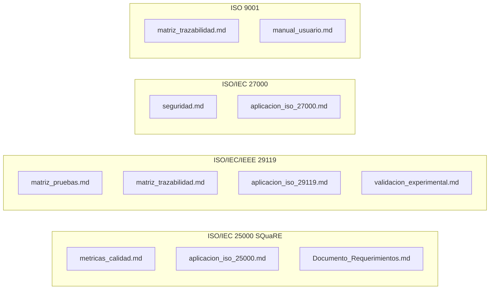

# Índice de Documentación — NATURACOR

## Sistema Web de Punto de Venta y Gestión Integral
**Fecha:** 09/05/2026  
**Versión:** 2.0 — Reestructurado en 3 fases ISO del ciclo de vida del software  
**Total de documentos:** 28 · **Archivos `.md` en `doc/`:** 28 (incluye este índice)

---

## Organización por Fases del Ciclo de Vida

La documentación se organiza en **3 fases principales** alineadas a normas ISO internacionales, cada una con subcarpetas temáticas:

| Fase | Carpeta | Norma ISO | Propósito |
|------|---------|-----------|-----------|
| **1. Planificación** | `01_planificacion_requerimientos/` | ISO/IEC 25000 (SQuaRE) | Requerimientos, estado del arte, metodologías, artículos, calidad del producto |
| **2. Construcción** | `02_diseno_construccion/` | ISO/IEC/IEEE 29119 | Arquitectura, pruebas, métricas, procesos de empresa |
| **3. Mantenimiento** | `03_mantenimiento_seguridad/` | ISO/IEC 27000 | Seguridad, operación, despliegue, referencia |

---

## Fase 1: Planificación y Requerimientos (ISO 25000)

### Requerimientos (`01_planificacion_requerimientos/requerimientos/`)

| # | Archivo | Contenido | Pág. est. |
|---|---------|-----------|:---------:|
| 1 | `Documento_Requerimientos_NATURACOR.md` | 72 RF + 15 RNF, historias de usuario, reglas de negocio | ~25 |
| 2 | `casos_uso.md` | 12 casos de uso UML con flujos, actores y diagramas Mermaid | ~12 |

### Estado del Arte (`01_planificacion_requerimientos/estado_del_arte/`)

| # | Archivo | Contenido | Pág. est. |
|---|---------|-----------|:---------:|
| 3 | `estado_del_arte.md` | Revisión de literatura, gap analysis, comparación con Amazon/Netflix/iHerb, contribuciones originales | ~12 |

### Metodología (`01_planificacion_requerimientos/metodologia/`)

| # | Archivo | Contenido | Pág. est. |
|---|---------|-----------|:---------:|
| 4 | `metodologia_general.md` | Ciclo de vida, roles, herramientas, proceso iterativo, Definition of Done | ~10 |
| 5 | `metodologia_pruebas.md` | TDD, BDD, niveles de prueba, cobertura, CI/CD, gestión de defectos | ~12 |
| 6 | `metodologia_ia_aplicada.md` | 4 módulos de IA: recomendador, SES, heatmap, LLM; algoritmos y validación | ~14 |

### Artículos de Sustentación (`01_planificacion_requerimientos/articulos_sustentacion/`)

| # | Archivo | Contenido | Pág. est. |
|---|---------|-----------|:---------:|
| 7 | `sustentacion_articulos.md` | 14 referencias: Aggarwal, Ricci, Cohen, Welch, Gardner, Burke, Bouma + ISOs | ~8 |

### ISO Aplicada (`01_planificacion_requerimientos/iso_aplicada/`)

| # | Archivo | Contenido | Pág. est. |
|---|---------|-----------|:---------:|
| 8 | `aplicacion_iso_25000.md` | ISO 25010 (8 características), 25012 (datos), 25030 (requisitos), 25040 (evaluación) | ~10 |

---

## Fase 2: Diseño y Construcción (ISO 29119)

### Arquitectura (`02_diseno_construccion/arquitectura/`)

| # | Archivo | Contenido | Pág. est. |
|---|---------|-----------|:---------:|
| 9 | `arquitectura.md` | Diagrama multi-capa, flujo de venta, motor de recomendación, patrones de diseño | ~14 |
| 10 | `modelo_datos.md` | 21 tablas + 34 migraciones, diagrama ER, relaciones, campos | ~15 |
| 11 | `Analisis_Tecnico_NATURACOR.md` | Análisis del código fuente, bugs documentados, roadmap técnico | ~10 |

### Pruebas y Calidad (`02_diseno_construccion/pruebas_calidad/`)

| # | Archivo | Contenido | Pág. est. |
|---|---------|-----------|:---------:|
| 12 | `Plan_de_Pruebas_NATURACOR.md` | Plan maestro de pruebas y estrategia de testing | ~15 |
| 13 | `matriz_pruebas.md` | 350 tests en 52 archivos, detalle por módulo, CI/CD | ~14 |
| 14 | `matriz_trazabilidad.md` | 72 requerimientos → componentes → tests → resultado | ~15 |
| 15 | `enfoque_tdd_naturacor.md` | TDD: ciclo Red–Green–Refactor, capas, trazabilidad con REQ | ~8 |
| 16 | `enfoque_bdd_naturacor.md` | BDD: actores, escenarios Gherkin, Feature tests como especificación | ~8 |
| 17 | `validacion_experimental.md` | A/B testing, Welch t-test, Cohen's d, Precision@K, SES, heatmap | ~18 |

### Métricas (`02_diseno_construccion/metricas/`)

| # | Archivo | Contenido | Pág. est. |
|---|---------|-----------|:---------:|
| 18 | `metricas_calidad.md` | 8 características ISO 25010 evaluadas con métricas cuantitativas | ~14 |

### Procesos de Empresa (`02_diseno_construccion/procesos_empresa/`)

| # | Archivo | Contenido | Pág. est. |
|---|---------|-----------|:---------:|
| 19 | `procesos_empresa.md` | Modelado BPMN de 10 procesos, automatización, puntos de integración | ~12 |

### ISO Aplicada (`02_diseno_construccion/iso_aplicada/`)

| # | Archivo | Contenido | Pág. est. |
|---|---------|-----------|:---------:|
| 20 | `aplicacion_iso_29119.md` | Partes 1-5 de ISO 29119: procesos, documentación, técnicas, métricas | ~10 |

---

## Fase 3: Mantenimiento y Seguridad (ISO 27000)

### Seguridad (`03_mantenimiento_seguridad/seguridad/`)

| # | Archivo | Contenido | Pág. est. |
|---|---------|-----------|:---------:|
| 21 | `seguridad.md` | RBAC, CSRF, Bcrypt, OWASP Top 10, auditoría, sesiones | ~12 |

### Operación (`03_mantenimiento_seguridad/operacion/`)

| # | Archivo | Contenido | Pág. est. |
|---|---------|-----------|:---------:|
| 22 | `guia_despliegue_produccion.md` | Guía de despliegue en Railway.app y producción | ~10 |
| 23 | `guia_tecnica_naturacor.md` | Guía técnica de desarrollo y contribución | ~12 |
| 24 | `manual_usuario.md` | Guía operativa paso a paso de 13 módulos + FAQ | ~12 |
| 25 | `roadmap_produccion.md` | Roadmap de desarrollo futuro | ~8 |

### Referencia (`03_mantenimiento_seguridad/referencia/`)

| # | Archivo | Contenido | Pág. est. |
|---|---------|-----------|:---------:|
| 26 | `glosario_tecnico.md` | 40+ acrónimos, 100+ definiciones técnicas por categoría | ~6 |

### ISO Aplicada (`03_mantenimiento_seguridad/iso_aplicada/`)

| # | Archivo | Contenido | Pág. est. |
|---|---------|-----------|:---------:|
| 27 | `aplicacion_iso_27000.md` | SGSI, controles ISO 27002, gestión de riesgos, OWASP, PDCA | ~10 |

---

## Mapa de Cobertura por Norma ISO

---

## Orden de Lectura Sugerido

Para evaluadores académicos (jurados de tesis):

1. **`estado_del_arte.md`** — Contexto y contribuciones originales
2. **`metodologia_general.md`** — Cómo se desarrolló el proyecto
3. **`Documento_Requerimientos_NATURACOR.md`** — Qué hace el sistema
4. **`arquitectura.md`** — Cómo está construido
5. **`modelo_datos.md`** — Estructura de datos
6. **`casos_uso.md`** — Flujos de usuario
7. **`procesos_empresa.md`** — Procesos de negocio automatizados
8. **`metodologia_ia_aplicada.md`** — Cómo funciona la IA
9. **`validacion_experimental.md`** — Metodología experimental
10. **`metricas_calidad.md`** — Evaluación ISO 25010
11. **`matriz_trazabilidad.md`** — Cobertura req → test
12. **`matriz_pruebas.md`** — Auditar los 350 tests
13. **`seguridad.md`** — Controles ISO 27001/OWASP
14. **`sustentacion_articulos.md`** — Referencias bibliográficas
15. **`manual_usuario.md`** — Verificar usabilidad

---

## Estadísticas Globales

| Métrica | Valor |
|---------|-------|
| **Archivos de documentación** | 28 (27 técnicos + índice) |
| **Fases ISO** | 3 (25000, 29119, 27000) |
| **Subcarpetas** | 14 |
| **Documentos nuevos (v2.0)** | 9 |
| **Diagramas Mermaid** | 40+ |
| **Tablas estructuradas** | 100+ |
| **Normas ISO cubiertas** | 5 (9001, 25010, 25012, 27001, 29119) |
| **Referencias bibliográficas** | 14+ |
| **Requerimientos documentados** | 72 RF + 15 RNF |
| **Tests documentados** | 350 (113 Unit + 237 Feature) |
| **Modelos documentados** | 21 |
| **Procesos de empresa modelados** | 10 |
| **Páginas estimadas totales** | ~300+ |
