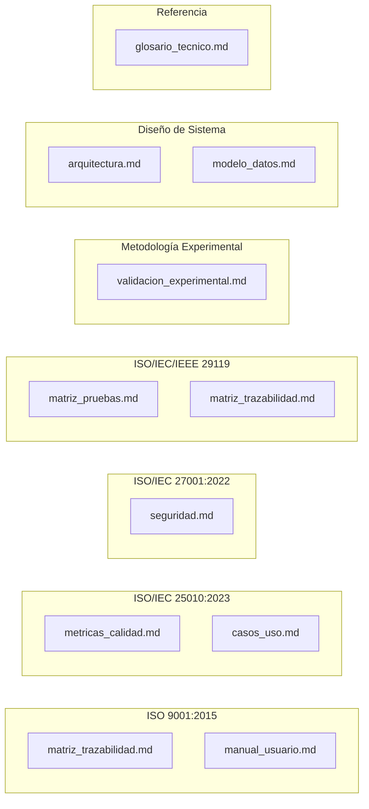

# Índice de Documentación — NATURACOR

## Sistema Web de Punto de Venta y Gestión Integral
**Fecha:** 29/04/2026  
**Versión:** 1.0  
**Total de documentos:** 17

---

## Documentación del Proyecto

La documentación del proyecto NATURACOR se organiza en **3 categorías** que cubren todos los aspectos requeridos para evaluación académica de nivel tesis.

---

## 1. Documentos Fundacionales (Previos)

Estos documentos existían antes de la fase de documentación formal:

| # | Archivo | Contenido | Páginas est. |
|---|---------|-----------|:---:|
| 1 | `Documento_Requerimientos_NATURACOR.md` | 72 requerimientos funcionales + no funcionales, historias de usuario, reglas de negocio | ~25 |
| 2 | `Analisis_Tecnico_NATURACOR.md` | Análisis técnico del sistema, stack, decisiones de diseño | ~10 |
| 3 | `Plan_de_Pruebas_NATURACOR.md` | Plan maestro de pruebas y estrategia de testing | ~15 |
| 4 | `guia_tecnica_naturacor.md` | Guía técnica de desarrollo y contribución | ~12 |
| 5 | `guia_despliegue_produccion.md` | Guía de despliegue en Railway.app y producción | ~10 |
| 6 | `roadmap_produccion.md` | Roadmap de desarrollo a futuro | ~8 |

---

## 2. Documentos Técnicos de Tesis (Nuevos v1.1)

Documentos generados y validados contra el código fuente:

| # | Archivo | Norma ISO | Contenido | Páginas est. |
|---|---------|-----------|-----------|:---:|
| 7 | `matriz_trazabilidad.md` | ISO 9001, ISO 29119 | 72 requerimientos → componentes → 555 tests → resultado | ~15 |
| 8 | `casos_uso.md` | UML 2.5, ISO 25010 | 12 casos de uso con flujos, actores y diagramas Mermaid | ~12 |
| 9 | `modelo_datos.md` | — | 21 tablas + 34 migraciones, ER diagram, relaciones, campos | ~15 |
| 10 | `arquitectura.md` | — | Diagrama multi-capa, flujo de venta (sequence diagram), motor de recomendación, patrones de diseño, scheduler | ~14 |
| 11 | `seguridad.md` | ISO 27001, OWASP Top 10 | RBAC, CSRF, Bcrypt, validación, auditoría, gestión de sesiones | ~12 |
| 12 | `metricas_calidad.md` | ISO/IEC 25010 | 8 características de calidad evaluadas con métricas cuantitativas | ~14 |
| 13 | `matriz_pruebas.md` | ISO/IEC/IEEE 29119 | 555 tests en 52 archivos, detalle por módulo, CI/CD | ~14 |
| 14 | `validacion_experimental.md` | Shani & Gunawardana | Diseño A/B, Welch t-test, Cohen's d, Precision@K, SES, heatmap, reproducibilidad, 7 referencias bibliográficas | ~18 |
| 15 | `manual_usuario.md` | ISO 9001 | Guía operativa paso a paso de 13 módulos + FAQ | ~12 |
| 16 | `glosario_tecnico.md` | — | 40+ acrónimos, 100+ definiciones técnicas organizadas por categoría | ~6 |
| 17 | `indice_documentacion.md` | — | **Este documento** — Índice maestro de toda la documentación | ~3 |

---

## 3. Mapa de Cobertura por Norma ISO

---

## 4. Orden de Lectura Sugerido

Para evaluadores académicos (jurados de tesis), se recomienda el siguiente orden:

1. **`Documento_Requerimientos_NATURACOR.md`** — Entender qué hace el sistema
2. **`arquitectura.md`** — Entender cómo está construido
3. **`modelo_datos.md`** — Entender la estructura de datos
4. **`casos_uso.md`** — Entender los flujos de usuario
5. **`validacion_experimental.md`** — Evaluar la metodología experimental
6. **`metricas_calidad.md`** — Verificar los criterios ISO 25010
7. **`matriz_trazabilidad.md`** — Verificar cobertura req → test
8. **`matriz_pruebas.md`** — Auditar los 555 tests
9. **`seguridad.md`** — Verificar controles ISO 27001/OWASP
10. **`manual_usuario.md`** — Verificar usabilidad
11. **`glosario_tecnico.md`** — Consulta rápida de términos

---

## 5. Estadísticas Globales de la Documentación

| Métrica | Valor |
|---------|-------|
| **Archivos de documentación** | 17 |
| **Tamaño total estimado** | ~250 KB |
| **Diagramas Mermaid** | 25+ (ER, sequence, flow, pie, mindmap, gantt) |
| **Tablas estructuradas** | 80+ |
| **Normas ISO cubiertas** | 4 (9001, 25010, 27001, 29119) |
| **Referencias bibliográficas** | 7 (en validación experimental) |
| **Requerimientos documentados** | 72 funcionales + 15 no funcionales |
| **Tests documentados** | 555 |
| **Modelos documentados** | 21 |
| **Controladores documentados** | 19 |
| **Servicios documentados** | 9 |
| **Casos de uso** | 12 |
| **Términos del glosario** | 100+ |
