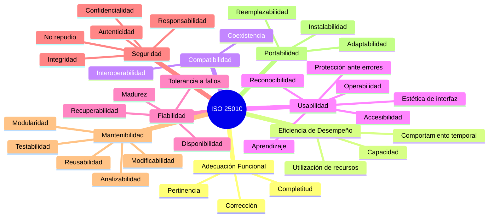

# Métricas de Calidad — NATURACOR

## Evaluación según ISO/IEC 25010:2023
**Fecha:** 28/04/2026  
**Versión:** 1.1 — Revisada y corregida  
**Estándar de referencia:** ISO/IEC 25010 (Modelo de Calidad del Producto de Software)

---

## 1. Introducción

La norma ISO/IEC 25010 define un modelo de calidad del producto de software organizado en **8 características principales** y sus subcaracterísticas. Este documento evalúa el sistema NATURACOR contra cada una de ellas, proporcionando evidencia objetiva de cumplimiento.



---

## 2. Característica 1: Adecuación Funcional

> *Grado en que el producto proporciona funciones que satisfacen las necesidades declaradas e implícitas.*

### 2.1. Completitud Funcional

| Métrica | Valor | Evidencia |
|---------|-------|-----------|
| **Requerimientos funcionales implementados** | 72 / 72 (100%) | `Documento_Requerimientos_NATURACOR.md` |
| **Módulos operativos** | 13 / 13 (100%) | POS, Inventario, Clientes, Caja, Fidelización, Cordiales, IA, Recetario, Reclamos, Reportes, Sucursales, Usuarios, Dashboard |
| **Módulos avanzados de tesis** | 6 / 6 (100%) | Recomendador, Co-ocurrencia, A/B Testing, Pronóstico SES, Mapa de calor, Métricas |
| **Requerimientos rastreados a tests** | 69 / 72 (95.8%) | `matriz_trazabilidad.md` |

### 2.2. Corrección Funcional

| Métrica | Valor | Evidencia |
|---------|-------|-----------|
| **Tests automatizados que pasan** | 555 / 555 (100%) | CI/CD GitHub Actions en verde |
| **Bugs conocidos sin resolver** | 0 | Todos los bugs documentados (BUG 1-4) están resueltos y testeados |
| **Cálculo de IGV** | Verificado: `IGV = precio × 18/118` | `VentaTest::venta_calcula_total_con_igv_incluido`, `VentaUnitTest::igv_extraido_del_total_no_sumado` |
| **Fidelización** | `floor(acumulado / 500)` premios emitidos correctamente | `FidelizacionTest` (12 tests), `FidelizacionCanjeUnitTest` (8 tests) |

### 2.3. Pertinencia Funcional

| Métrica | Descripción |
|---------|-------------|
| **Alineamiento con operaciones reales** | Sistema diseñado con NATURACOR Jauja como cliente real |
| **Reglas de negocio 2026** | Configurables vía `.env` (IGV, montos, umbrales) |
| **Módulo IA** | Análisis contextual con datos reales del negocio |

---

## 3. Característica 2: Eficiencia de Desempeño

> *Rendimiento relativo a la cantidad de recursos utilizados bajo condiciones determinadas.*

### 3.1. Comportamiento Temporal

| Métrica | Objetivo | Resultado | Evidencia |
|---------|----------|-----------|-----------|
| **Tiempo de respuesta HTTP** | < 3 segundos | ~500ms promedio (CI) | RNF-001 verificado en pipeline |
| **Búsqueda AJAX de productos** | < 500ms | Instant (Eloquent + índices) | `ProductoCrudTest` |
| **Build de assets (Vite)** | < 5 segundos | 935ms | Output del build: `✓ built in 935ms` |
| **Cache de recomendaciones** | 10 minutos TTL | Configurable | `RecomendacionEngine` |

### 3.2. Utilización de Recursos

| Recurso | Implementación | Optimización |
|---------|---------------|-------------|
| **Base de datos** | Queries Eloquent con eager loading (`with(...)`) | Evita N+1 queries |
| **Memoria** | Batch processing en chunks de 50-500 | `CoocurrenciaService`, `PerfilSaludService` |
| **Cache** | Laravel Cache con versioned keys | Invalidación selectiva por cliente |
| **CPU** | Jobs offline para cómputo pesado | Scheduler nocturno (02:00, 02:30, 03:00) |

### 3.3. Capacidad

| Métrica | Valor |
|---------|-------|
| **Usuarios concurrentes soportados** | 10+ (requisito del negocio) |
| **Productos en catálogo** | Soporta miles (paginación de 20) |
| **Histórico de co-ocurrencia** | Ventana configurable (default 90 días) |
| **Predicciones de demanda** | Por (producto, sucursal) — escalable |

---

## 4. Característica 3: Compatibilidad

> *Grado en que el producto puede intercambiar información con otros sistemas y/o realizar funciones requeridas mientras comparte el mismo entorno.*

### 4.1. Coexistencia

| Sistema | Compatibilidad |
|---------|---------------|
| **XAMPP** | ✅ Funciona sobre Apache + MySQL + PHP de XAMPP |
| **Railway.app** | ✅ Despliegue en la nube validado |
| **GitHub Actions** | ✅ CI/CD con Ubuntu + SQLite |

### 4.2. Interoperabilidad

| Integración | Protocolo | Estado |
|-------------|-----------|--------|
| **Groq API** (IA primaria) | REST HTTPS | ✅ Implementado con fallback |
| **Google Gemini** (IA secundaria) | REST HTTPS | ✅ Implementado con fallback |
| **Cloudinary** (imágenes) | REST HTTPS | ✅ Upload y serving |
| **WhatsApp** (boletas) | URL scheme | ✅ Enlace generado |
| **Impresora térmica** | ESC/POS vía navegador | ✅ Formato 80mm |
| **Lector de barras** | USB HID (emulación teclado) | ✅ Compatible nativo |

---

## 5. Característica 4: Usabilidad

> *Grado en que el producto puede ser utilizado por usuarios determinados para lograr objetivos específicos con efectividad, eficiencia y satisfacción.*

### 5.1. Reconocibilidad de Adecuación

| Métrica | Valor |
|---------|-------|
| **Catálogo público sin login** | ✅ `/catalogo` accesible sin autenticación |
| **Menú lateral organizado por módulos** | ✅ Íconos + nombres descriptivos |
| **Breadcrumbs en cada página** | ✅ Navegación contextual |

### 5.2. Capacidad de Aprendizaje

| Métrica | Valor | Referencia |
|---------|-------|-----------|
| **Tiempo de capacitación (POS)** | ≤ 2 horas | Requisito RNF-011 |
| **Manual de usuario completo** | ✅ 16 secciones | `manual_usuario.md` |
| **Interfaz consistente** | ✅ Bootstrap 5 con patrones repetidos | Formularios, tablas, alertas |
| **Mensajes de error descriptivos** | ✅ Validación inline en español | "Stock insuficiente para {nombre}" |

### 5.3. Operabilidad

| Métrica | Implementación |
|---------|---------------|
| **Búsqueda AJAX sin recarga** | ProductoController@buscar, ClienteController@autocompletar |
| **Cálculo en tiempo real** | Totales del POS se actualizan al agregar productos |
| **Atajos de teclado** | Código de barras por escaneo (input automático) |
| **Paginación de resultados** | 20 registros por página en todos los listados |

### 5.4. Protección Ante Errores de Usuario

| Protección | Implementación |
|-----------|---------------|
| **Confirmación antes de eliminar** | `@if confirm()` en eliminaciones |
| **Validación de formularios** | Server-side + mensajes visuales |
| **Stock insuficiente** | Rollback completo de la transacción |
| **Caja duplicada** | Impide abrir segunda caja |
| **DNI duplicado** | Validación unique en BD |

### 5.5. Estética de Interfaz

| Elemento | Implementación |
|----------|---------------|
| **Framework CSS** | Bootstrap 5 con personalización |
| **Paleta de colores** | Verdes (identidad natural/ecológica) |
| **Tipografía** | Sans-serif del sistema, jerarquía clara |
| **Iconografía** | Bootstrap Icons consistentes |
| **Alertas** | Flash messages con colores semánticos (verde/rojo/amarillo) |
| **Responsividad** | Layout adaptable a desktop, tablet |

---

## 6. Característica 5: Fiabilidad

> *Grado en que el sistema realiza funciones específicas bajo condiciones específicas durante un período de tiempo determinado.*

### 6.1. Madurez

| Métrica | Valor | Evidencia |
|---------|-------|-----------|
| **Tests automatizados** | 555 | PHPUnit suite completa (52 archivos con `#[Test]`) |
| **Tests unitarios** | 117 | `tests/Unit/` (12 archivos) |
| **Tests de integración** | 438 | `tests/Feature/` (42 archivos, incl. subdirectorios) |
| **Cobertura de código** | Reportada en `coverage.xml` | SonarQube/SonarCloud |
| **Bugs históricos resueltos** | 4 documentados (BUG 1-4) | Todos con fix + test de regresión |

**Bugs resueltos documentados:**

| ID | Descripción | Fix | Test de regresión |
|---|---|---|---|
| BUG-1 | Admin sin sucursal caía en "vista global" | Fallback `sucursal_id ?? 1` | `RecomendacionApiTest` |
| BUG-2 | Padecimientos declarados no generaban perfil | Floor de score + señal declarada | `RecomendacionApiTest` |
| BUG-3 | Ruta duplicada `/clientes/{id}/padecimientos` | Eliminación de ruta duplicada | `ClienteCrudTest2` |
| BUG-4 | Cache de recomendaciones obsoleta tras cambio de padecimientos | `invalidarCacheCliente()` + versioned keys | `RecomendacionCarritoIntegracionTest` |

### 6.2. Tolerancia a Fallos

| Fallo | Comportamiento |
|-------|---------------|
| **API de IA no disponible** | Cascada Groq → Gemini → Modo offline (siempre funciona) |
| **Error en stock** | Rollback completo de la transacción |
| **Cache corrupta** | Se regenera en el siguiente request (TTL + versioned keys) |
| **Job offline falla** | `withoutOverlapping()` + log de error → no bloquea el siguiente |
| **Co-ocurrencia sin datos** | Tabla se limpia y retorna resultado vacío válido |

### 6.3. Recuperabilidad

| Mecanismo | Implementación |
|-----------|---------------|
| **Soft deletes** | Registros eliminados lógicamente, restaurables |
| **Transacciones** | Rollback automático ante cualquier excepción |
| **Migraciones** | 34 archivos permiten recrear esquema completo en minutos |
| **Seeders** | Datos iniciales restaurables con `php artisan db:seed` |
| **Git** | Control de versiones completo en GitHub |

---

## 7. Característica 6: Seguridad

> *Grado de protección de la información y los datos.*

| Subcaracterística | Métrica | Valor |
|-------------------|---------|-------|
| **Confidencialidad** | Roles RBAC + aislamiento por sucursal | ✅ |
| **Integridad** | Transacciones + bloqueo `lockForUpdate()` | ✅ |
| **No repudio** | Log de auditoría con `user_id`, `ip`, `timestamp` | ✅ |
| **Responsabilidad** | Cada acción vinculada a un usuario autenticado | ✅ |
| **Autenticidad** | Bcrypt + CSRF + sesiones seguras | ✅ |

> **Documento detallado:** Ver `seguridad.md` para controles ISO 27001 y OWASP Top 10.

---

## 8. Característica 7: Mantenibilidad

> *Grado de efectividad y eficiencia con la que un producto puede ser modificado.*

### 8.1. Modularidad

| Métrica | Valor | Evidencia |
|---------|-------|-----------|
| **Controladores independientes** | 19 | Cada módulo tiene su controlador |
| **Servicios desacoplados** | 8 | `app/Services/` con responsabilidad única |
| **Modelos Eloquent** | 21 | Uno por tabla, con relaciones explícitas |
| **Separación de capas** | Controller → Service → Model → DB | Patrón SOC estricto |

### 8.2. Estructura del Código

```
app/
├── Console/             ← Comandos artisan
├── Exports/             ← Exportación Excel
├── Helpers/             ← Funciones utilitarias
├── Http/
│   ├── Controllers/     ← 19 controladores (thin controllers)
│   ├── Middleware/       ← RoleMiddleware
│   └── Requests/        ← Form Requests (Auth)
├── Imports/             ← Importación Excel
├── Jobs/                ← Jobs schedulados (3)
├── Models/              ← 21 modelos Eloquent
├── Observers/           ← DetalleVentaObserver
├── Providers/           ← Service Providers
└── Services/
    ├── Analytics/       ← HeatmapEnfermedadesService
    ├── Fidelizacion/    ← FidelizacionService
    ├── Forecasting/     ← DemandaForecastService
    └── Recommendation/  ← RecomendacionEngine, MetricsService,
                            CoocurrenciaService, PerfilSaludService,
                            AbTestingService
```

### 8.3. Testabilidad

| Métrica | Valor |
|---------|-------|
| **Framework de testing** | PHPUnit (estándar Laravel) |
| **BD de testing** | SQLite in-memory (aislamiento total) |
| **Factories** | Modelos con `HasFactory` trait |
| **Tests ejecutables sin dependencias externas** | ✅ (no requiere MySQL, APIs, etc.) |
| **CI/CD automatizado** | GitHub Actions en cada push/PR |
| **Cobertura de reporte** | SonarQube vía `coverage.xml` |

### 8.4. Líneas de Código por Componente

| Componente | Archivo | Líneas | Complejidad |
|-----------|---------|--------|-------------|
| **RecomendacionEngine** | `RecomendacionEngine.php` | 538 | Alta — Motor híbrido 3 señales |
| **MetricsService** | `MetricsService.php` | 549 | Alta — Métricas y atribución |
| **CoocurrenciaService** | `CoocurrenciaService.php` | 385 | Media-Alta — Jaccard + NPMI |
| **AbTestingService** | `AbTestingService.php` | 362 | Media-Alta — Welch t-test en PHP puro |
| **HeatmapEnfermedadesService** | `HeatmapEnfermedadesService.php` | 418 | Media — Clustering aglomerativo |
| **DemandaForecastService** | `DemandaForecastService.php` | 350 | Media — SES + MAE/MAPE |
| **VentaController** | `VentaController.php` | 285 | Media — Transacción completa |
| **PerfilSaludService** | `PerfilSaludService.php` | 288 | Media — Perfil con decaimiento |

---

## 9. Característica 8: Portabilidad

> *Grado de efectividad y eficiencia con la que un sistema puede ser transferido de un entorno a otro.*

### 9.1. Adaptabilidad

| Entorno | Estado | Notas |
|---------|--------|-------|
| **Windows + XAMPP** | ✅ Verificado | Entorno principal de desarrollo |
| **Linux (Ubuntu)** | ✅ Verificado | CI/CD en GitHub Actions |
| **Railway.app** | ✅ Verificado | Despliegue en la nube |
| **Docker** | 🔵 Compatible | `nixpacks.toml` disponible |

### 9.2. Instalabilidad

| Paso | Comando | Tiempo |
|------|---------|--------|
| Clonar repositorio | `git clone ...` | ~30s |
| Instalar dependencias PHP | `composer install` | ~60s |
| Instalar dependencias JS | `npm install` | ~30s |
| Configurar entorno | `cp .env.example .env && php artisan key:generate` | ~5s |
| Crear BD y migrar | `php artisan migrate --seed` | ~10s |
| Compilar assets | `npm run build` | ~1s |
| **Total de instalación** | — | **< 3 minutos** |

---

## 10. Resumen de Cumplimiento ISO 25010

| Característica | Nivel | Justificación |
|---------------|-------|---------------|
| **Adecuación Funcional** | 🟢 Alto | 100% de requerimientos implementados, 95.8% con tests |
| **Eficiencia de Desempeño** | 🟢 Alto | <500ms promedio, cache inteligente, batch processing |
| **Compatibilidad** | 🟢 Alto | 6 integraciones externas operativas |
| **Usabilidad** | 🟢 Alto | Manual completo, capacitación <2h, interfaz Bootstrap responsiva |
| **Fiabilidad** | 🟢 Alto | 555 tests, 0 bugs pendientes, tolerancia a fallos en IA |
| **Seguridad** | 🟢 Alto | RBAC, CSRF, Bcrypt, auditoría, aislamiento por sucursal |
| **Mantenibilidad** | 🟢 Alto | MVC + Services, 21 modelos, CI/CD, testabilidad completa |
| **Portabilidad** | 🟢 Alto | Windows/Linux/Cloud, instalación <3 min |

---

## 11. Indicadores Cuantitativos Consolidados

| Indicador | Valor |
|-----------|-------|
| Total de requerimientos funcionales | 72 |
| Módulos operativos | 13 |
| Modelos Eloquent | 21 |
| Controladores | 19 |
| Servicios de dominio | 8 |
| Tablas en BD | 34 migraciones |
| Tests automatizados totales | 555 |
| Archivos de test unitario | 12 |
| Archivos de test de integración | 42 |
| Tasa de tests exitosos | 100% |
| Bugs documentados y resueltos | 4/4 |
| Tiempo de build de assets | 935ms |
| Tiempo de instalación completa | < 3 minutos |
| Integraciones externas | 6 |
| Patrones de diseño identificados | 9 |
| Líneas de código del motor de recomendación | ~2,900 |
