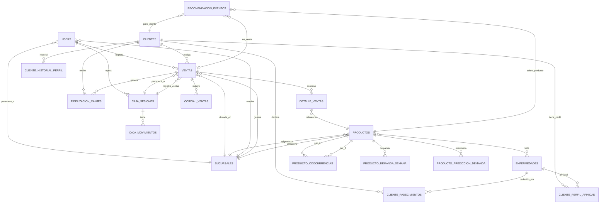

# Modelo de Datos — NATURACOR

## Sistema Web Empresarial
**Fecha:** 28/04/2026  
**Versión:** 1.1 — Revisada y corregida  
**Motor de BD:** MySQL 8.0+ (producción) / SQLite (testing)  
**ORM:** Eloquent (Laravel 12)

---

## 1. Diagrama Entidad-Relación (Principal)

---

## 2. Tablas del Sistema

### 2.1. `users` — Usuarios del sistema

| Campo | Tipo | Nullable | Descripción |
|-------|------|----------|-------------|
| `id` | BIGINT PK | No | Identificador autoincremental |
| `name` | VARCHAR(255) | No | Nombre completo del usuario |
| `email` | VARCHAR(255) UNIQUE | No | Correo electrónico (login) |
| `password` | VARCHAR(255) | No | Contraseña hasheada (Bcrypt) |
| `sucursal_id` | BIGINT FK → sucursales | Sí | Sucursal asignada (null = acceso global) |
| `activo` | BOOLEAN | No | Estado del usuario (true/false) |
| `email_verified_at` | TIMESTAMP | Sí | Fecha de verificación de email |
| `remember_token` | VARCHAR(100) | Sí | Token de "Recuérdame" |
| `created_at` | TIMESTAMP | Sí | — |
| `updated_at` | TIMESTAMP | Sí | — |

**Relaciones:** `belongsTo(Sucursal)`, `hasMany(Venta)`, `hasMany(CajaSesion)`  
**Traits:** `HasFactory`, `Notifiable`, `HasRoles` (Spatie)

---

### 2.2. `sucursales` — Puntos de venta

| Campo | Tipo | Nullable | Descripción |
|-------|------|----------|-------------|
| `id` | BIGINT PK | No | — |
| `nombre` | VARCHAR(255) | No | Nombre de la sucursal |
| `direccion` | VARCHAR(255) | Sí | Dirección física |
| `telefono` | VARCHAR(20) | Sí | Teléfono de contacto |
| `ruc` | VARCHAR(20) | Sí | RUC de la empresa |
| `activa` | BOOLEAN | No | Estado activo/inactivo |
| `deleted_at` | TIMESTAMP | Sí | Soft delete |
| `created_at` / `updated_at` | TIMESTAMP | Sí | — |

**Relaciones:** `hasMany(User)`, `hasMany(Producto)`, `hasMany(Venta)`, `hasMany(CajaSesion)`

---

### 2.3. `productos` — Catálogo de productos naturales

| Campo | Tipo | Nullable | Descripción |
|-------|------|----------|-------------|
| `id` | BIGINT PK | No | — |
| `nombre` | VARCHAR(255) | No | Nombre del producto |
| `descripcion` | TEXT | Sí | Descripción detallada |
| `precio` | DECIMAL(10,2) | No | Precio de venta (IGV incluido) |
| `stock` | INT | No | Stock actual |
| `stock_minimo` | INT | No | Umbral de alerta (default: 5) |
| `tipo` | VARCHAR(50) | Sí | Tipo: `natural`, `cordial`, `complemento` |
| `frecuente` | BOOLEAN | No | Producto frecuente (aparece primero) |
| `activo` | BOOLEAN | No | Estado activo/inactivo |
| `imagen` | VARCHAR(255) | Sí | URL de imagen (Cloudinary) |
| `codigo_barras` | VARCHAR(100) | Sí | Código de barras EAN-13 |
| `sucursal_id` | BIGINT FK | Sí | Sucursal (null = todas) |
| `deleted_at` | TIMESTAMP | Sí | Soft delete |
| `created_at` / `updated_at` | TIMESTAMP | Sí | — |

**Relaciones:** `belongsTo(Sucursal)`, `hasMany(DetalleVenta)`, `belongsToMany(Enfermedad)`  
**Método clave:** `tieneStockBajo(): bool`

---

### 2.4. `clientes` — Base de clientes

| Campo | Tipo | Nullable | Descripción |
|-------|------|----------|-------------|
| `id` | BIGINT PK | No | — |
| `dni` | VARCHAR(20) UNIQUE | No | Documento Nacional de Identidad |
| `nombre` | VARCHAR(100) | No | Nombres |
| `apellido` | VARCHAR(100) | Sí | Apellidos |
| `telefono` | VARCHAR(20) | Sí | Teléfono de contacto |
| `acumulado_naturales` | DECIMAL(10,2) | No | Acumulado histórico para fidelización |
| `frecuente` | BOOLEAN | No | Marca de cliente frecuente |
| `deleted_at` | TIMESTAMP | Sí | Soft delete |
| `created_at` / `updated_at` | TIMESTAMP | Sí | — |

**Relaciones:** `hasMany(Venta)`, `hasMany(FidelizacionCanje)`, `hasMany(ClientePerfilAfinidad)`, `hasMany(ClientePadecimiento)`, `hasMany(ClienteHistorialPerfil)`  
**Métodos clave:** `puedeReclamarPremio()`, `premiosTeoricosTotales()`, `premiosTeoricosDisponibles()`

---

### 2.5. `ventas` — Registro de ventas

| Campo | Tipo | Nullable | Descripción |
|-------|------|----------|-------------|
| `id` | BIGINT PK | No | — |
| `numero_boleta` | VARCHAR(20) | Sí | Formato `B001-XXXXXX` |
| `cliente_id` | BIGINT FK → clientes | Sí | Cliente (null = anónimo) |
| `user_id` | BIGINT FK → users | No | Empleado que registra |
| `sucursal_id` | BIGINT FK → sucursales | No | Sucursal donde se vendió |
| `subtotal` | DECIMAL(10,2) | No | Base imponible (sin IGV) |
| `igv` | DECIMAL(10,2) | No | IGV calculado (18%) |
| `total` | DECIMAL(10,2) | No | Total = subtotal + igv + cordiales |
| `descuento_total` | DECIMAL(10,2) | No | Suma de descuentos aplicados |
| `metodo_pago` | VARCHAR(50) | No | `efectivo`, `yape`, `plin` |
| `metodos_pago_detalle` | JSON | Sí | Pago mixto (futuro) |
| `estado` | VARCHAR(20) | No | `completada`, `anulada` |
| `incluir_igv` | BOOLEAN | No | Flag de inclusión de IGV |
| `notas` | TEXT | Sí | Notas adicionales de la venta |
| `caja_sesion_id` | BIGINT FK | Sí | Sesión de caja activa |
| `grupo_ab` | VARCHAR(20) | Sí | `control`, `tratamiento`, `sin_ab` |
| `deleted_at` | TIMESTAMP | Sí | Soft delete |
| `created_at` / `updated_at` | TIMESTAMP | Sí | — |

**Relaciones:** `belongsTo(Cliente)`, `belongsTo(User)` (alias `empleado`), `belongsTo(Sucursal)`, `hasMany(DetalleVenta)` (alias `detalles`), `hasMany(CordialVenta)` (alias `cordialVentas`), `belongsTo(CajaSesion)`, `hasMany(FidelizacionCanje)` (alias `canjes`)  
**Método clave:** `generarNumeroBoleta(): string` — genera correlativo `B001-XXXXXX`

---

### 2.6. `detalle_ventas` — Líneas de venta

| Campo | Tipo | Nullable | Descripción |
|-------|------|----------|-------------|
| `id` | BIGINT PK | No | — |
| `venta_id` | BIGINT FK → ventas | No | Venta padre |
| `producto_id` | BIGINT FK → productos | Sí | Producto vendido |
| `nombre_producto` | VARCHAR(255) | No | Snapshot del nombre |
| `precio_unitario` | DECIMAL(10,2) | No | Precio al momento |
| `cantidad` | INT | No | Unidades |
| `descuento` | DECIMAL(10,2) | No | Descuento por unidad |
| `subtotal` | DECIMAL(10,2) | No | (precio - descuento) × cantidad |
| `es_gratis` | BOOLEAN | Sí | Producto cortesía |
| `created_at` / `updated_at` | TIMESTAMP | Sí | — |

**Observer:** `DetalleVentaObserver` → registra `comprada` en métricas de recomendación.

---

### 2.7. `cordial_ventas` — Ventas de cordiales

| Campo | Tipo | Nullable | Descripción |
|-------|------|----------|-------------|
| `id` | BIGINT PK | No | — |
| `venta_id` | BIGINT FK → ventas | No | — |
| `tipo` | VARCHAR(50) | No | `tienda_s3`, `litro_puro_s80`, etc. |
| `precio` | DECIMAL(10,2) | No | Precio según `$precios` estáticos |
| `cantidad` | INT | No | Unidades |
| `es_invitado` | BOOLEAN | No | Cordial de cortesía |
| `empleado_invita_id` | BIGINT FK → users | Sí | Empleado que invita |
| `motivo_invitado` | TEXT | Sí | Razón de la cortesía |

---

### 2.7b. `caja_movimientos` — Movimientos de caja

| Campo | Tipo | Nullable | Descripción |
|-------|------|----------|-------------|
| `id` | BIGINT PK | No | — |
| `caja_sesion_id` | BIGINT FK → caja_sesiones | No | Sesión de caja padre |
| `user_id` | BIGINT FK → users | No | Empleado que registra |
| `tipo` | VARCHAR(20) | No | `ingreso`, `egreso` |
| `monto` | DECIMAL(10,2) | No | Monto del movimiento |
| `descripcion` | VARCHAR(255) | Sí | Descripción del movimiento |
| `metodo_pago` | VARCHAR(50) | Sí | Método de pago |
| `created_at` / `updated_at` | TIMESTAMP | Sí | — |

**Relaciones:** `belongsTo(CajaSesion)`, `belongsTo(User, 'user_id')` (alias `empleado`)

---

### 2.8. `caja_sesiones` — Sesiones de caja

| Campo | Tipo | Nullable | Descripción |
|-------|------|----------|-------------|
| `id` | BIGINT PK | No | — |
| `user_id` | BIGINT FK → users | No | Empleado operador |
| `sucursal_id` | BIGINT FK → sucursales | No | — |
| `monto_inicial` | DECIMAL(10,2) | No | Efectivo al abrir |
| `monto_real_cierre` | DECIMAL(10,2) | Sí | Conteo real al cerrar |
| `total_efectivo` | DECIMAL(10,2) | No (default 0) | Acumulado ventas efectivo |
| `total_yape` | DECIMAL(10,2) | No (default 0) | — |
| `total_plin` | DECIMAL(10,2) | No (default 0) | — |
| `total_otros` | DECIMAL(10,2) | No (default 0) | — |
| `total_esperado` | DECIMAL(10,2) | No (default 0) | Suma teórica |
| `diferencia` | DECIMAL(10,2) | Sí | `monto_real - total_esperado` |
| `estado` | VARCHAR(20) | No | `abierta`, `cerrada` |
| `apertura_at` | DATETIME | No | — |
| `cierre_at` | DATETIME | Sí | — |
| `notas_cierre` | TEXT | Sí | — |

---

### 2.9. `enfermedades` — Recetario de condiciones de salud

| Campo | Tipo | Nullable | Descripción |
|-------|------|----------|-------------|
| `id` | BIGINT PK | No | — |
| `nombre` | VARCHAR(255) | No | Nombre de la enfermedad/condición |
| `descripcion` | TEXT | Sí | Descripción detallada |
| `categoria` | VARCHAR(100) | Sí | Categoría (ej: digestivo, respiratorio) |
| `activa` | BOOLEAN | No | Estado activo |
| `deleted_at` | TIMESTAMP | Sí | Soft delete |

**Relaciones:** `belongsToMany(Producto)` via `enfermedad_producto`

---

### 2.10. `enfermedad_producto` — Pivote Recetario

| Campo | Tipo | Descripción |
|-------|------|-------------|
| `enfermedad_id` | BIGINT FK | — |
| `producto_id` | BIGINT FK | — |
| `instrucciones` | TEXT | Instrucciones de uso |
| `orden` | INT | Orden de presentación |
| `created_at` / `updated_at` | TIMESTAMP | — |

---

### 2.11. `fidelizacion_canjes` — Premios de fidelización

| Campo | Tipo | Nullable | Descripción |
|-------|------|----------|-------------|
| `id` | BIGINT PK | No | — |
| `cliente_id` | BIGINT FK → clientes | No | Beneficiario |
| `venta_id` | BIGINT FK → ventas | Sí | Venta que disparó el premio |
| `producto_id` | BIGINT FK → productos | Sí | Producto del premio |
| `tipo_regla` | VARCHAR(50) | No | `regla1_500` |
| `valor_premio` | DECIMAL(10,2) | No | Valor monetario |
| `descripcion` | TEXT | Sí | Descripción del hito |
| `descripcion_premio` | TEXT | Sí | Descripción del premio |
| `entregado` | BOOLEAN | No | ¿Ya se entregó? |
| `entregado_at` | DATETIME | Sí | Fecha de entrega |

---

### 2.12. `reclamos` — Gestión de reclamos

| Campo | Tipo | Nullable | Descripción |
|-------|------|----------|-------------|
| `id` | BIGINT PK | No | — |
| `cliente_id` | BIGINT FK → clientes | Sí | Cliente que reclama (SET NULL on delete) |
| `vendedor_id` | BIGINT FK → users | No | Empleado/vendedor que registra (CASCADE on delete) |
| `sucursal_id` | BIGINT FK → sucursales | No | Sucursal del incidente (CASCADE on delete) |
| `tipo` | ENUM | No | `producto`, `servicio`, `otro` (default: `otro`) |
| `descripcion` | TEXT | No | Detalle del reclamo |
| `estado` | ENUM | No | `pendiente`, `en_proceso`, `resuelto` (default: `pendiente`) |
| `resolucion` | TEXT | Sí | Descripción de la resolución |
| `escalado` | BOOLEAN | No | Si fue escalado al admin (default: `false`) |
| `admin_resolutor_id` | BIGINT FK → users | Sí | Admin que resolvió (SET NULL on delete) |
| `created_at` / `updated_at` | TIMESTAMP | Sí | — |

**Relaciones:** `belongsTo(Cliente)`, `belongsTo(User, 'vendedor_id')` (alias `vendedor`), `belongsTo(Sucursal)`, `belongsTo(User, 'admin_resolutor_id')` (alias `adminResolutor`)  
**Scopes:** `scopePendientes()`, `scopeEscalados()`, `scopeDeSucursal(int)`

---

### 2.13. `logs_auditoria` — Registro de auditoría

| Campo | Tipo | Nullable | Descripción |
|-------|------|----------|-------------|
| `id` | BIGINT PK | No | — |
| `user_id` | BIGINT FK → users | No | Usuario que ejecutó la acción |
| `accion` | VARCHAR(100) | No | `venta.creada`, `reclamo.escalado`, etc. |
| `tabla_afectada` | VARCHAR(100) | No | Nombre de la tabla |
| `registro_id` | BIGINT | Sí | ID del registro afectado |
| `datos_anteriores` | JSON | Sí | Snapshot anterior |
| `datos_nuevos` | JSON | Sí | Snapshot posterior |
| `ip` | VARCHAR(45) | Sí | IP del request |
| `sucursal_id` | BIGINT FK | Sí | — |

---

## 3. Tablas del Módulo de Recomendación (Tesis)

### 3.1. `cliente_perfil_afinidad` — Perfil de afinidad cliente ↔ enfermedad

| Campo | Tipo | Descripción |
|-------|------|-------------|
| `id` | BIGINT PK | — |
| `cliente_id` | BIGINT FK → clientes | — |
| `enfermedad_id` | BIGINT FK → enfermedades | — |
| `score` | DECIMAL(8,6) | Score normalizado [0, 1] |
| `evidencia_count` | INT | Líneas de detalle que aportan señal |
| `ultima_evidencia_at` | DATETIME | Última señal de compra/declaración |
| `computed_at` | DATETIME | Fecha de cálculo |

---

### 3.2. `cliente_padecimientos` — Padecimientos declarados

| Campo | Tipo | Descripción |
|-------|------|-------------|
| `id` | BIGINT PK | — |
| `cliente_id` | BIGINT FK | — |
| `enfermedad_id` | BIGINT FK | — |
| `registrado_por` | BIGINT FK → users | Empleado que registró |

---

### 3.3. `cliente_historial_perfil` — Historial de snapshots del perfil

| Campo | Tipo | Descripción |
|-------|------|-------------|
| `id` | BIGINT PK | — |
| `cliente_id` | BIGINT FK | — |
| `enfermedad_id` | BIGINT FK | — |
| `score` | DECIMAL(8,6) | Score en ese momento |
| `evidencia_count` | INT | — |
| `fecha_computacion` | DATETIME | — |

---

### 3.4. `recomendacion_eventos` — Métricas del recomendador

| Campo | Tipo | Descripción |
|-------|------|-------------|
| `id` | BIGINT PK | — |
| `reco_sesion_id` | UUID | Sesión de recomendación |
| `cliente_id` | BIGINT FK | — |
| `producto_id` | BIGINT FK | — |
| `score` | DECIMAL(10,4) | Score del motor |
| `razones` | JSON | Razones explicables |
| `accion` | VARCHAR(20) | `mostrada`, `clic`, `agregada`, `comprada` |
| `posicion` | INT | Posición en el ranking |
| `venta_id` | BIGINT FK | Solo para `comprada` |
| `user_id` | BIGINT FK | Empleado del POS |
| `sucursal_id` | BIGINT FK | — |
| `grupo_ab` | VARCHAR(20) | `control`, `tratamiento`, `sin_ab` |

---

### 3.5. `producto_coocurrencias` — Matriz de co-ocurrencia

| Campo | Tipo | Descripción |
|-------|------|-------------|
| `id` | BIGINT PK | — |
| `producto_a_id` | BIGINT FK | Par ordenado (a < b) |
| `producto_b_id` | BIGINT FK | — |
| `co_count` | INT | Co-ocurrencias en canastas |
| `count_a` | INT | Apariciones de A |
| `count_b` | INT | Apariciones de B |
| `total_transacciones` | INT | N total de canastas |
| `score_jaccard` | DECIMAL(10,6) | Índice Jaccard [0, 1] |
| `score_npmi` | DECIMAL(10,6) | NPMI [-1, 1] |
| `metrica_principal` | VARCHAR(20) | `jaccard` o `npmi` |
| `score` | DECIMAL(10,6) | Score seleccionado |
| `dias_ventana` | INT | Ventana temporal usada |
| `computed_at` | DATETIME | — |

---

### 3.6. `producto_demanda_semana` — Histórico semanal de demanda

| Campo | Tipo | Descripción |
|-------|------|-------------|
| `id` | BIGINT PK | — |
| `producto_id` | BIGINT FK | — |
| `sucursal_id` | BIGINT FK | — |
| `anio` | INT | Año ISO |
| `semana_iso` | INT | Semana ISO |
| `semana_inicio` | DATE | Lunes de la semana |
| `unidades_vendidas` | INT | Unidades vendidas en esa semana |

---

### 3.7. `producto_prediccion_demanda` — Predicciones SES

| Campo | Tipo | Descripción |
|-------|------|-------------|
| `id` | BIGINT PK | — |
| `producto_id` | BIGINT FK | — |
| `sucursal_id` | BIGINT FK | — |
| `semana_objetivo` | DATE | Semana a predecir |
| `prediccion` | DECIMAL(10,2) | ŷ_{T+1} unidades |
| `intervalo_inf` | DECIMAL(10,2) | Banda inferior 95% |
| `intervalo_sup` | DECIMAL(10,2) | Banda superior 95% |
| `alpha_usado` | DECIMAL(4,2) | Parámetro α de SES |
| `modelo` | VARCHAR(20) | `SES` |
| `n_observaciones` | INT | Semanas de historia |
| `mae` | DECIMAL(10,4) | Mean Absolute Error |
| `mape` | DECIMAL(10,4) | Mean Absolute Percentage Error |
| `computed_at` | DATETIME | — |

---

## 4. Resumen de Migraciones

El sistema cuenta con **34 archivos de migración** que crean y modifican el esquema de forma incremental:

| # | Migración | Descripción |
|---|-----------|-------------|
| 1 | `create_users_table` | Tabla de usuarios con autenticación |
| 2 | `create_cache_table` | Cache de Laravel |
| 3 | `create_jobs_table` | Queue de Laravel |
| 4 | `create_permission_tables` | Roles y permisos (Spatie) |
| 5-6 | `create_productos/sucursales_table` | Catálogo y sucursales |
| 7-9 | `create_clientes/ventas/detalle_ventas_table` | Core de ventas |
| 10-11 | `create_caja_sesiones/cordial_ventas_table` | Caja y cordiales |
| 12-13 | `create_enfermedades/enfermedad_producto_table` | Recetario |
| 14-15 | `create_fidelizacion_canjes/logs_auditoria_table` | Fidelización y auditoría |
| 16 | `create_sync_queue_table` | Cola de sincronización |
| 17-18 | Campos adicionales a `users` y `clientes` | Evolución del esquema |
| 19-25 | Migraciones de cordiales, fidelización, código de barras | Refinamientos |
| 26-30 | `create_cliente_perfil_afinidad/recomendacion_eventos/padecimientos` | Módulo de recomendación |
| 31-34 | `create_producto_coocurrencias/demanda_semana/prediccion_demanda` + A/B testing | Motor colaborativo y pronóstico |

---

## 5. Índices y Constraints

- **Claves foráneas:** Todas las relaciones usan `FOREIGN KEY` con `ON DELETE` según caso (CASCADE para detalles, SET NULL para referencias opcionales).
- **Índices únicos:** `clientes.dni`, `users.email`, `producto_coocurrencias(producto_a_id, producto_b_id)`.
- **Índices compuestos:** `recomendacion_eventos(reco_sesion_id, cliente_id, producto_id, accion)` para consultas de métricas eficientes.
- **Soft Deletes:** `clientes`, `productos`, `ventas`, `sucursales`, `enfermedades` usan `SoftDeletes`.
